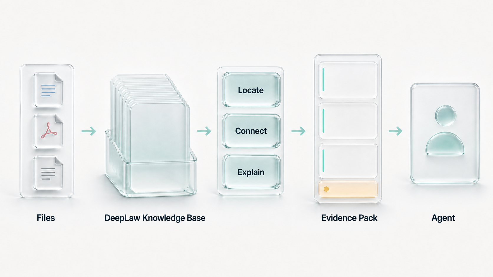

<p align="center">
  <strong>简体中文</strong> · <a href="README_EN.md">English</a>
</p>

<h1 align="center">DeepLaw 2.0</h1>

<p align="center">
  
</p>

<p align="center">
  <strong>面向 Agent 的可验证知识库。</strong><br />
  让文件成为可定位、可核验、可复现的知识。
</p>

<p align="center">
  <a href="https://github.com/Eysn0130/DeepLaw/actions/workflows/ci.yml"></a>
  
  
  
  <a href="LICENSE"></a>
</p>

<p align="center">
  <a href="#快速开始">快速开始</a> ·
  <a href="#deeplaw-架构">系统架构</a> ·
  <a href="#evidence-compiler">Evidence Compiler</a> ·
  <a href="#agent-接入">Agent 接入</a> ·
  <a href="#当前收录与更新">当前收录</a> ·
  <a href="#文档">文档</a>
</p>

---

<p align="center">
  
</p>

DeepLaw 2.0 把法律资料构建为版本化、可追溯的知识发布。在回答问题前，它先确定问题需要
哪些证据，再依据来源、版本、时效与抽取质量，从知识库中选择少量必要片段；无法覆盖的内容
作为显式缺口返回，而不是交给模型猜测。

它不是把整座知识库塞入上下文，也不是让一个不可解释的总分决定答案。候选发现、关系连接和
质量筛选发生在模型上下文之外，Agent 最终只接收一个有硬预算、可按 ID 复核的
**Evidence Pack**。

## 核心能力

| 能力 | DeepLaw 2.0 的做法 |
| --- | --- |
| **来源绑定** | 每个可引用片段绑定原件、官方来源、版本、定位、source hash 与 segment hash |
| **结构保真** | 保留文档顺序、标题/条文层级、页码、段落、表格行和抽取证据 |
| **主题防串扰** | 已审核概念绑定原件 hash 与条款；相邻罪名或其他标准不能补位，无法解析即返回缺口 |
| **证据编译** | 先定义问题必须覆盖的证据义务，再按优先级在硬预算内选择小型、去冗余的覆盖集 |
| **限制优先** | 时效不明、抽取风险、例外或冲突不会被相关性分数掩盖，而是进入不确定证据或缺口 |
| **有界交付** | 默认最多五张证据卡；完整文本按精确 `segment_id` 二次读取，不暴露内部候选池 |
| **可验证回执** | receipt 固定到不可变 release、document、segment 与文本 hash，可独立核验 |
| **宿主隔离** | 官方目录、用户私有法律资料与 Analytix 案件项目物理分离，Agent 接口保持只读 |

## DeepLaw 架构

DeepLaw 架构将“原件”和“便于 Agent 使用的视图”严格分层：

```text
Immutable Source Files
  → Document IR
  → Immutable SQLite Knowledge Release
  → Rebuildable Markdown / Search / Map Views
  → Evidence Compiler
  → Evidence Pack
  → Agent
```

- **不可变原件**：保存取得来源、文件身份、字节数与 SHA-256，是内容追溯的起点；
- **Document IR**：把 DOCX、PDF、TXT 输入统一成有顺序、有定位、有版面与抽取质量信息的
  block，不提前丢失页码、段落、表格或来源关系；
- **SQLite Knowledge Release**：是运行时规范数据源，以 `mode=ro&immutable=1` 打开，保存
  block、segment、版本、关系、风险与 hash；
- **Markdown 派生视图**：用于人工浏览、校对和审阅，由 Document IR 确定性生成；它可以删除
  和重建，但不覆盖原件，也不是运行时权威数据源；
- **发现视图**：全文索引、关系地图和其他候选发现能力都固定到 release，可重建，不能提升
  资料的权威、时效或审核状态。

这套分层避免把 Markdown 当数据库，也避免让抽取后的扁平文本成为无法回到原件的第二份真相。

### 从文件到证据的知识闭环

<p align="center">
  
</p>

| 动作 | 作用 | 约束 |
| --- | --- | --- |
| **Ingest** | 校验文件、解析内容并建立 Document IR | 处理成功不等于人工审核通过 |
| **Organize** | 保存层级、顺序、版本与 Knowledge Map | 派生摘要不能覆盖原文 |
| **Locate** | 定位题名、文号、条款、关键词与相关片段 | 泛词不会展开成无限候选 |
| **Connect** | 连接引用、修订、废止、替代、定义与例外 | 关系连接本身不是法律结论 |
| **Explain** | 生成有来源的导航、短摘要与问题分解 | 派生解释必须回到精确来源片段 |
| **Verify** | 检查来源、时效、证据义务、预算、缺口与回执 | 不为看起来完整而补造答案 |

`Deliver` 是最终动作：只把完成当前任务所需的证据、限制、缺口和回执交给 Agent。

### Evidence Core

<p align="center">
  
</p>

Evidence Core 将五类信息保持在同一条可复核链路中：

- **Sources & Versions**：固定 release、来源 URL、source hash、segment hash 与精确定位；
- **Knowledge Map**：只让有来源的关系进入权威路径，派生关系只能用于发现候选；
- **Evidence Duties**：把问题编译为封闭的证据要求，包括主规则、精确引文、时效、定义、
  解释、程序、数额/立案标准、反证和案例参考；
- **Limits & Gaps**：限制卡片、字符、关系路径和 hop；区分证据缺口、语料缺口、复核缺口、
  时效缺口和抽取缺口；
- **Receipts & Replay**：记录选择结果所绑定的 release、segment 与 hash，使结果可验证、可重放。

## Evidence Compiler

Evidence Compiler 是 DeepLaw 2.0 的核心查询路径。它不直接截取“分数最高的若干片段”，而是
先定义什么才算足以回答当前问题，再选择内容：

```text
Question
  → closed Evidence Duties
  → bounded candidate discovery
  → integrity / relevance / temporal-intent / extraction admission
  → coverage witnesses
  → limitation and counterevidence challenges
  → bounded coverage-first evidence set
  → evidence + uncertain evidence + gaps + receipts
```

在有限候选池和上下文预算内，编译器按确定性优先级先满足精确目标与必需证据义务，再处理
定义、限制、例外、反证和版本变化；只有能新增或改善 witness 的候选才进入结果。这个过程追求
有界覆盖与去冗余，不宣称求解全局最小集合。大量同主题片段不能挤掉精确条文或必要限制；没有
通过能力条件的候选不能产生 coverage witness，也不能把必需证据标记为已覆盖。

Evidence Pack 明确区分：

| 输出 | 含义 |
| --- | --- |
| `evidence` | 通过完整性、相关性及本次查询实际启用的时效/抽取门禁的研究证据；不等于来源身份或现行效力已完成人工审核 |
| `uncertain_evidence` | 与问题相关，但至少一项准入条件尚未满足 |
| `obligation_coverage` | 每项证据义务由哪些可检查 witness 覆盖 |
| `gaps` | 尚未覆盖或无法确认的证据、语料、时效、复核与抽取缺口 |
| `receipt_id` | 可对固定 release 中的片段重新计算 hash 的回执 |

候选发现可综合题名、条文、相关性和来源层级用于排序，但这个排序分数不能提升完整性、时效、
抽取质量或人工审核状态。模型或派生索引可以帮助发现候选，不能自行判定修订废止、消除阻断性
缺口或把研究候选变成案件适用结论。

## 当前版本 v0.3.0

| 能力 | 当前状态 |
| --- | --- |
| 文件处理 | 官方目录支持 DOCX/PDF；用户私有库另支持 UTF-8 TXT；保留 block 级定位与抽取证据 |
| 数据表示 | 不可变原件、Document IR、只读 SQLite release 与可重建 Markdown 派生视图分层 |
| 官方目录 | Ed25519 验签、HTTPS 更新、sequence 防回滚/改写、逐来源大小与 SHA-256 校验 |
| 用户私有库 | owner-only 物理目录、显式增删、独立不可变快照，不与官方结果混排 |
| 定位与连接 | 题名、别名、文号、条款、中文全文检索、来源绑定主题定位与有限关系路径 |
| 证据交付 | 封闭 QueryPlan、启发式证据义务、按查询启用的时效/抽取门禁、有界证据、显式缺口与 receipt |
| Agent 接口 | 一个只读 MCP leaf tool；官方与私有 operation 分离，没有语料写工具 |
| 宿主 | Codex、Claude Code 与 OpenCode 适配；Analytix 案件项目仍在 DeepLaw 2.0 范围之外 |

## 快速开始

需要 Python 3.11+ 和 [`uv`](https://docs.astral.sh/uv/)：

```bash
git clone https://github.com/Eysn0130/DeepLaw.git
cd DeepLaw
uv tool install '.[document-engine]'
deeplaw --version
```

官方目录包含 PDF。首次安装或更新官方 release 前，还需安装 PDF 渲染、OCR 与简体中文语言数据：

```bash
# macOS (Homebrew)
brew install poppler tesseract tesseract-lang

# Debian / Ubuntu
sudo apt-get update
sudo apt-get install -y poppler-utils tesseract-ocr tesseract-ocr-chi-sim
```

安装后可独立验证四项构建依赖：

```bash
deeplaw-document-engine --version
pdftoppm -v
tesseract --version
tesseract --list-langs | grep -x 'chi_sim'
```

签名官方目录声明的构建策略是强制策略。`official install` 与 `official update` 会在下载任何官方
原件、构建 release 或切换激活版本前执行同样的严格预检；缺少任一依赖即终止，不会静默降级，
也不能通过 CLI 弱化目录策略。若机器只读取已经构建好的 release，可改用轻量安装
`uv tool install .`。处理用户自己的风险 PDF 时显式选择：

```bash
uv tool install --force '.[document-engine]'
deeplaw private add \
  --source "/path/to/scanned-legal-reference.pdf" \
  --pdf-fallback document-engine \
  --allow-needs-ocr \
  --confirm-no-case-data
```

安装 DeepLaw 2.0 团队维护的官方目录。客户端先验证签名，再从目录记录的官方来源下载原件并在
本机构建不可变 release；仓库不重新分发这些原件。

```bash
deeplaw official install
deeplaw official status
deeplaw doctor
```

需要人工浏览或校对时，可从不可变 release 确定性导出 Markdown；该目录是派生视图，可随时删除
并重建：

```bash
deeplaw export-markdown --output "/path/to/deeplaw-markdown"
```

团队发布新目录后，由用户显式更新：

```bash
deeplaw official update
```

已经持有与目录完全一致的 source package 时，可以复用本地原件：

```bash
deeplaw official install --source-root "/path/to/legal-source-package"
```

官方目录是可选能力，停用或卸载不会触碰用户私有库：

```bash
deeplaw official disable
deeplaw official enable
deeplaw official uninstall
```

用户自己的法律参考资料进入独立的本机私有库。导入需要确认文件不是案件材料；Agent 只能
读取，不能通过 MCP 上传或删除。

```bash
deeplaw private add \
  --source "/path/to/user-legal-reference.docx" \
  --confirm-no-case-data
deeplaw private list
deeplaw private search --query "资料题名 第一条"
deeplaw private delete --document-id "doc_..."
```

## Agent 接入

| 宿主 | 入口 | 激活边界 |
| --- | --- | --- |
| Codex | [`plugins/deeplaw`](plugins/deeplaw) | 由 Skill 按法律任务显式使用只读 MCP |
| Claude Code | [`plugins/deeplaw`](plugins/deeplaw) | 使用同一组 Skill 与 MCP 契约 |
| OpenCode | [`adapters/opencode`](adapters/opencode) | 默认不激活，由专用 agent 显式授权 |
| Analytix | [`docs/ANALYTIX_INTEGRATION.md`](docs/ANALYTIX_INTEGRATION.md) | 未来按 turn 接入；案件项目库不属于 DeepLaw 2.0 |

Codex 本地安装：

```bash
codex plugin marketplace add /absolute/path/to/DeepLaw
codex plugin add deeplaw@deeplaw
```

DeepLaw 2.0 只暴露一个 MCP leaf tool：`law_support`。官方目录使用
`search/get/verify/release_info`，用户私有库使用
`private_search/private_get/private_verify/private_info`；八个 operation 全部只读。安装插件不会
在后台下载或修改资料，安装与更新只能由用户显式运行 CLI。

普通代码、数据、SQL 或文档任务不应激活 DeepLaw 2.0。宿主必须在工具 schema 进入模型上下文前
完成法律意图门禁，避免通用 Agent 的 Token、延迟和任务路由退化。

## 知识边界

| 范围 | 存储与更新 | Agent 访问 |
| --- | --- | --- |
| 官方团队目录 | `~/.deeplaw/official` 管理目录；release 位于 `~/.deeplaw/releases`；团队发布递增签名目录 | 默认官方四个只读 operation；用户可停用或卸载 |
| 用户私有法律资料 | `~/.deeplaw/private` owner-only 根目录；本机用户显式增删并重建独立快照 | 仅显式 `private_*`；不改变官方来源、排序或更新状态 |
| Analytix 案件项目 | Analytix 自己的每案件 SQLite/DuckDB、附件和会话存储 | 不进入 DeepLaw 2.0，也不由 DeepLaw 2.0 读取 |

当前本地私有库依赖操作系统账户和 owner-only 文件权限，不是共享服务的多租户认证。案件证据、
事实、聊天、身份、交易和 Agent 记忆不能进入官方目录或用户私有法律资料库。

## 文件处理与质量门禁

- **DOCX**：直接解析 OOXML，保留段落、表格行、样式与脚注引用；
- **PDF**：按页保留原生文本、版面块、定位、抽取方法、置信信息与风险标记；低质量页面进入
  多路径解析和视觉复核流程；
- **TXT**：以严格 UTF-8 解析，保存稳定行序与段落定位；
- **Document IR**：为每个 block 建立稳定 ID、顺序、文本 hash、页码/段落、类型、来源和质量状态；
- **Markdown**：只从 IR 生成用于浏览与校对的派生视图，不作为切分、检索或法律引用的真源。

质量判断落实在页和 segment，而不是粗暴地污染整份文档。未通过抽取门禁的片段只进入
`uncertain_evidence`，不会成为已核验主证据；详细逐页状态、方法、hash 与审计记录保存在
release 构建报告中，修正通过新的不可变 release 发布。

## 质量验证

```bash
uv lock --check
uv run ruff check .
uv run pytest
uv run deeplaw eval --cases evals/core-2026-07-14.jsonl --limit 5
git diff --check
```

当前可复现 smoke 集覆盖精确定位、时效分桶、抽取门禁、官方/私有隔离和 receipt 往返校验。
测试所绑定的 release、database、case、源码、环境、hash 与指标见
[`docs/BENCHMARKS.md`](docs/BENCHMARKS.md)。跨系统性能结论需要在相同语料、问题、模型和上下文
预算下使用外部 held-out 数据验证。

## 安全与责任边界

- DeepLaw 2.0 返回可复核的研究证据，不替代法律意见、事实认定或裁判结论；
- 查询时不会把公网内容直接加入主证据，模型也不能自行决定修订、废止、冲突或优先级；
- 用户私有资料不能改变官方 release、审核状态、排序或更新生命周期；
- 受限法源与案件信息不得进入 issue、PR、日志、截图或公开 benchmark。

语料治理见 [`docs/CORPUS_GOVERNANCE.md`](docs/CORPUS_GOVERNANCE.md)，安全报告流程见
[`SECURITY.md`](SECURITY.md)。

## 路线图

- [x] 不可变 Knowledge Release、Document IR、receipt 与只读 MCP
- [x] 官方签名目录生命周期与用户私有法律资料物理隔离
- [x] 精确定位、证据义务、时效/抽取门禁和显式 gaps
- [x] Codex、Claude Code 与 OpenCode 适配
- [ ] 扩展完整法律层级与双时态法律事件账本
- [ ] 增加 Corpus Coverage Manifest 与 release 审批/撤销元数据
- [ ] 建立外部 held-out 中文法律证据 benchmark
- [ ] 完成 Analytix turn-scoped 激活与 inactive zero-impact A/B gate

## 文档

| 文档 | 内容 |
| --- | --- |
| [`docs/DEEPLAW_2.md`](docs/DEEPLAW_2.md) | DeepLaw 2.0 技术设计、形式化不变量与研究门禁 |
| [`docs/ARCHITECTURE.md`](docs/ARCHITECTURE.md) | 系统架构、存储与运行时事实 |
| [`docs/DOCUMENT_IR.md`](docs/DOCUMENT_IR.md) | DOCX/PDF/TXT 摄取、Document IR、PDF 多候选门禁与 Markdown 定位 |
| [`docs/CORPUS_GOVERNANCE.md`](docs/CORPUS_GOVERNANCE.md) | 法源、复核、许可、发布与更新治理 |
| [`docs/BENCHMARKS.md`](docs/BENCHMARKS.md) | 可复现验证结果与下一阶段评价协议 |
| [`docs/RESEARCH_MATRIX.md`](docs/RESEARCH_MATRIX.md) | Agent 知识库技术研究矩阵、分层边界与对照门禁 |
| [`docs/AGENT_ADAPTERS.md`](docs/AGENT_ADAPTERS.md) | Codex、Claude Code 与 OpenCode 适配 |
| [`docs/ANALYTIX_INTEGRATION.md`](docs/ANALYTIX_INTEGRATION.md) | Analytix 未来接入与 zero-impact 门禁 |
| [`docs/SOURCE_AUDIT_2026-07-14.md`](docs/SOURCE_AUDIT_2026-07-14.md) | 首批 28 份资料的来源与构建历史审计 |

## 当前收录与更新

DeepLaw 2.0 是通用法律知识库。当前官方目录收录截至 **2026-07-14** 的 **28** 份资料，包括
**10 DOCX** 和 **18 PDF**；这只是当前覆盖情况，不限定未来法域和资料类型。仓库分发签名目录、
公钥信任根、来源 URL、大小和 hash，原件在安装时从官方来源获取。

| 当前法源分组 | 数量 | 覆盖内容 |
| --- | ---: | --- |
| 核心法源 | 4 | 刑法、刑诉法、修正案与立案追诉标准 |
| 金融与非法集资 | 4 | 洗钱、反洗钱、非法集资及取缔规则 |
| 数据与网络 | 3 | 个人信息、数据安全与反电信网络诈骗 |
| 案例参考 | 4 | 人民法院案例库公开案例 |
| 办案程序与证据 | 4 | 经侦办案、刑事程序与涉案财物处置 |
| 反洗钱、支付与主体穿透 | 8 | 外汇、受益所有人、客户尽调、支付机构等 |
| 罪名专题 | 1 | 危害税收征管刑事案件司法解释 |
| **合计** | **28** | **10 DOCX + 18 PDF** |

DeepLaw 2.0 分别记录**发布机关**与**官方托管下载站点**：前者用于识别来源权威，后者记录原件的
实际取得位置。

这里的“官方目录”指 DeepLaw 团队维护、签名并从下列官方站点取材的下载目录；它不表示发布机关
对 DeepLaw 构建结果作出认证，也不等同于逐条人工法律审查。

| 官方下载来源 | 数量 | 当前取得的文件 |
| --- | ---: | --- |
| [国家法律法规数据库](https://flk.npc.gov.cn/) | 10 | DOCX：法律、修正案、司法解释等 |
| [司法部行政法规库](https://xzfg.moj.gov.cn/) | 4 | PDF：行政法规及相关规范 |
| [中国人民银行](https://www.pbc.gov.cn/)及其官方分支站点 | 6 | PDF：反洗钱、支付、客户尽调与修改决定 |
| [山东法院官网](https://www.sdcourt.gov.cn/)官方托管页 | 5 | PDF：人民法院案例库参考案例及程序文件 |
| [证监会](https://www.csrc.gov.cn/)、[国家移民管理局](https://www.nia.gov.cn/)、[深交所](https://www.szse.cn/)官方托管页 | 3 | PDF：发布机关文件的官方托管原件 |
| **合计** | **28** | **每份均记录 URL、格式、字节数与 SHA-256** |

使用者获取团队更新只需显式运行：

```bash
deeplaw official update
```

团队维护目录时遵循三个步骤：

1. 以题名、文号、发布机关、公布/施行日期和时效状态定位资料；
2. 从发布机关或官方托管页面取得原件，不猜测下载 URL，也不把网页正文另存为原件；
3. 校验格式、首页身份、大小与 SHA-256，记录版本关系后构建新的不可变 release。

草案、征求意见稿、仅有网页正文的材料、商业数据库转载和案件私有材料不进入公共目录。案例
只用于检索与论证参考，不能替代法律规范的效力判断。

## 社区与许可

欢迎使用 synthetic fixture 提交可复现的定位、版本、解析和安全问题。参见
[`CONTRIBUTING.md`](CONTRIBUTING.md)、[`CODE_OF_CONDUCT.md`](CODE_OF_CONDUCT.md) 和
[`SECURITY.md`](SECURITY.md)。

DeepLaw 源代码按 [Apache License 2.0](LICENSE) 发布。外部法源、案例、网站版式和第三方资产的
相关权利仍由各权利人保留；可选文档处理依赖的许可、模型与再分发边界见
[`THIRD_PARTY_NOTICES.md`](THIRD_PARTY_NOTICES.md)。
