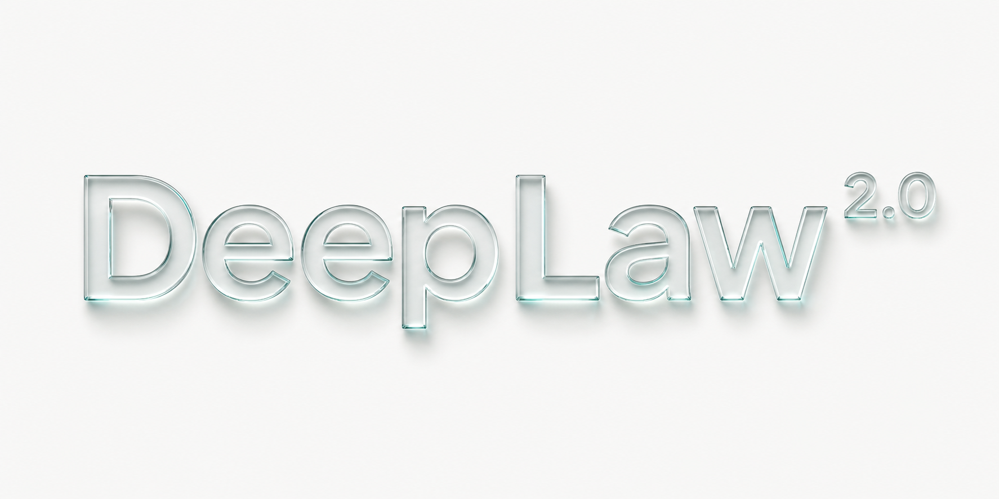
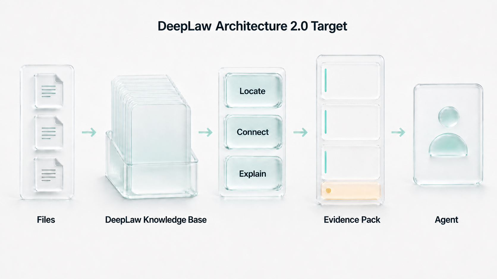
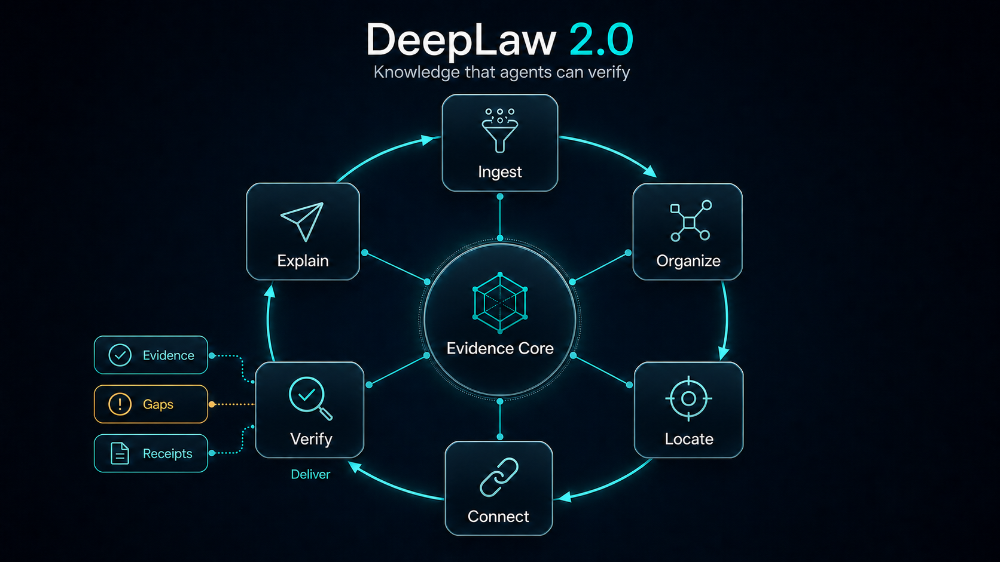
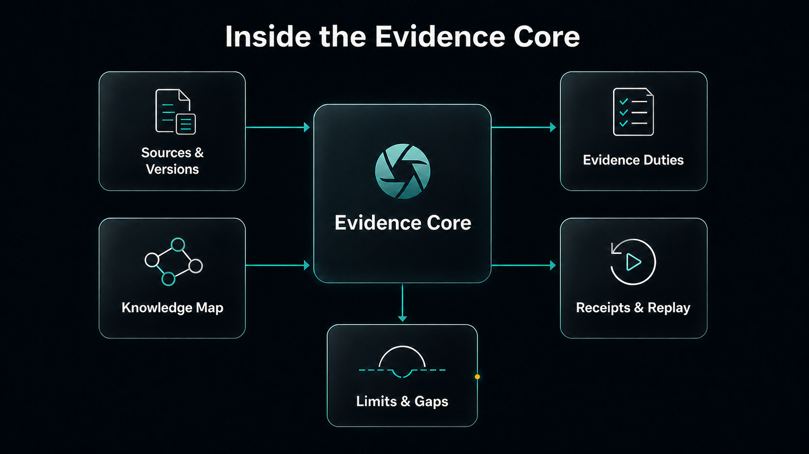

<p align="center">
  <strong>简体中文</strong> · <a href="README_EN.md">English</a>
</p>

<h1 align="center">DeepLaw - 2.0</h1>

<p align="center">
  
</p>

<p align="center">
  <strong>面向 Agent 的可验证知识库。</strong><br />
  Files in. Verifiable knowledge out.
</p>

<p align="center">
  <sub>Architecture 2.0 是目标架构 · 当前可运行版本为 0.2.0 alpha</sub>
</p>

<p align="center">
  <a href="https://github.com/Eysn0130/DeepLaw/actions/workflows/ci.yml"></a>
  
  
  
  <a href="LICENSE"></a>
</p>

<p align="center">
  <a href="#快速开始">快速开始</a> ·
  <a href="#法源获取与更新">法源获取</a> ·
  <a href="#deeplaw-如何工作">工作原理</a> ·
  <a href="docs/DEEPLAW_2.md">2.0 技术设计</a> ·
  <a href="docs/BENCHMARKS.md">评测</a> ·
  <a href="SECURITY.md">安全</a>
</p>

---

<p align="center">
  
</p>

上图是 Architecture 2.0 目标，不是当前运行截图。当前 `0.2.0` 能把 DOCX 和 PDF 构建成
只读、版本化、可追溯的 Agent Knowledge Base，在知识库内部完成有界定位、连接和核验，再向
Agent 交付小型 **Evidence Pack**：主证据、不确定证据、显式缺口和可复核回执。2.0 将补齐
source-bound Explain、TXT 输入和最小充分证据选择。

`DeepLaw` 是产品名，Architecture 2.0 是下一代架构方向；当前可运行包仍为 `0.2.0` alpha。
主页不会把研究目标伪装成已完成能力。

## 快速开始

需要 Python 3.11+ 和 [`uv`](https://docs.astral.sh/uv/)：

```bash
git clone https://github.com/Eysn0130/DeepLaw.git
cd DeepLaw
uv sync --extra dev
uv run deeplaw --version
```

构建操作者自己合法取得、且有权处理并保留的 source package：

```bash
export DEEPLAW_SOURCE_ROOT="/path/to/legal-source-package"
export DEEPLAW_SOURCE_MANIFEST="$DEEPLAW_SOURCE_ROOT/manifest.json"

uv run deeplaw build \
  --source-root "$DEEPLAW_SOURCE_ROOT" \
  --manifest "$DEEPLAW_SOURCE_MANIFEST" \
  --output-root "$HOME/.deeplaw/releases" \
  --activate

uv run deeplaw doctor
uv run deeplaw search --query "刑法第二百六十六条" --as-of 2024-07-01
```

仓库不分发受限法源、案件材料或生成的 SQLite release。`build` 成功只表示产物通过了机器
闸门，不表示资料已经完成人工法律审核。

## DeepLaw 如何工作

<p align="center">
  
</p>

Architecture 2.0 用六个核心知识动作定义从文件到 Agent 的闭环；下表同时标明 `0.2.0` 与
2.0 目标的边界：

| 动作 | 作用 | 当前状态与边界 |
| --- | --- | --- |
| **Ingest** | 校验文件、解析内容、保留页码/段落/hash | 当前支持 DOCX/PDF；处理成功不等于人工审核通过 |
| **Organize** | 构建层级、版本、关系和 Knowledge Map | 当前保留标题/条文分段和顺序；完整法律层级属于 2.0 目标 |
| **Locate** | 精确定位题名、文号、条款、关键词和相关片段 | 泛词不会展开成无限候选 |
| **Connect** | 连接引用、修订、废止、替代、实施和例外关系 | 当前仅 provenance-bound 单跳文档关系；定义、范围和 challenge closure 属于 2.0 目标 |
| **Explain** | 生成有来源的导航、短摘要和问题分解 | 2.0 目标；当前只有 excerpt 和固定的下一步问题 |
| **Verify** | 执行来源、时效、证据义务、预算、缺口和 receipt | 当前已实现基础门禁；witness 与 replay 属于 2.0 目标 |

`Deliver` 是最终输出动作：交付最多五张证据卡，并按 ID 二次读取所选 segment 的规范化抽取
文本；若 `truncated=true`，可在契约上限 6000 字符内提高 `max_chars` 后重取。Agent 不接收
内部候选池。抽取文本仍须通过 official source 与 locator 核对。任何 2.0 派生解释都必须回到
精确 source segment 才能成为可引用证据。

## Architecture 2.0 目标：Evidence Core

<p align="center">
  
</p>

Evidence Core 是 2.0 目标架构。`0.2.0` 已实现其中的不可变来源、基础 Knowledge Map、
Evidence Duties、有界结果、gaps 与 receipts；coverage witness、挑战结果和 replay trace 尚未
实现。

### Sources & Versions

每张主证据都必须绑定固定 release、来源 URL、source hash、segment hash 和精确定位。目标时点
以 `verified_in_scope`、`unverified_metadata`、`outside_effective_interval` 三分法处理；未知
时效不会混入已验证主证据。

### Knowledge Map

当前 release 保留标题/条文分段、顺序，以及有来源的单跳关系。2.0 目标会扩展完整法律层级，
并把模型或统计发现的候选关系放入可删除、可重建、固定到 release 的 discovery sidecar；它
只能帮助 Locate / Connect，不能授予权威。

### Evidence Duties

问题先编译为封闭 `QueryPlan`。当前有八类 Duty：primary rule、exact citation、temporal
status、definitions、interpretation、procedure、counterevidence 和 case reference。没有覆盖的
必需 Duty 进入 `gaps`，而不是由模型记忆补齐。

### Limits & Gaps

搜索最多返回五张卡；导航和精确查询通常更少。字符预算、关系路径和 hop 数都有硬上限。
DeepLaw 区分主证据、不确定证据、区间外候选和 blocking/non-blocking gap。

### Receipts & Replay

`receipt_id` 绑定 release、document、segment、source hash 和 text hash。`verify` 会重新计算
当前不可变 release 中的 segment hash。2.0 目标还会增加 coverage witness 与短 replay trace，
解释为什么返回这些证据、拒绝了哪些候选。

## Architecture 2.0 目标能力

### 1. Knowledge Release

- 原始文件 hash、来源声明、文档身份与版本；
- 当前保留标题/条文分段和顺序；2.0 目标扩展为文件 → 编 → 章 → 节 → 条 → 款 → 项；
- 页码、段落、抽取方式、风险和审核状态；
- content-addressed release，不覆盖同 ID；
- SQLite `mode=ro&immutable=1`，运行时无语料写接口。

### 2. Evidence-first selection

当前运行时已经具备 QueryPlan、时效门、证据卡、coverage、gaps 与 receipt。2.0 的关键增量
是把选择顺序改成：

```text
Question
  → Evidence Duties
  → bounded discovery
  → source / version / extraction admission
  → limitation and counterevidence challenges
  → minimal sufficient evidence set
  → Evidence Pack
```

目标不是选“分数最高的五张”，而是在硬预算内选能覆盖必需 Duty 的最小证据集。

### 3. Evidence capability types

这是 2.0 目标。证据风险不会压成单一 confidence 分数。Integrity、source identity、authority metadata、
temporal、extraction 和 provenance 是正交能力；只有确定性校验或人工 attestation 才能提升
能力类型，模型自评不能升级。

### 4. Challenges before confidence

这是 2.0 目标。系统主动检查时效变化、例外、定义、范围、交叉引用、抽取风险和冲突。每项只能是
`satisfied`、`unresolved` 或 `not_applicable`；`unresolved` 必须保留为 gap。

### 5. Public knowledge, private cases

DeepLaw 只承载公用、只读知识。案件项目上传、事实、聊天、身份、交易与 Agent memory 必须留
在宿主私有项目中，不得写入公共 release、sidecar、日志或公开 benchmark。这是强制集成
边界；`0.2.0` 没有内容级 DLP 或私有资料分类器，宿主必须在调用 DeepLaw 之前完成隔离和拒绝。

完整 2.0 设计、形式化不变量、实现阶段和“不能做”的事项见
[`docs/DEEPLAW_2.md`](docs/DEEPLAW_2.md)。

## 当前已经实现什么

| 能力 | `0.2.0` 状态 |
| --- | --- |
| 文件处理 | DOCX 直接解析；文本 PDF 原生层优先；低质量页可进入本地视觉共识管线 |
| 不可变发布 | source/segment/release hash、原子发布、只读 SQLite、receipt |
| 精确定位 | 题名、别名、文号、条款与中文 FTS |
| QueryPlan | 8 类封闭 Evidence Duty、稳定 plan ID 和硬边界 |
| 时效 | 目标日期、已验证区间、不确定元数据和区间外候选分离 |
| Knowledge Map | provenance-bound 单跳关系与有限路径 |
| Agent 接口 | 一个只读 MCP leaf tool，四个 operation |
| 宿主 | Codex、Claude Code、OpenCode 适配；Analytix 仅有未来设计，尚未修改 |

当前还没有实现：签名 release 审批/撤销、完整法律双时态事件账本、coverage-first 最小集、
coverage witness、replay trace、外部 held-out 中文法律 benchmark，以及 Analytix 的 schema 前
激活门。这些不会被当前主页表述成已完成。

## 一个小型 Agent 接口

DeepLaw 只暴露一个 MCP leaf tool：`law_support`。内部四个 operation 全部只读：

| Operation | 作用 |
| --- | --- |
| `search` | 返回有界证据、不确定证据、覆盖状态、关系路径和 gaps |
| `get` | 按精确 `segment_id` 读取规范化抽取文本，并显式返回 `truncated` |
| `verify` | 验证 receipt 与当前 release 中的 segment hash |
| `release_info` | 检查固定 release、schema、审核与再分发状态 |

响应骨架：

```json
{
  "release_id": "lawrel_...",
  "query_plan": { "plan_id": "lawplan_...", "obligations": [] },
  "evidence": [{ "segment_id": "seg_...", "receipt_id": "lawrcpt_..." }],
  "uncertain_evidence": [],
  "obligation_coverage": [],
  "gaps": [],
  "total_excerpt_chars": 0
}
```

完整 schema 位于 [`contracts`](contracts)，真实运行时不会把示意 ID 当作有效 ID。

## Agent 接入

| 宿主 | 当前入口 | 激活边界 |
| --- | --- | --- |
| Codex | [`plugins/deeplaw`](plugins/deeplaw) | Skill 明确要求后使用只读 MCP |
| Claude Code | [`plugins/deeplaw`](plugins/deeplaw) | 同一插件内的 Skill + MCP |
| OpenCode | [`adapters/opencode`](adapters/opencode) | 默认 deny，由专用 agent 显式授权 |
| Analytix | [`docs/ANALYTIX_INTEGRATION.md`](docs/ANALYTIX_INTEGRATION.md) | 未来 turn-scoped 接入；当前未改代码 |

安装插件不等于每轮自动调用。普通代码、数据、SQL 或文档任务不应进入 DeepLaw。未来
Analytix 接入必须在 provider tool schema 物化前完成法律意图门禁，并用 inactive A/B 证明
普通任务的 route、stable prefix、request body、Token 和延迟零退化。

## 文件与抽取质量

- DOCX：直接解析 OOXML，保留段落、表格行和脚注引用；
- 文本 PDF：优先读取原生文本层；
- 低质量 PDF：按页渲染并比较 native/OCR/selected text hash；
- OCR：只在原生层失败时启动本地 fallback；
- 人工校对：必须绑定 source PDF hash 和 rendered-page hash，并记录人工身份、角色、时间与比对声明；
- 低置信度或 native/OCR 分歧：保持 `review_required`，管线不能冒充 `human_reviewed`。

## 评测与诚实边界

```bash
uv lock --check
uv run ruff check .
uv run pytest
uv run deeplaw eval --cases evals/core-2026-07-14.jsonl --limit 5
git diff --check
```

当前本地 candidate 在 32 项已知语料白盒 smoke case 上为 32/32，109/109 张返回证据的
receipt 往返核验通过。它绑定特定 release、database、case、源码与环境，并且不是盲测、
留出集、人工法律金标或跨系统冠军榜。完整 hash、指标与限制见
[`docs/BENCHMARKS.md`](docs/BENCHMARKS.md)。

DeepLaw 只有在外部 held-out 集、专家中文法律集、mutation suite 和非法律任务激活测试同时
通过后，才会发布领先性结论。架构可以有野心，性能主张必须有证据。

## 法源与安全边界

- DeepLaw 输出研究证据候选，不是法律意见、事实认定或裁判结论；
- 日期匹配不等于规则适用于本案；
- 查询时不自动把公网内容加入主证据；
- 模型不能决定修订、废止、冲突或优先级；
- 不预测有罪、量刑、责任或案件结果；
- 宿主和操作者不得把案件私有材料写入或发送到公共知识库；
- 不在 issue、PR、日志、截图或 benchmark 中发布受限法源与案件信息。

语料治理见 [`docs/CORPUS_GOVERNANCE.md`](docs/CORPUS_GOVERNANCE.md)，安全报告流程见
[`SECURITY.md`](SECURITY.md)。

## 文档地图

| 文档 | 内容 |
| --- | --- |
| [`docs/DEEPLAW_2.md`](docs/DEEPLAW_2.md) | DeepLaw Architecture 2.0 完整技术设计与研究门禁 |
| [`docs/ARCHITECTURE.md`](docs/ARCHITECTURE.md) | 当前 `0.2.0` 实现、存储与运行时事实 |
| [`docs/CORPUS_GOVERNANCE.md`](docs/CORPUS_GOVERNANCE.md) | 法源、审核、许可、发布和更新治理 |
| [`docs/BENCHMARKS.md`](docs/BENCHMARKS.md) | 可复现 smoke 结果与下一阶段评价协议 |
| [`docs/AGENT_ADAPTERS.md`](docs/AGENT_ADAPTERS.md) | Codex、Claude Code 与 OpenCode 适配 |
| [`docs/ANALYTIX_INTEGRATION.md`](docs/ANALYTIX_INTEGRATION.md) | Analytix 未来接入和 zero-impact 门禁 |
| [`docs/SOURCE_AUDIT_2026-07-14.md`](docs/SOURCE_AUDIT_2026-07-14.md) | 当前受限核心包的 hash-bound AI precheck |

## Roadmap

- [x] 不可变 Knowledge Release、receipt 和只读 MCP
- [x] QueryPlan、Evidence Duties、时效分桶和显式 gaps
- [x] provenance-bound Knowledge Map 与单跳有限导航
- [x] 页级 PDF 证据和人工审校 attestation
- [x] Codex、Claude Code、OpenCode 适配
- [ ] coverage witness、challenge result 和 replay trace
- [ ] coverage-first 最小充分证据集
- [ ] TXT 输入、完整法律层级与 source-bound Explain
- [ ] Corpus Coverage Manifest 与法律双时态事件账本
- [ ] 签名发布、撤销、supersession feed 和安全更新
- [ ] 外部 held-out 中文法律证据 benchmark
- [ ] Analytix turn-scoped 激活与 inactive zero-impact A/B gate

## 法源获取与更新

DeepLaw 面向通用法律知识库建设。下表仅展示截至 **2026-07-14** 当前已收录的资料：共 **28**
份二进制原件，含 **10 DOCX**、**18 PDF**、**0 HTML**，不构成未来收录范围的限制。下列数量
来自操作方维护的下载清单；DeepLaw 仓库不再分发这些原件。

| 经侦法源分组 | 数量 | 覆盖内容 |
| --- | ---: | --- |
| 核心法源 | 4 | 刑法、刑诉法、修正案与立案追诉标准 |
| 金融与非法集资 | 4 | 洗钱、反洗钱、非法集资及取缔规则 |
| 数据与网络 | 3 | 个人信息、数据安全与反电信网络诈骗 |
| 案例参考 | 4 | 人民法院案例库公开案例 |
| 办案程序与证据 | 4 | 经侦办案、刑事程序与涉案财物处置 |
| 反洗钱、支付与主体穿透 | 8 | 外汇、受益所有人、客户尽调、支付机构等 |
| 罪名专题 | 1 | 危害税收征管刑事案件司法解释 |
| **合计** | **28** | **10 DOCX + 18 PDF** |

下载时必须区分**发布机关**和**官方托管下载站点**：前者决定权威性，后者只记录二进制原件的
取得位置。当前清单中的实际下载来源如下：

| 官方下载来源 | 数量 | 当前取得的文件 |
| --- | ---: | --- |
| [国家法律法规数据库](https://flk.npc.gov.cn/) | 10 | DOCX：法律、修正案、司法解释等 |
| [司法部行政法规库](https://xzfg.moj.gov.cn/) | 4 | PDF：行政法规及相关规范 |
| [中国人民银行](https://www.pbc.gov.cn/)及其官方分支站点 | 6 | PDF：反洗钱、支付、客户尽调与修改决定 |
| [山东法院官网](https://www.sdcourt.gov.cn/)官方托管页 | 5 | PDF：人民法院案例库参考案例及程序文件 |
| [证监会](https://www.csrc.gov.cn/)、[国家移民管理局](https://www.nia.gov.cn/)、[深交所](https://www.szse.cn/)官方托管页 | 3 | PDF：发布机关文件的官方托管原件 |
| **合计** | **28** | **每份均记录 URL、格式、字节数与 SHA-256** |

精简更新方法：

1. 以题名、文号、发布机关、公布/施行日期和时效状态定位文件；
2. 从发布机关或官方托管页面下载当前包支持的 DOCX/PDF 原件，不猜测下载 URL，也不将网页正文另存为原件；
3. 校验文件格式、首页信息和 SHA-256，更新下载清单中的 URL、哈希、版本关系与备注，再构建新的只读 release。

草案、征求意见稿、仅有网页正文的材料、商业数据库转载以及案件私有材料不进入公共法源包。案例
只用于检索和论证参考，不能替代法律规范的效力判断。

## Community and license

欢迎使用 synthetic fixture 提交可复现的定位、版本、解析和安全问题。参见
[`CONTRIBUTING.md`](CONTRIBUTING.md)、[`CODE_OF_CONDUCT.md`](CODE_OF_CONDUCT.md) 和
[`SECURITY.md`](SECURITY.md)。

DeepLaw 源代码按 [Apache License 2.0](LICENSE) 发布。该许可不自动授予外部法源、案例、
网站版式、第三方商标、模型或工具的再分发权。品牌资产由 image2 生成并经项目审核使用；
名称仍应在商业发布前完成目标司法辖区的专业商标检索。
