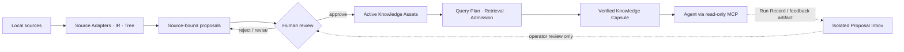

<p align="center">
  <strong>简体中文</strong> · <a href="README_EN.md">English</a>
</p>

<h1 align="center">DeepLaw 2.0</h1>

<p align="center">
  
</p>

<p align="center">
  <strong>给 Agent 一个可追溯、经审核、不会被它静默改写的知识库。</strong><br />
  本地单用户 Agent Knowledge OS · Source-bound · Human-reviewed · Capsule-delivered
</p>

<p align="center">
  <a href="https://github.com/Eysn0130/DeepLaw/actions/workflows/ci.yml"></a>
  <a href="https://github.com/Eysn0130/DeepLaw/releases/tag/v0.7.0"></a>
  
  
  
  <a href="LICENSE"></a>
</p>

<p align="center">
  <a href="#什么知识值得进入-vault">适合什么</a> ·
  <a href="#五步开始">开始</a> ·
  <a href="#知识如何运转">工作方式</a> ·
  <a href="#vault-内部">Vault 内部</a> ·
  <a href="#接入-agent">Agent 接入</a> ·
  <a href="#v070-能力概览">能力</a> ·
  <a href="#文档">文档</a>
</p>

<p align="center">
  
</p>

<p align="center">
  <sub>本地来源进入 Vault，经审核和可解释召回，成为交付给 Agent 的有界 Knowledge Capsule。</sub>
</p>

DeepLaw 是本地资料与 Agent 之间的知识层。它把文档、代码、决策、约束、经验和工具结果编译为
**可追溯的 Knowledge Assets**，再针对当前任务交付一份小而完整、可以复核的
**Knowledge Capsule**。

DeepLaw 关心的不是“存了多少”，而是 Agent 能否知道：**这条知识从哪里来、现在是否有效、为什么
进入本次上下文、还有哪些缺口**。来源、知识、审核、检索与反馈各自拥有独立身份和生命周期；
owner-only SQLite、内容寻址来源片段与追加审计链共同构成本机规范状态。

> DeepLaw 不替 Agent 思考，也不把聊天记录自动变成记忆。它守住来源、审核与交付边界，让 Agent
> 在明确的证据范围内工作。

## 什么知识值得进入 Vault

不是所有文件都要变成长期知识。最适合进入 DeepLaw 的，是会跨任务复用、错误代价不低、并且需要
持续说明出处与状态的信息：

| 知识场景 | 典型来源 | Agent 得到什么 |
| --- | --- | --- |
| **项目约束与架构决策** | ADR、接口契约、仓库规范、依赖选择 | 当前有效的 constraint / decision，以及原始依据 |
| **可重复的工作方法** | 发布清单、排障手册、审核流程、操作记录 | 有前置条件和边界的 procedure，而不是一段模糊摘要 |
| **研究与领域知识** | 研究笔记、规范、术语、概念关系、开放问题 | 可追溯 concept / question 与显式 gaps |
| **经验与 Agent 反馈** | 工具结果、失败复盘、Run Record、feedback artifact | 进入 Proposal Inbox 的待审核经验；不会自行写入 active knowledge |

同一份 Vault 可以服务编码、研究、运维和内容工作；每次只按当前任务编译必要上下文，不把整个资料库
塞进提示词。

## 为什么 Agent 需要知识系统

Agent 可以推理和执行，但它不会天然知道本地资料中哪一条仍然有效、哪一条经过审核、为什么本次
应该选它，以及缺少了什么。一个可用的 Agent 知识库至少要回答五个问题：

| 问题 | DeepLaw 的回答 |
| --- | --- |
| **这条知识来自哪里？** | 精确 Source Revision、fragment、locator 与 hash；摘要不能替代原件 |
| **它现在可以使用吗？** | `proposed / quarantined / active / superseded / revoked` 生命周期与人工 Review Receipt |
| **为什么这次召回它？** | 可哈希 Query Plan、通道候选、准入/排除原因和 Explain Trace |
| **应该给 Agent 多少？** | 同时受正文、来源元数据和完整载荷预算约束的 Knowledge Capsule |
| **Agent 的反馈如何回来？** | Capsule-bound Run Record / feedback artifact → 隔离 Proposal Inbox → 人工审核；不直写 active knowledge |

这使知识库从“能搜到片段”变成“能向 Agent 交付可验证上下文”。

## 五步开始

需要 Python 3.11+ 和 [`uv`](https://docs.astral.sh/uv/)。从 GitHub Release 安装已签名 wheel：

```bash
uv tool install https://github.com/Eysn0130/DeepLaw/releases/download/v0.7.0/deeplaw-0.7.0-py3-none-any.whl
```

然后完成本地闭环：

```bash
# 1. 初始化 owner-controlled Vault
deeplaw init ./vault --name my-project

# 2. 摄取文件或目录；只生成 proposed / quarantined knowledge
deeplaw add ./docs --vault ./vault --confirm-no-case-data

# 3. 在本地审核、编辑、拆分、合并或拒绝 proposal
deeplaw review --vault ./vault --interactive

# 4. 为当前任务生成 Query Plan、Explain Trace 与有界 Capsule
deeplaw recall "项目发布前必须满足哪些约束？" \
  --vault ./vault --confirm-no-case-data --output capsule.json

# 5. 检查本次选择、排除、来源覆盖与缺口
deeplaw explain --vault ./vault --last
```

这条默认路径不需要远程数据库、后台服务或大模型 API Key。`recall` 会在同一结果中验证 Capsule；
验证失败时关闭交付，而不是把不可核验的上下文交给 Agent。

## 知识如何运转

DeepLaw 把知识当成持续演进的本地资产，而不是一次性索引。一次完整循环从保留来源开始，经过
proposal 与人工审核，再按任务召回、解释、验证和交付；任何反馈都回到隔离的待审核入口。

<p align="center">
  
</p>

<p align="center">
  <sub>知识不是一次性索引：来源、审核、召回、解释、验证与交付共同构成可复核的生命周期。</sub>
</p>

## Vault 内部

<p align="center">
  
</p>

<p align="center">
  <sub>Vault 不是一个黑盒索引；来源、知识、任务要求、缺口与回执始终保持可辨认。</sub>
</p>

| Vault 责任 | 保留或产生的证据 |
| --- | --- |
| **Sources & Revisions** | 原始字节、文档顺序、结构化 locator、内容 hash 与不可变 revision |
| **Knowledge Assets** | 经来源支持的 constraint、decision、procedure、experience、concept 与 question |
| **Knowledge Duties** | 当前任务必须覆盖的要求；先定义责任，再比较候选与分配预算 |
| **Limits & Gaps** | 正文/来源/完整载荷预算，以及找不到、不能使用或覆盖不足的证据 |
| **Receipts & Replay** | Review、Explain、Run、feedback 与审计锚点，用于验证和重放本次选择 |

### 一条知识如何穿过系统


```mermaid
flowchart LR
  S["Local sources"] --> IR["Source Adapters · IR · Tree"]
  IR --> P["Source-bound proposals"]
  P --> R{"Human review"}
  R -->|approve| K["Active Knowledge Assets"]
  R -->|reject / revise| P
  K --> Q["Query Plan · Retrieval · Admission"]
  Q --> C["Verified Knowledge Capsule"]
  C --> A["Agent via read-only MCP"]
  A -. "Run Record / feedback artifact" .-> I["Isolated Proposal Inbox"]
  I -. "operator review only" .-> R
```

### 五个核心对象

| 对象 | 作用 |
| --- | --- |
| **Source Revision** | 不可变来源字节、结构、顺序、定位与 hash；独立于所有派生知识保存 |
| **Knowledge Asset** | 由一个或多个来源片段支持的 constraint、decision、procedure、experience、concept 或 question |
| **Knowledge Vault** | owner-only SQLite、内容寻址来源片段、关系 revision、FTS 与追加审计链 |
| **Knowledge Capsule** | 针对单个任务选择的有界上下文，携带来源、选择原因、缺口、预算和 Vault 审计锚点 |
| **Explain / Run / Feedback records** | 让检索、Agent 使用与反馈可重放；反馈只产生待审核 artifact |

### 设计原则

- **来源优先**：Source bytes 与 fragment 永远独立保存；graph、embedding、summary 和 ranking
  都是可删除、可重建的派生数据。
- **人工治理**：编译器、模型、导入包和 Agent 反馈只能产生 proposal 或 quarantine；只有显式审核
  可以激活知识。
- **身份稳定**：Identity v2 分离 logical source、Source Revision、Compilation、Knowledge Revision
  与 Governance Revision，保留 rename、move、split、merge 和历史关系。
- **有界交付**：先编译任务需求，再做 exact、BM25、Source Tree、reviewed graph、temporal、feedback
  与显式可选 Dense / reranker 候选融合；分数不能改变 authority。
- **本地所有权**：单用户、本机持久化、默认无遥测、无远程监听；Markdown/Obsidian 是可重建视图，
  SQLite 才是规范状态。
- **只读 Agent 面**：Agent 可以查询并取得 Capsule，不能通过 MCP 执行 remember、learn、approve、
  import、revoke、delete 或 administration。

## 接入 Agent

DeepLaw 2.0 在同一仓库提供两个互相隔离的产品面。它们共享“来源可验证、Agent 只读、写入由本地
operator 治理”的原则，但不共享进程、存储或隐式触发：

| 产品面 | 管理什么 | 交付给 Agent | 可选插件 / MCP tool |
| --- | --- | --- | --- |
| **Agent Knowledge OS** | 通用项目知识、决策、约束、经验与工具结果 | 带来源、选择理由、预算和 gaps 的 Knowledge Capsule | `deeplaw-knowledge-os` / `knowledge_support` |
| **中国 Legal Pack** | 基于经 Ed25519 精确字节验签的 catalog 构建的不可变、版本感知官方法源 release | 最多五张 evidence cards、按 ID 取得的精确 segment 与 receipt | `deeplaw` / `law_support` |

Codex、Claude Code 与 OpenCode 都使用各自的薄适配层；插件必须显式安装和启用，不会接管普通代码
或数据任务。两个 MCP 面永久只读；所有摄取、审核、激活、导入、撤销与删除都只属于本地 CLI。
配置、安装、升级、移除及双产品隔离见
[`docs/AGENT_ADAPTERS.md`](docs/AGENT_ADAPTERS.md)。

## v0.7.0 能力概览

| 能力面 | 当前实现 |
| --- | --- |
| **摄取与结构** | Markdown/TXT、HTML、PDF、DOCX、PPTX、XLSX、EPUB、代码、JSON/YAML/TOML、CSV/TSV、SQL、conversation 与 tool result；保留 Source IR / Tree、locator、顺序和 hash |
| **编译与治理** | deterministic-v2 many-to-many compiler、proposal/quarantine、批量与逐项 review、lineage、temporal relation、carry-forward proposal |
| **召回与解释** | Query Plan、exact/BM25/structure/graph/temporal/feedback、多通道 fusion、Knowledge Duties、token budget、Explain Trace、显式 gaps |
| **本地工作面** | Golden CLI、resumable jobs、curses Workbench、Markdown/Obsidian/JSON Canvas 投影、isolated Inbox、Skill Factory |
| **可靠性** | snapshot/restore、migration/rollback、GC、forget、doctor、corruption/lock/permission checks、POSIX owner-only 与原生 Windows ACL/reparse gates |
| **可选派生能力** | 可删除且精确绑定模型/Vault/source/index bytes 的 Discovery Index，以及 manifest-pinned 本地 reranker；均不进入默认 MCP/Context 路径 |

详细状态、边界和命令以 [`docs/KNOWLEDGE_OS.md`](docs/KNOWLEDGE_OS.md) 与
[`docs/CLI_LIFECYCLE.md`](docs/CLI_LIFECYCLE.md) 为准。

## 安全边界

- 导入文本始终是不可信数据；即使通过审核，也不能覆盖宿主、仓库、开发者或当前用户指令。
- `restricted` Knowledge、Vault 本地路径、inactive proposal 和无界图遍历不会通过 MCP 暴露。
- 案件私有文档、事实、聊天和标识符不进入 Knowledge OS、Legal Pack、缓存、日志或查询语料。
- 通用 Knowledge Asset 始终是 `legal_authority: false`；官方法源只存在于独立、不可变、基于经
  Ed25519 精确字节验签的 catalog 构建的 Legal Pack release 中；release artifact 本身没有独立的
  发布批准签名。
- Dense、reranker、模型编译器和生成视图都不能批准知识、判断法律效力或补造缺失来源。
- 仓库包含可复核的 benchmark 与 evaluator 工具，但不把未完成的外部执行写成性能结论。

安全策略与威胁边界见 [`SECURITY.md`](SECURITY.md)；发现安全问题请按其中的私密渠道报告。

## 开源协作

DeepLaw 以 [Apache License 2.0](LICENSE) 开源。欢迎从可复现 bug、Source Adapter、跨平台回归、
文档和受约束的检索改进开始：

- 阅读 [`CONTRIBUTING.md`](CONTRIBUTING.md) 与 [`CODE_OF_CONDUCT.md`](CODE_OF_CONDUCT.md)；
- 在 [Issues](https://github.com/Eysn0130/DeepLaw/issues) 提交最小复现、预期边界和环境信息；
- 查看 [`ROADMAP.md`](ROADMAP.md) 了解长期方向；
- 从 [Releases](https://github.com/Eysn0130/DeepLaw/releases) 获取版本化 wheel、sdist、OCI、SBOM 与校验材料。

请勿提交法律原件、生成 release 数据库、凭据、模型权重、私有笔记或包含用户材料的本地路径。

## 文档

| 文档 | 入口 |
| --- | --- |
| Knowledge OS 契约 | [`docs/KNOWLEDGE_OS.md`](docs/KNOWLEDGE_OS.md) |
| Golden CLI、Workbench 与运维生命周期 | [`docs/CLI_LIFECYCLE.md`](docs/CLI_LIFECYCLE.md) |
| 本地单用户架构与双产品隔离 | [`docs/ARCHITECTURE.md`](docs/ARCHITECTURE.md) |
| Agent / MCP 适配 | [`docs/AGENT_ADAPTERS.md`](docs/AGENT_ADAPTERS.md) |
| 安装、升级与回滚 | [`docs/INSTALL_UPGRADE_ROLLBACK.md`](docs/INSTALL_UPGRADE_ROLLBACK.md) |
| Benchmark 证据与外部评测协议 | [`docs/BENCHMARKS.md`](docs/BENCHMARKS.md) · [`docs/EXTERNAL_BENCHMARK_PROTOCOL.md`](docs/EXTERNAL_BENCHMARK_PROTOCOL.md) |
| v0.7 验收与 Release Notes | [`docs/V0_7_ACCEPTANCE_MATRIX.md`](docs/V0_7_ACCEPTANCE_MATRIX.md) · [`docs/RELEASE_NOTES_v0.7.0.md`](docs/RELEASE_NOTES_v0.7.0.md) |
| 第三方组件 | [`THIRD_PARTY_NOTICES.md`](THIRD_PARTY_NOTICES.md) |

---

<p align="center">
  <strong>Local sources in. Verifiable knowledge out. Agent writes stay review-gated.</strong>
</p>
