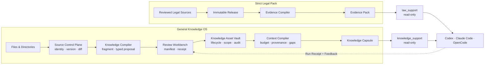

<p align="center">
  <strong>简体中文</strong> · <a href="README_EN.md">English</a>
</p>

<h1 align="center">DeepLaw 2.0</h1>

<p align="center">
  
</p>

<p align="center">
  <strong>为长期运行的 AI Agent 编译可验证知识。</strong><br />
  本地优先 · 来源可追溯 · 人工审核 · 生命周期治理 · 有界上下文 · 受控反馈
</p>

<p align="center">
  <a href="https://github.com/Eysn0130/DeepLaw/actions/workflows/ci.yml"></a>
  
  
  
  
  <a href="LICENSE"></a>
</p>

<p align="center">
  <a href="#从-v050-到-v060">版本亮点</a> ·
  <a href="#90-秒本地闭环">快速开始</a> ·
  <a href="#系统架构">系统架构</a> ·
  <a href="#已验证能力矩阵">能力矩阵</a> ·
  <a href="#agent-接入">Agent 接入</a> ·
  <a href="#信任边界">安全边界</a> ·
  <a href="#文档">文档</a>
</p>

<p align="center">
  
</p>

---

> **v0.6.0 状态：商业级内部发布候选。** CLI 控制面与可信闭环已通过 Python 3.11–3.13、
> macOS、Windows CI；跨系统领先仍等待秘密 held-out 与两家独立机构签名，不提前宣传。

DeepLaw 是 Codex、Claude Code、OpenCode 等 Agent 宿主之外的独立知识层。它不替代模型、
Agent Runtime、IDE、向量数据库或人类笔记工具，而是把知识从“搜到一段文本”升级为一条
可检查、可更新、可重放的供应链：

```text
来源 → 不可变版本 → 片段 → proposal → 人工审核
     → active Knowledge Assets → 有界 Capsule → Agent 任务
     → Run Receipt → 结构化反馈 → proposal / regression case
```

与普通 RAG 不同，检索命中不会让内容自动变得可信。DeepLaw 将原始字节、精确 locator、hash、
审核决定、生命周期和任务回执分别保存；任何绑定失效时都失败关闭。

中国法律能力是第一个严格 Domain Pack，使用独立进程和存储，保留官方来源、不可变 release、
时效和 receipt 规则。通用项目知识不能继承法律权威，案件私有资料不进入任何一个产品。

| Compile | Govern | Deliver |
| --- | --- | --- |
| 文件与目录成为带精确定位和不可变版本的 Knowledge Assets | proposal、quarantine、人工 Review Receipt 与显式 supersede/revoke | Context Compiler 只交付有预算、有来源、有 gaps 的 Knowledge Capsule |

## 从 v0.5.0 到 v0.6.0

v0.5.0 建立了“可验证知识内核”；v0.6.0 将它推进为可由 CLI 日常管理的完整控制面。

| v0.6.0 新闭环 | 交付结果 |
| --- | --- |
| **Source Control Plane** | 稳定 `source_key`、不可变版本、目录 manifest、diff/update/remove 与审核后原子切换 |
| **Review Workbench** | 精确 membership hash、reviewer identity、批量事务与不可变 Review Receipt |
| **Verified execution** | Capsule 验证后才能创建 Run Receipt，任务、来源、资产和 Vault revision 全部绑定 |
| **Feedback Compiler** | helpful/irrelevant/harmful/stale/missing 分类，生成 proposal、regression case 与 replay 对比 |
| **Safe operations** | migration plan/backup/apply/verify/rollback、权限 doctor、稳定 JSON/JSONL/human 输出 |
| **Release discipline** | 可重复 wheel/sdist、fresh-wheel 验收、Linux/macOS/Windows CI 与明确外部证据边界 |

## 为什么是 DeepLaw

| 常见知识系统 | DeepLaw 2.0 |
| --- | --- |
| chunk 或生成摘要逐渐成为实际真源 | 原始字节和定位片段始终是证据；摘要、图、embedding、Wiki 页面均为派生数据 |
| 文件更新后静默重复或覆盖旧知识 | 稳定 `source_key` 管理不可变版本、审核 diff 和显式 supersede/revoke |
| Agent 可以直接写入“记忆” | Agent MCP 永久只读；成长必须经过不可信 proposal 和人工审核 |
| 相似度被当作可信度或权威 | Discovery、Admission、Selection、Authority 分层处理 |
| Top-k 上下文噪声大、缺少来源 | Capsule 有条目、载荷、来源硬预算；每个 source-bound item 至少保留一条紧凑来源引用 |
| 反馈是脱离任务的自由文本 | 反馈绑定已验证 Capsule 与 Run Receipt，区分有用、无关、有害、过期和缺失知识，并形成可重放回归用例 |

<p align="center">
  
</p>

## 90 秒本地闭环

需要 Python 3.11+ 与 [`uv`](https://docs.astral.sh/uv/)。以下流程不下载可选模型，且只写入
临时 Vault。

```bash
git clone https://github.com/Eysn0130/DeepLaw.git
cd DeepLaw
uv sync --frozen

QUICKSTART_ROOT="$(mktemp -d)"
QUICKSTART_VAULT="$QUICKSTART_ROOT/vault"
printf '# Decision\nUse SQLite as the canonical local store.\n' > "$QUICKSTART_ROOT/project.md"

uv run deeplaw knowledge init \
  --vault "$QUICKSTART_VAULT" \
  --name quickstart \
  --scope project

SOURCE_RESULT="$(uv run deeplaw knowledge source add \
  --vault "$QUICKSTART_VAULT" \
  --source "$QUICKSTART_ROOT/project.md" \
  --typed-extraction deterministic-v1 \
  --confirm-no-case-data)"
SOURCE_ID="$(printf '%s' "$SOURCE_RESULT" | uv run python -c \
  'import json,sys; print(json.load(sys.stdin)["source"]["source_id"])')"

REVIEW_MANIFEST="$(uv run deeplaw knowledge review manifest \
  --vault "$QUICKSTART_VAULT" \
  --source-id "$SOURCE_ID")"
REVIEW_SHA="$(printf '%s' "$REVIEW_MANIFEST" | uv run python -c \
  'import json,sys; print(json.load(sys.stdin)["review_manifest_sha256"])')"

uv run deeplaw knowledge review approve-source \
  --vault "$QUICKSTART_VAULT" \
  --source-id "$SOURCE_ID" \
  --review-manifest-sha256 "$REVIEW_SHA" \
  --reviewer-id local-operator \
  --reason 'Reviewed the exact source and proposal.' \
  --confirm-reviewed

uv run deeplaw knowledge context \
  --vault "$QUICKSTART_VAULT" \
  --task 'Which local store must this project use?' \
  --confirm-no-case-data \
  --output "$QUICKSTART_ROOT/capsule.json"

uv run deeplaw knowledge verify-capsule \
  --vault "$QUICKSTART_VAULT" \
  --capsule "$QUICKSTART_ROOT/capsule.json"
```

命令默认返回稳定 JSON。在 `knowledge` 后使用 `--format jsonl` 或 `--format human`，可分别
获得紧凑机器事件或人类可读输出。审核步骤绑定精确 proposal membership；如果来源或队列
发生变化，批准会停止，而不是对移动目标继续执行。

## 系统架构


```mermaid
flowchart LR
  subgraph KOS["General Knowledge OS"]
    S["Files & Directories"] --> SC["Source Control Plane<br/>identity · version · diff"]
    SC --> KC["Knowledge Compiler<br/>fragment · typed proposal"]
    KC --> RW["Review Workbench<br/>manifest · receipt"]
    RW --> V["Knowledge Asset Vault<br/>lifecycle · scope · audit"]
    V --> CC["Context Compiler<br/>budget · provenance · gaps"]
    CC --> CAP["Knowledge Capsule"]
  end

  subgraph LEGAL["Strict Legal Pack"]
    LS["Reviewed Legal Sources"] --> LP["Immutable Release"]
    LP --> EC["Evidence Compiler"]
    EC --> EP["Evidence Pack"]
  end

  CAP --> KMCP["knowledge_support<br/>read-only"]
  EP --> LMCP["law_support<br/>read-only"]
  KMCP --> AGENT["Codex · Claude Code · OpenCode"]
  LMCP --> AGENT
  AGENT -. "Run Receipt + Feedback" .-> RW
```

SQLite 与内容寻址的 source fragment 是规范真源。Markdown/Obsidian 导出只是确定性人类视图，
永远不是第二数据库。

<p align="center">
  
</p>

这套循环保留了 v0.5.0 的 Evidence Core，并在 v0.6.0 增加 Source Version、Review Receipt、
Run Receipt 和结构化 Feedback，使每一次“成长”都能回到真实来源与人工门禁。

### 来源版本与原子更新

```bash
uv run deeplaw knowledge source list --vault "$QUICKSTART_VAULT"
uv run deeplaw knowledge source update \
  --vault "$QUICKSTART_VAULT" \
  --source-key sourcekey_REPLACE_WITH_EXACT_ID \
  --source ./project.md \
  --typed-extraction deterministic-v1 \
  --confirm-no-case-data
uv run deeplaw knowledge source diff \
  --vault "$QUICKSTART_VAULT" \
  --old-source-id source_REPLACE_OLD \
  --new-source-id source_REPLACE_NEW
```

后继版本的精确审核清单通过前，旧 active 版本继续可用。系统拒绝单项批准后继来源资产，因为
这会破坏原子切换。完整批准后，在一个事务内显式 supersede 对应知识并 revoke 已删除章节；
历史版本、原始字节和审计记录都保留。

目录摄取使用有界、可重放 manifest。每个文件是独立原子来源事务；失败文件不会损坏已成功
文件，并会在结果中明确列出。

```bash
uv run deeplaw knowledge source add-dir \
  --vault "$QUICKSTART_VAULT" \
  --directory ./docs \
  --recursive \
  --include '*.md' \
  --exclude 'archive/**' \
  --dry-run \
  --confirm-no-case-data
```

### Typed proposal 不是自动真相

`deterministic-v1` 只识别 Decision、Constraint、Procedure、Rule、Fact、Lesson、Question 等明确
标题线索。它是本地、确定性、可选且刻意受限的提取器。全部结果仍为 `proposed` 或
`quarantined`，永远不会依据提取器分数自动 active。通用模型提炼仍是实验能力，不进入默认
运行路径。

### Run Receipt 与反馈重放

```bash
uv run deeplaw knowledge run-receipt create \
  --vault "$QUICKSTART_VAULT" \
  --capsule "$QUICKSTART_ROOT/capsule.json" \
  --status partial \
  --host-name codex \
  --host-version local

uv run deeplaw knowledge feedback record \
  --vault "$QUICKSTART_VAULT" \
  --run-id run_REPLACE_WITH_EXACT_ID \
  --outcome partial \
  --missing-knowledge 'The rollback owner is not documented.' \
  --observation 'The storage decision was useful.' \
  --recommended-action 'Review a source-bound rollback owner decision.' \
  --confirm-no-case-data
```

反馈会形成需审核的 lesson proposal 和不含真实来源文本的 regression case。Replay 只比较历史
已验证 Capsule 与当前检索，不推断任务已经成功；所有开发结果都保持
`claim_eligible=false`。

## 已验证能力矩阵

这里的状态表示“实现 + 测试 + 可用 CLI/MCP 路径”，不是市场领先声明。

| 能力 | 状态 | 边界 |
| --- | --- | --- |
| 原始字节、fragment、locator、hash | **Supported** | 来源文本是不可信数据；选中原件会重新验 hash |
| 逻辑来源、不可变版本、diff/update/remove | **Supported** | 后继版本必须通过精确来源审核才能激活 |
| 单文件与有界目录摄取 | **Supported** | PDF、DOCX、受控转换的 legacy DOC、Markdown/TXT、代码、JSON/JSONL、YAML/TOML、CSV/TSV、SQL、XML/HTML/CSS/log 文本 |
| Review queue、manifest、本地 Review Receipt | **Supported** | v1 绑定 reviewer 与内容；签名明确为 `null` |
| Knowledge Asset 生命周期 | **Supported** | `proposed/quarantined → active → superseded/revoked`，仅人工审核可激活 |
| 确定性 typed extraction | **Operator-only** | 只识别明确标题线索，不宣称通用语义理解 |
| Context Capsule 与验证 | **Supported** | 条目、字符、载荷、来源硬预算；gaps 显式保留 |
| Task Run Receipt 与结构化 Feedback Ledger | **Supported** | Run 身份由已验证 Capsule 派生；replay 不推断任务成功 |
| 旧 Vault control migration 恢复 | **Supported** | apply 前验证备份、apply 后审计/生命周期验证、显式原子回滚 |
| 本地语义 Discovery Index | **Experimental** | 可删除、固定模型并绑定 Vault；不进入默认 Context/MCP |
| Markdown/Obsidian 投影 | **Supported (minimal)** | 单向 Asset/INDEX 投影；SQLite 仍是规范真源；丰富视图仍在规划 |
| `.dlk` 可移植包 | **Supported with restriction** | 只有内容完整性；导入后一律不可信隔离 |
| `knowledge_support` 与 `law_support` MCP | **Supported** | 独立进程、显式激活、只读、有界输出 |
| Windows 等价 owner-only ACL 证明 | **Not verified** | `knowledge doctor --permissions` 返回 `not_verified`；原生 ACL 门禁仍在路线图 |
| URL/Git connector、watch job、TUI/Web 审核台 | **Planned** | 不以空命令或文档占位冒充实现 |
| 跨系统性能领先 | **External verification pending** | 需要冻结 artifact、秘密 held-out 和两家真实独立机构签名 |

旧 v0.5 Vault 可以查看、应用、验证并回滚增量 control-plane migration。应用前会自动创建并
验证备份，数据库不会在无有效备份时进入迁移：

```bash
uv run deeplaw knowledge migrate --vault /path/to/vault
uv run deeplaw knowledge migrate --vault /path/to/vault --apply --backup /safe/vault-backup
uv run deeplaw knowledge migrate --vault /path/to/vault --verify --backup /safe/vault-backup
uv run deeplaw knowledge migrate --vault /path/to/vault \
  --rollback --backup /safe/vault-backup --confirm-rollback
uv run deeplaw knowledge doctor --vault /path/to/vault --permissions
```

## Agent 接入

DeepLaw 提供两个可选插件：

- `plugins/deeplaw-knowledge-os`：通用 `knowledge_support` leaf；
- `plugins/deeplaw`：中国 Legal Pack `law_support` leaf。

两个 MCP 均永久只读。导入、审核、激活、记录反馈、删除和迁移仍是离线 CLI 管理操作。
Codex、Claude Code、OpenCode 配置和“实机验证/仅静态验证”的区别见
[`docs/AGENT_ADAPTERS.md`](docs/AGENT_ADAPTERS.md)。

```json
{
  "operation": "context",
  "task": "Prepare the migration while preserving reviewed project constraints",
  "confirm_no_case_data": true
}
```

面向 Provider 的 search 最多返回五张 evidence card；完整内容按精确 Asset 或 segment ID 获取。
`restricted` Knowledge Asset 永远不会越过 Agent MCP 边界。

## 中国 Legal Pack

Legal Pack 不是通用 Vault 的一个 preset。它将官方目录、用户私有法律参考、不可变 release、
时效、Evidence Duties 和 receipts 物理及语义隔离。HTTPS 官方目录必须通过精确字节 Ed25519
验签；私有参考永远不能继承官方 authority、排名或审核状态。

<p align="center">
  
</p>

详见 [`docs/DEEPLAW_2.md`](docs/DEEPLAW_2.md) 与
[`docs/CORPUS_GOVERNANCE.md`](docs/CORPUS_GOVERNANCE.md)。DeepLaw 提供法律研究证据，不会仅凭
检索结果判断某条规则适用于具体案件。

## 信任边界

- Agent MCP 没有 write、learn、remember、approve、import、revoke 或 delete 操作；
- MCP 只读不等于操作系统沙箱。如果宿主授予 Agent 同账户任意 Shell，它仍可能调用离线管理
  CLI；必须由宿主工具策略或独立 OS 身份阻断；
- Vault 拒绝 symlink root 和受保护文件，并检查 POSIX owner-only mode；当前尚未机械证明
  Windows NTFS ACL 的等价隔离；
- 导入文本可能包含 prompt injection。只有 active、human-reviewed 的 constraint/rule/procedure
  可以携带 `reviewed_instruction`，且仍不能覆盖宿主、仓库、开发者或当前用户指令；
- 案件私有文件、事实、聊天和标识符不得进入 Knowledge OS 或 Legal Pack，测试必须使用隔离
  合成 fixture；
- `.dlk` v1 只验证内容完整性，不认证发布者身份；导入永远失去来源 trust 并进入 quarantine。

在向宿主开放本地 Shell 或文件系统前，请阅读 [`SECURITY.md`](SECURITY.md)。

## Benchmark 与证据状态

开发评测会尽量绑定源码、依赖锁、语料/查询 hash、参数和硬件。它们只用于诊断，不是外部
声明，统一标记 `claim_eligible=false`。

外部协议和 evaluator tooling 已准备，但当前状态仍是：

```text
pending_external_execution
```

本版本尚未取得秘密 held-out 运行结果，也没有两家真正独立机构的签名复现。因此 DeepLaw
不会宣称“最好”“世界第一”或全面超过所有 RAG、GraphRAG、Memory、Wiki 或笔记系统。详见
[`docs/BENCHMARKS.md`](docs/BENCHMARKS.md) 与
[`docs/EXTERNAL_BENCHMARK_PROTOCOL.md`](docs/EXTERNAL_BENCHMARK_PROTOCOL.md)。

## 开发与验证

```bash
uv lock --check
uv run ruff check .
uv run pytest
uv build
uv run --frozen python benchmarks/verify_fresh_wheel.py --dist dist
git diff --check
```

运行时支持 Python 3.11–3.13。任何可选文档引擎模型变更都要求重新安全审计、更新 OpenVEX，
并执行真实 PDF 抽取测试。

## 文档

| 文档 | 用途 |
| --- | --- |
| [`docs/KNOWLEDGE_OS.md`](docs/KNOWLEDGE_OS.md) | Knowledge Asset、Context、生命周期和安全契约真源 |
| [`docs/CLI_LIFECYCLE.md`](docs/CLI_LIFECYCLE.md) | Source → review → Capsule → run → feedback → update 完整流程 |
| [`docs/ARCHITECTURE.md`](docs/ARCHITECTURE.md) | 产品隔离与运行架构 |
| [`docs/DEEPLAW_2.md`](docs/DEEPLAW_2.md) | 中国 Legal Pack 设计与当前边界 |
| [`docs/BENCHMARKS.md`](docs/BENCHMARKS.md) | 可复现内部证据与限制 |
| [`docs/EXTERNAL_BENCHMARK_PROTOCOL.md`](docs/EXTERNAL_BENCHMARK_PROTOCOL.md) | 独立秘密评测协议 |
| [`ROADMAP.md`](ROADMAP.md) | 未完成事项、依赖与验收门禁 |
| [`CONTRIBUTING.md`](CONTRIBUTING.md) / [`SECURITY.md`](SECURITY.md) | 贡献与安全政策 |

历史施工方案位于 [`docs/archive/`](docs/archive/)，不再充当当前实现真源。

## 贡献与许可证

欢迎提交 Issue 和范围明确的 Pull Request。请保留来源、审计与生命周期边界，为每项契约变更
增加测试，并且不要提交法律原件、生成 release 数据库、凭据或私有笔记。

DeepLaw 使用 [Apache License 2.0](LICENSE)。上游说明见
[`THIRD_PARTY_NOTICES.md`](THIRD_PARTY_NOTICES.md)。
