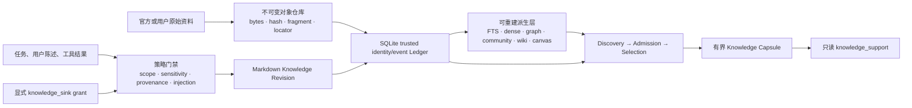

<p align="center">
  <strong>简体中文</strong> · <a href="README_EN.md">English</a>
</p>

<h1 align="center">DeepLaw</h1>

<p align="center">
  
</p>

<p align="center">
  <strong>Local-first Agent Knowledge OS</strong><br />
  <sub>Source-to-Knowledge Compiler · Governed Living Wiki · Verifiable Context</sub>
</p>

<p align="center">
  <a href="https://github.com/Eysn0130/DeepLaw/actions/workflows/ci.yml"></a>
  <a href="https://github.com/Eysn0130/DeepLaw/releases/tag/v0.11.0"></a>
  
  
  <a href="LICENSE"></a>
</p>

<p align="center">
  <strong>DeepLaw 是面向 Agent 的本地优先知识操作系统</strong><br />
  将原始资料持续编译为受治理的 Living Wiki，并向不同 Agent 提供可验证、有边界、可追溯的知识上下文。
</p>

## 从原始资料到可用知识

DeepLaw 是 **Source-to-Knowledge Compiler**：它不把资料简单转换成 Markdown，而是保留原始来源，
将其持续编译为长期、类型化、可验证、可演化的知识对象，再投影为人和 Agent 都能使用的
Living Wiki。

| Compile · 编译 | Govern · 治理 | Deliver · 交付 |
| --- | --- | --- |
| 保留原始字节、结构、locator 与 hash，生成稳定、类型化的知识对象 | 以 identity、revision、provenance、authority、scope 和 audit 约束持续演化 | 通过 CLI 与 MCP 为每个任务返回有界 Knowledge Capsule，而不是倾倒整个 Vault |

### DeepLaw 不是什么

- 普通 RAG；
- 单纯的 Markdown 笔记工具；
- Obsidian 替代品；
- 只面向法律的问答系统；
- 单一 Agent 的 Memory 插件。

DeepLaw 不替代 Codex、Claude Code、OpenCode 或其他 Agent Runtime。模型、会话编排和通用工具仍由
宿主控制；DeepLaw CLI 是第一方核心入口，MCP 是面向 Agent 的核心协议入口。未来 GUI 只会建立在
同一领域服务之上。

> [!NOTE]
> **DeepLaw 2.0 是产品品牌，不是软件版本号。** **本地单用户 Agent Knowledge OS** 是当前交付边界。
> 当前软件版本 `v0.11.0` 在 0.10 的可验证质量闭环之上，正式交付宿主中立
> Source-to-Knowledge Compilation Run、Rich Living Wiki Projection、compiled-first /
> evidence-first 查询、受控 backfill 和 28-source Authoritative Pack 质量门禁。旧版
> proposal/review 工作流只保留为
> 来源编译、外部导入和迁移兼容面，不再是 Agent 派生知识的默认激活路径。当前契约与迁移边界见
> [`docs/AUTONOMOUS_KNOWLEDGE_OS.md`](docs/AUTONOMOUS_KNOWLEDGE_OS.md)。

## 核心边界

- **local-first、single-user、owner-controlled**：规范状态默认只在本机；无远程 canonical
  database、内容遥测或隐式联网。
- **双知识平面**：官方/用户原件进入不可变证据平面；任务结论、经验、概念、关系、记忆、Wiki 和
  Skill 进入 Agent 自主知识平面。Ledger 与索引是支撑层，不是第三种 Authority。
- **Markdown-native，不是 Markdown-only**：Agent 派生知识的正文和开放元数据以稳定 ID 的
  Markdown revision 承载；SQLite Ledger 裁决 authority、scope、sensitivity、双时态、writer、
  lineage 与审计；原始字节进入内容寻址对象仓库。
- **自主写入不等于权威升级**：已授权 Agent 知识可以直接 `active`，但始终
  `origin=agent_derived`、`authority=agent_derived`、`legal_authority=false`。来源伪造、权限扩大、
  存储型 prompt injection 和治理字段篡改进入 quarantine。
- **查询与写入分离**：`knowledge_support` 永久只读；`knowledge_sink` 是另一个进程、另一个 leaf，
  必须由 owner 显式创建 scope-bound grant 后才能启动。`law_support` 继续独立且只读。
- **法律资料不混权威**：官方 Legal Pack、用户私有法律库和 Agent 派生解释分别准入与展示；排名、
  embedding、图权重和模型 confidence 都不能产生官方身份或法律适用结论。


```mermaid
flowchart LR
  E["官方或用户原始资料"] --> CAS["不可变对象仓库\nbytes · hash · fragment · locator"]
  A["任务、用户陈述、工具结果"] --> G["策略门禁\nscope · sensitivity · provenance · injection"]
  G --> M["Markdown Knowledge Revision"]
  CAS --> L["SQLite trusted identity/event Ledger"]
  M --> L
  L --> D["可重建派生层\nFTS · dense · graph · community · wiki · canvas"]
  D --> Q["Discovery → Admission → Selection"]
  L --> Q
  Q --> C["有界 Knowledge Capsule"]
  C --> R["只读 knowledge_support"]
  S["显式 knowledge_sink grant"] --> G
```

## 快速开始

正式版本使用 Python 3.11+ 与 [`uv`](https://docs.astral.sh/uv/)：

```bash
uv tool install \
  https://github.com/Eysn0130/DeepLaw/releases/download/v0.11.0/deeplaw-0.11.0-py3-none-any.whl
deeplaw --version
```

开发工作树：

```bash
uv sync --all-extras

# 新 Vault 默认同时安装 Markdown-native autonomous core；不会自动启用写权限
uv run deeplaw knowledge init --vault ./vault --name my-project --scope project

# owner 显式创建最小权限 grant；token 只写入 Vault 内 owner-only capability 文件
uv run deeplaw knowledge sink enable \
  --vault ./vault \
  --writer-id codex-local \
  --scope project \
  --max-sensitivity private
```

普通 Agent grant 默认只能记录 `agent_self_report`。如需记录 `user` 或 `external_check` 评价，
owner 必须用 `--feedback-evaluator-type` 创建独立、最小权限的评价 grant；评价标签不能由写入 Agent
自行提升。未传 `--operation` 时 grant 只允许 `remember`；其他 mutation 必须逐项显式加入。
`remember` 只承载普通 Knowledge Object，不能代替 `upsert_concept`、`save_synthesis` 或
`save_skill`；这些语义更强的类型必须由 grant 和请求同时选择对应 operation。

把一次 mutation 写成 closed JSON contract；每次调用都要求 idempotency key 与案件数据边界确认。
凡是声明 `run_id` 的知识必须先提交同 scope/sensitivity 的不可变 Run Record，不能用一个自由文本 ID
伪造 provenance：

```json
{
  "operation": "record_run",
  "idempotency_key": "run-42-record",
  "confirm_no_case_data": true,
  "run_id": "run-42",
  "task": "Prepare the release decision.",
  "host_id": "codex-local",
  "model_id": "host-model",
  "status": "succeeded",
  "scope": "project",
  "sensitivity": "private"
}
```

随后提交 Knowledge Revision：

```json
{
  "operation": "remember",
  "idempotency_key": "run-42-release-decision",
  "confirm_no_case_data": true,
  "title": "Release uses one commit coordinator",
  "body": "All durable knowledge writes pass through the shared coordinator.",
  "kind": "decision",
  "scope": "project",
  "sensitivity": "private",
  "run_id": "run-42",
  "model_id": "host-model",
  "tool_id": "codex"
}
```

```bash
uv run deeplaw knowledge sink apply \
  --vault ./vault \
  --grant-id grant_REPLACE_WITH_RETURNED_ID \
  --request ./remember.json

uv run deeplaw knowledge autonomy recall \
  --vault ./vault --query "release coordinator"

uv run deeplaw knowledge autonomy explain \
  --vault ./vault --query "release coordinator"

uv run deeplaw knowledge autonomy graph --vault ./vault --limit 20

uv run deeplaw knowledge autonomy identity \
  --vault ./vault --query "release coordinator"

uv run deeplaw knowledge autonomy gaps --vault ./vault

uv run deeplaw knowledge autonomy context \
  --vault ./vault \
  --task "prepare the release" \
  --confirm-no-case-data

uv run deeplaw knowledge autonomy verify --vault ./vault
uv run deeplaw knowledge sink status \
  --vault ./vault --grant-id grant_REPLACE_WITH_RETURNED_ID
```

已有 `v0.7` Vault 使用带预迁移备份的显式路径：

```bash
uv run deeplaw knowledge autonomy migrate --vault ./vault --backup ./vault-v07-backup
uv run deeplaw knowledge autonomy rollback \
  --vault ./vault --backup ./vault-v07-backup --confirm
```

## 开放 Markdown 工作面

Vault 使用稳定 ID，而不是路径作为身份。Obsidian、Tolaria 或普通编辑器可以 rename/move 文件；内容
变化只有经过 reconcile 才成为带 writer、hash、parent revision 与 Ledger event 的新版本。重复 ID、
陈旧 base revision、来源/authority/scope 篡改都会保留冲突副本并恢复当前可信版本。
当工作面存在尚未 reconcile 的正文变化时，CLI 或 Sink 的直接更新会拒绝覆盖并先保存冲突；路径
仍在受限工作区内的 rename/move 会保持稳定 ID，后续直接 revision 不会把它移回默认文件名。

```bash
uv run deeplaw knowledge autonomy reconcile \
  --vault ./vault \
  --grant-id grant_REPLACE_WITH_RETURNED_ID \
  --confirm-no-case-data

# 显式前台 Watcher；每轮仍调用同一 reconcile/commit coordinator
uv run deeplaw knowledge autonomy watch \
  --vault ./vault \
  --grant-id grant_REPLACE_WITH_RETURNED_ID \
  --confirm-no-case-data --interval 2

uv run deeplaw knowledge autonomy lint --vault ./vault
uv run deeplaw knowledge autonomy rebuild --vault ./vault

# 遗忘后先 dry-run，再由 owner 明确确认擦除 eligible Agent Knowledge bytes
uv run deeplaw knowledge autonomy gc --vault ./vault
uv run deeplaw knowledge autonomy gc --vault ./vault --no-dry-run --confirm \
  --reason "owner retention policy"

# 只把含显式 completion criterion 的 Procedure 编译为受治理 draft Skill
uv run deeplaw knowledge autonomy skill-draft \
  --vault ./vault --grant-id grant_REPLACE_WITH_RETURNED_ID --request ./skill-draft.json
```

典型布局：

```text
vault/
├── sources/                 # 原件视图；实际字节同时进入 CAS
├── knowledge/               # claim/concept/entity/event/decision/procedure/...
├── memory/                  # working/episodic/semantic/procedural/reflective
├── skills/                  # versioned Skill Knowledge Objects
├── wiki/                    # 可重建 Living Wiki 导航
├── canvas/                  # 可重建 JSON Canvas
├── .deeplaw/
│   ├── objects/sha256/      # immutable content-addressed objects
│   ├── ledger.sqlite3       # identity, governance, bitemporal state, audit
│   ├── capabilities/        # owner-only sink tokens
│   ├── staging/             # crash recovery and preserved conflicts
│   └── derived/             # rebuildable indexes and manifests
└── vault.sqlite3            # only an unmigrated v0.7 compatibility location
```

## Agent 接入

| 进程 / leaf | 权限 | 用途 |
| --- | --- | --- |
| `deeplaw knowledge mcp --stdio` / `knowledge_support` | 只读 | v4：recall/get/lineage/graph/identity/gaps/Wiki/verify/Capsule、compilation 状态和 purpose-aware query |
| `deeplaw knowledge sink mcp --grant-id … --stdio` / `knowledge_sink` | 显式、scope-bound mutation | v3：受控 mutation、独立 allowlist 的 Compilation Run 与 backfill；默认插件仍不注册 |
| `deeplaw mcp --stdio` / `law_support` | 只读、独立存储 | 官方与用户私有法律证据，以及显式分区的 authority-aware federated context；单分区最多五张 evidence cards |

默认 `deeplaw-knowledge-os` 插件只注册 `knowledge_support`。启用 `knowledge_sink` 必须由 owner 在宿主
配置中单独添加进程和具体 grant ID；插件、Skill、检索内容和模型都不能自行创建 grant 或扩大权限。

## 已实现、兼容与未宣称

| 状态 | 内容 |
| --- | --- |
| **Current** | v0.11.0：Source-to-Knowledge Compilation Run、closed Plan/Receipt、依赖/新鲜度、Rich Living Wiki、compiled-first/evidence-first 查询、受控 backfill、稳定 API/CLI/MCP、编辑器 Bridge，以及 Living Wiki/28-source/fresh-wheel/release-bound 质量门禁 |
| **Compatibility** | v0.7 Source IR、reviewed Knowledge Asset、proposal Inbox、Workbench、retrieval fabric 和 package 命令仍可使用；`knowledge_support` 在迁移后以独立分区联合旧 source-derived 结果 |
| **Quality closure** | DeepLaw Evaluation Protocol v1 以公开、维护者可见、时间冻结的 holdout 评估仓库检索、自治安全和 Typed Compiler；发布报告绑定 exact wheel、commit、freeze 和逐项结果。无需外部机构认证 |
| **Comparative closure pending** | 未执行真实 Codex / Claude Code / OpenCode 模型任务与具名基线的同条件比较；没有配对置信区间和完整成本/失败清单，因此 `competitive_claim_eligible=false` |
| **Not claimed** | 没有远程 SaaS、多人控制平面、自动法律适用/裁判或模型自授予权限；公开 holdout 不被描述为 secret、unseen 或 contamination-free，也不宣称全面领先或 SOTA |

## 安全与验证

- 导入文件、网页、Markdown、Wiki、tool result、模型输出和 memory 都是不可信数据。
- 新来源的 CLI 事务成功后会同步 exact bytes/CAS evidence binding；`knowledge doctor` 与
  `autonomy verify` 同时检查 legacy 和 autonomous 规范面，未同步的旁路写入会 fail closed。
- `restricted`、越权 scope、本地绝对路径、capability token、凭据和案件资料不得经 Agent 查询面输出。
- 官方 catalog 在解析和下载前对 exact bytes 做 Ed25519 验签，并实施 key revocation、catalog identity、
  sequence 与回滚防护；网络 catalog 不接受 unsigned-development bypass。
- 自主 snapshot 包含规范 Markdown、对象仓库、Ledger、Inbox provenance artifacts 与 capability
  状态（包括 owner-only capability material）；默认还保留 resumable operation/source-snapshot 与
  retrieval-profile operator state，`--no-include-operator-state` 可显式排除后者。它不包含可重建的
  Wiki、Canvas 和检索 cache；snapshot 必须按凭据等级保护、不得提交或分享，恢复后必须重建派生层。
- 任何 benchmark 结论必须固定 corpus、split、模型、prompt、权限、预算、硬件、网络和成本口径。

运行完整自主可验证评测（源码运行可验证质量；正式宣称资格只授予 clean commit 上的 exact wheel）：

```bash
uv run python -m benchmarks.evaluation.run_protocol \
  --repository . \
  --output-dir /tmp/deeplaw-evaluation
uv run python -m benchmarks.evaluation.run_protocol \
  --repository . \
  --verify-report-dir /tmp/deeplaw-evaluation
```

交付前验证：

```bash
uv run pytest
uv run ruff check .
git diff --check
```

## 文档

| 文档 | 说明 |
| --- | --- |
| [`docs/AUTONOMOUS_KNOWLEDGE_OS.md`](docs/AUTONOMOUS_KNOWLEDGE_OS.md) | 当前自主内核契约、迁移、CLI/MCP、安全与限制 |
| [`docs/LIVING_WIKI_COMPILER.md`](docs/LIVING_WIKI_COMPILER.md) | 工作树 Compiler 协议、CLI/API/MCP、恢复与真实示例 |
| [`docs/EDITOR_BRIDGES.md`](docs/EDITOR_BRIDGES.md) | Obsidian/Tolaria Bridge、Editor Context Envelope 与安全边界 |
| [`docs/LIVING_WIKI_BENCHMARK_PROTOCOL.md`](docs/LIVING_WIKI_BENCHMARK_PROTOCOL.md) | 具名比较协议与 `not_executed` 证据状态 |
| [`docs/LIVING_WIKI_ACCEPTANCE_REPORT_2026-07-30.md`](docs/LIVING_WIKI_ACCEPTANCE_REPORT_2026-07-30.md) | 历史 pre-release 工作树实现报告；不是正式发布证据 |
| [`docs/ARCHITECTURE.md`](docs/ARCHITECTURE.md) | 当前系统架构、事务边界与派生层 |
| [`docs/KNOWLEDGE_OS.md`](docs/KNOWLEDGE_OS.md) | v0.7 兼容面和当前覆盖说明 |
| [`docs/DEEPLAW_2.md`](docs/DEEPLAW_2.md) | 双层 Legal Pack 与法律检索边界 |
| [`docs/AGENT_ADAPTERS.md`](docs/AGENT_ADAPTERS.md) | Codex、Claude Code、OpenCode 的薄适配与隔离 |
| [`docs/BENCHMARKS.md`](docs/BENCHMARKS.md) | 可复现评测与领先性证据边界 |
| [`docs/EVALUATION_PROTOCOL.md`](docs/EVALUATION_PROTOCOL.md) | Evaluation Protocol 固定评分、冻结规则、报告和宣称边界 |
| [`docs/V0_11_ACCEPTANCE_MATRIX.md`](docs/V0_11_ACCEPTANCE_MATRIX.md) | v0.11 的 48 项验收、28 项交付物与 28-source 质量门禁 |
| [`docs/RELEASE_NOTES_v0.11.0.md`](docs/RELEASE_NOTES_v0.11.0.md) | v0.11.0 发布说明、限制与升级边界 |
| [`commercial-release-manifest.json`](https://github.com/Eysn0130/DeepLaw/releases/download/v0.11.0/commercial-release-manifest.json) | v0.11.0 exact-tag、制品、Schema、迁移和平台绑定 |
| [`post-release-verification.json`](https://github.com/Eysn0130/DeepLaw/releases/download/v0.11.0/post-release-verification.json) | 从公开 Release 下载后的 Hash、签名、provenance 与安装复验 |
| [`SECURITY.md`](SECURITY.md) | 威胁模型和安全报告渠道 |

DeepLaw 以 [Apache License 2.0](LICENSE) 开源。请勿提交法律原件、生成 release database、凭据、
签名私钥、私有笔记或包含用户材料的本地路径。
