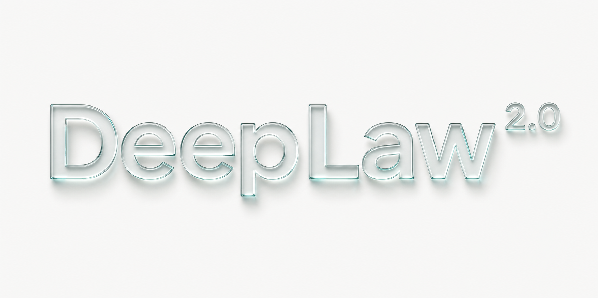

<p align="center">
  <strong>简体中文</strong> · <a href="README_EN.md">English</a>
</p>

<h1 align="center">DeepLaw 2.0</h1>

<p align="center">
  
</p>

<p align="center">
  <strong>本地单用户 Agent Knowledge OS。</strong><br />
  可验证来源 · Identity v2 · 多通道召回 · Knowledge Capsule · 人工治理
</p>

<p align="center">
  <a href="https://github.com/Eysn0130/DeepLaw/actions/workflows/ci.yml"></a>
  
  
  
  
  <a href="LICENSE"></a>
</p>

> **v0.7.0 商业正式版。** 商业发布资格与竞争性领先声明已经分离：正式发布清单固定
> `commercial_release_eligible=true`、`competitive_claim_eligible=false`。真实模型任务 E2E、
> 17 项具名基线、秘密 held-out 和独立机构签名尚未完成，因此本版本不宣称 best、SOTA、
> 整体最优或超过全部基线；无模型宿主生命周期也不被描述成模型任务验收。

DeepLaw 永久聚焦本地单用户场景。它不是暂时缺少云服务，也不以多租户、团队 RBAC、远程
数据库、中心服务或企业 SaaS 为演进方向。默认无遥测；规范状态只存在于所有者本机的 SQLite、
内容寻址来源片段和追加审计链中。

## 一条命令安装，五步 Golden Path

从 GitHub Release 的已签名 wheel 一条命令安装：

```bash
uv tool install https://github.com/Eysn0130/DeepLaw/releases/download/v0.7.0/deeplaw-0.7.0-py3-none-any.whl
```

随后不需要解析 JSON、复制 `source_id`、`asset_id` 或 manifest hash：

```bash
# 1. 初始化本地 Vault
deeplaw init ./vault --name my-project

# 2. 摄取文件或目录；任务可续跑、重试和取消
deeplaw add ./docs --vault ./vault --confirm-no-case-data

# 3. 在本地交互审核 proposal
deeplaw review --vault ./vault --interactive

# 4. 自动生成 Query Plan、Retrieval Trace 和有界 Capsule，并立即验 Capsule
deeplaw recall "项目发布前必须满足哪些约束？" \
  --vault ./vault --confirm-no-case-data --output capsule.json

# 5. 查看上一次召回的可解释轨迹
deeplaw explain --vault ./vault --last
```

`recall` 的结果同时包含 `capsule_verification`，失败关闭而不是交付一个无法验证的上下文。
高级 `deeplaw knowledge ...` 命令继续提供稳定 `human/json/jsonl` 输出和精确运维控制。

## 产品闭环

```text
文件 / 目录 / 结构化数据
  → Source Adapter → Source IR / Source Tree
  → 不可变 Source Revision → Many-to-Many Compiler
  → quarantined / proposed Knowledge Revision
  → 人工 Review Receipt → active Knowledge Asset
  → Query Plan → 多通道 Candidate Fusion → Admission / Selection
  → token-aware Knowledge Capsule → Agent
  → Capsule-bound Run Record → 结构化 Feedback → Proposal Inbox
```

检索命中、模型评分、图关系或 embedding 都不会赋予 authority。只有 exact source binding、有效
生命周期、策略允许和人工审核共同满足时，候选才可进入 Capsule。来源文本始终视为不可信数据。


```mermaid
flowchart LR
  S["Local sources"] --> A["Source Adapters"]
  A --> IR["Source IR / Tree"]
  IR --> C["Many-to-Many Compiler"]
  C --> R["Human Review"]
  R --> V["Identity v2 Vault"]
  V --> Q["Evidence-Governed Retrieval Fabric"]
  Q --> K["Knowledge Capsule"]
  K --> M["read-only knowledge_support"]
  M --> G["Codex · Claude Code · OpenCode"]
  G -. "Run Record / feedback artifact" .-> I["Isolated Proposal Inbox"]
  I -. "operator review only" .-> R
```

通用 Knowledge OS 与中国 Legal Pack 使用不同插件、进程和存储。`knowledge_support` 与
`law_support` 均永久只读，不能互相路由，也不会自动激活。

## Recall、Explain 与 Lineage

Retrieval Fabric 会先编译可哈希的 Query Plan，再运行 exact、fielded BM25、Source Tree、
reviewed graph、temporal、feedback 以及显式启用的 Dense / 本地 reranker 通道。RRF、来源多样性、
Knowledge Duties、生命周期、scope、敏感度和 token 预算在统一边界内处理。词法完全无命中时可执行
有界 ASCII 单编辑 typo repair；reviewed graph 最多扩展两跳，仍受同一 evidence admission 和通道预算
约束。

```bash
deeplaw recall "截至 2026-07-01 当前发布流程和例外是什么？" \
  --vault ./vault --mode hybrid --as-of 2026-07-01T23:59:59Z \
  --max-tokens 4096 --confirm-no-case-data

deeplaw explain --vault ./vault --last --format json
deeplaw knowledge lineage --vault ./vault --asset-id asset_REPLACE_WITH_EXACT_ID
deeplaw knowledge lineage --vault ./vault --map-status split \
  --from-asset-id asset_PREDECESSOR --to-asset-id asset_SUCCESSOR_A \
  --to-asset-id asset_SUCCESSOR_B --reason 'Reviewed source-bound split.' \
  --confirm-reviewed
deeplaw knowledge relation list --vault ./vault --mode past
deeplaw knowledge relation carry-forward --vault ./vault
```

高级 Lineage 命令只接受 exact source-bound Identity v2 revisions；split/merged/ambiguous mapping 会在
所有涉及的 Knowledge Key 下记录同一人工证据，不创建或激活知识，也不继承批准。普通操作员可在
Workbench 中按可见行号完成相同审核，无需复制内部 ID。

来源更新后，unchanged 关系端点只会生成待审核的 carry-forward candidate；modified/renamed/moved
端点进入 full review，deleted/split/merge/ambiguous 端点不会进入当前图。Golden `review` 与本地
Workbench 可直接处理队列，不继承旧审核，也不要求常规流程复制 relation ID。

显式启用已验证的本地 Dense sidecar 时，可在 `recall` / `explain` 上提供
`--discovery-index`、`--model-root` 和 `--threads`；不提供时不会静默联网、下载模型或假装执行
semantic 通道。

Explain Trace 记录每个通道的候选、rank fusion、reranker rank、排除原因、来源覆盖、Duty 缺口和
最终预算；数值融合值明确不是概率，排序器也不能改变权威或审核状态。

可选本地 reranker 必须由 manifest 固定 executable、closed argv、模型 revision、所有模型文件的
SHA-256、候选上限和 timeout。它只能重排已存在候选。DeepLaw 不把进程参数当作网络沙箱；如需
机械禁止出网，操作员仍须配置操作系统 egress policy。

## Source Identity v2 与 Source IR

Identity v2 将以下身份分开保存：

- collection + logical path 形成稳定 Source Identity；rename/move 产生显式映射；
- source bytes 形成不可变 Source Revision；
- parser/config/fragment inventory 形成 Compilation Identity；
- proposal set、Knowledge Revision 和 Governance Revision 各自独立；
- 一个 Knowledge Revision 可以引用多个 source fragment，一个 fragment 也可以支持多个知识；
- split、merge、modified、deleted、ambiguous lineage 保留来源绑定的人工映射证据；
- relation revision 同时记录 event time、valid time、observed time、review time 和 ingest time。
- relation carry-forward 只生成 inactive proposal；modified 端点必须重新审核，deleted/ambiguous
  端点保持阻断。

Source Adapter 当前覆盖 Markdown/TXT、HTML、PDF、DOCX、PPTX、XLSX、EPUB、代码、
JSON/JSONL/YAML/TOML、CSV/TSV、SQL、对话和 tool result。Python 使用 AST；
JavaScript/JSX、TypeScript/TSX、Java、Go、Rust 使用 exact-pinned 官方 Tree-sitter grammar，
core/grammar 版本进入 compilation identity；SQL 使用 exact-pinned SQLGlot AST，保留 statement、
CTE、table、column 与 line span。解析器版本、语法恢复和超界或失败后的 bounded lexical fallback
都显式记录质量标记。标题、页面、表格、单元格、symbol、数据 path、SQL structure、locator、顺序
和 hash 进入 Source IR；结构浏览不依赖生成摘要。OOXML/EPUB 在读取内容前校验完整 archive 与
relationship inventory，并限制 XML byte/node/depth；XLSX 还拒绝重复或越界 cell、无效 shared-string、
混乱 row order 和非法 merged range。

显式连接器只生成 owner-only、hash-bound 的一次性 Source Snapshot，不注册后台同步。HTTPS
只接受无凭据、query、fragment 的公共 DNS `https://...:443`，逐跳重新执行 SSRF 门禁，固定已解析
IP 与 TLS hostname，拒绝压缩响应、超过 5 次重定向和超过 64 MiB 的内容；可再用调用者给定的
SHA-256 固定下载字节。远程内容始终以 `untrusted` 进入审核。Git 只读取已有本地仓库的完整
40/64 hex commit，不 clone、不 checkout、禁用 lazy fetch，也不把本地仓库路径写入 canonical
Source Identity。两条路径都不会自动 active，也不会进入 MCP 写面。

```bash
deeplaw knowledge structure list --vault ./vault --source-id source_REPLACE
deeplaw knowledge structure search --vault ./vault --query "rollback"
deeplaw knowledge structure trace --vault ./vault --node-id irnode_REPLACE
deeplaw sync --vault ./vault --watch --interval 2
deeplaw knowledge source show --vault ./vault --alias docs/policy.md --active
deeplaw knowledge source diff --vault ./vault --alias docs/policy.md --latest

# 显式 HTTPS 快照；--dry-run 不联网也不写快照
deeplaw add --url https://example.org/guide.md --expected-sha256 SHA256_REPLACE \
  --vault ./vault --confirm-network --confirm-no-case-data

# 已有本地 Git 仓库的精确 commit；更新时再次显式运行 add
deeplaw add --git-repository ./repo --git-revision FULL_COMMIT_REPLACE \
  --git-repository-id product-docs --include '*.md' --vault ./vault \
  --confirm-local-repository --confirm-no-case-data
```

`--alias` 使用规范化 logical path；审核后的 rename/move 仍可由历史 path 找到同一 Source
Identity。`--active` 选择当前审核版本，`--latest` 可查看尚待审核的 successor；alias 复用产生歧义时
命令失败关闭；同一 Source Identity 有多个并行 pending successor 时，`--latest` 也失败关闭，不会
依赖秒级时间戳或内部 ID 猜测。

`deterministic-v2` 是默认可重放 compiler。`local-model-v1` 和
`external-model-explicit` 必须固定 extractor manifest；外部模式还要求逐次确认 disclosure。
所有模型输出仍只进入 proposal/quarantine，绝不自动 active。

## 本地人类工作面与 Obsidian

```bash
# 启动 curses 本地 TUI；非 TTY 环境输出同一 workbench snapshot JSON
deeplaw open --vault ./vault

# 生成丰富但非规范的 Markdown + JSON Canvas 投影
deeplaw open --vault ./vault --obsidian --print-uri
```

Operator Workbench 包含 Source List/Tree/Diff、side-by-side review、approve/reject/edit/split/merge、
按可见行审核 cross-key Lineage mapping、Recall、Explain、Lineage、Relations、Current/Historical、
Capsule、Feedback、Health 和 benchmark 边界。多项 approve/reject 是单事务操作，任一项失败会整体
回滚；quarantined proposal 的批准还要求独立风险确认。Obsidian/Canvas 投影包含 sources、knowledge、
concepts、decisions、constraints、procedures、
experiences、questions、relations、history、Capsules 和 feedback 页面。

投影不是数据库。编辑投影后只能执行 diff，并生成带来源绑定的 quarantined proposal；不能覆盖
active Asset，也不继承旧批准。

## Inbox、Skill Factory 与可靠性

Agent 或外部工具只能把有界 `.dlproposal`、`.dlfeedback`、`.dlrun`、`.dleval` 写入物理隔离的
Inbox。导入 proposal 会把 artifact 原始字节登记为不可信 Source Revision，再生成
Identity-v2-bound quarantine；canonical Vault 写入仍只能由离线 operator command 完成。

Skill Factory 从 active、source-bound Knowledge 生成固定 manifest、最小 source refs、预算和测试
fixture。外部 Skill 导入默认 quarantine；Skill 只携带只读 recall/context 指令，不携带审核、导入、
删除或管理命令。

本地可靠性命令覆盖 resumable job、retry/cancel/crash recovery、watch、atomic update、snapshot、
restore、GC、orphan detection、derived rebuild、migration、rollback、corruption doctor 和 backup
validation：

```bash
deeplaw status --vault ./vault --jobs
deeplaw doctor --vault ./vault
deeplaw knowledge snapshot create --vault ./vault --output ./snapshot
deeplaw knowledge gc --vault ./vault --dry-run
deeplaw knowledge forget --vault ./vault --asset-id asset_REPLACE --reason "operator request" --confirm
```

历史与审计默认保留；显式 forgetting 会让目标退出当前检索并使当前 relation 失效，不把“删除
历史证据”伪装成遗忘成功。

## 当前支持矩阵

状态词只使用 `Supported`、`Supported local-only`、`Operator-only`、`Experimental`、
`External verification pending` 和 `Planned`。

| 能力 | 状态 | 边界 |
| --- | --- | --- |
| Identity v2、many-to-many 来源绑定、lineage、temporal relation | **Supported** | 旧 source-free 手工 proposal 标记为 legacy-unbound；不能伪装成 v2 来源知识 |
| Source Adapter / IR / Tree 与多格式本地摄取 | **Supported local-only** | 基础闭合 adapter 已回归；复杂 PDF OCR/table/figure/multilingual 仍需 Operator-only 引擎与冻结实测；所有输出继续受边界、hash 和 review 约束 |
| 显式 HTTPS / 本地 exact-Git Source Snapshot | **Operator-only** | 一次性、owner-only、review-gated；无轮询、clone、checkout、认证 URL、私网访问或静默 fallback |
| deterministic-v2 compiler | **Supported** | proposal-only；人工审核是唯一 activation 路径 |
| 本地/外部模型 compiler | **Operator-only** | exact manifest；外部 disclosure 必须显式确认 |
| Retrieval Fabric、Query Plan、Explain Trace、token-aware Capsule | **Supported** | Dense 仍不在默认 Context/MCP 路径 |
| 固定离线本地 reranker | **Operator-only** | candidate-only、rank-only；OS 网络隔离由部署者配置 |
| Golden CLI、resumable sync、shell completion | **Supported local-only** | 高级命令保留稳定 JSON/JSONL |
| curses Operator Workbench | **Supported local-only** | 与 CLI 共用 service layer，无远程服务、无遥测 |
| Markdown/Obsidian/JSON Canvas 双向 proposal workflow | **Supported local-only** | SQLite 是唯一规范真源；reverse edit 永不直接覆盖 active |
| Proposal Inbox 与 Skill Factory | **Supported local-only** | import/install 默认 quarantine；Agent MCP 无写工具 |
| snapshot/restore/GC/orphan/doctor/migration/rollback | **Supported local-only** | destructive operations 需要明确 operator confirmation |
| POSIX owner-only 权限 | **Supported local-only** | 建议同时启用操作系统全盘加密 |
| 原生 Windows owner SID/Users/Everyone/inheritance/reparse/junction 门禁 | **Supported local-only** | `windows-latest` 商业门禁实测；强制零 skip，junction/reparse 与真实 ACL 失败关闭 |
| Discovery Index | **Experimental** | 精确绑定模型、Vault revision、projection 和 index bytes；可完整删除 |
| `.dlk` package | **Supported local-only** | 当前仅内容完整性；导入失去 source trust 并进入 quarantine |
| `knowledge_support` / `law_support` MCP | **Supported** | 独立、显式启用、只读、最多五张 evidence card |
| Codex / Claude Code / OpenCode 无模型宿主生命周期 | **Supported local-only** | 官方 CLI 完成 manifest/config、发现、安装、启停、升级、移除和双产品隔离；仅证明无模型生命周期与 MCP handshake，不是模型任务验收 |
| 具名基线整体最优与跨系统领先 | **External verification pending** | 必须通过冻结 held-out、统计检验和两家独立签名 |

## Benchmark 与证据状态

仓库登记了 17 个具名系统/配置：BM25、Dense、BM25+Dense+Reranker、RAGFlow、Microsoft
GraphRAG、LightRAG、Graphiti、Mem0、Cognee、MemOS、PageIndex、OpenKB、WikiGraph、Obsidian
workflow，以及 DeepLaw lexical/hybrid/full。第三方项目只允许官方实现和固定 commit/model；没有用
自写玩具实现冒充基线。

具名 subprocess 执行器使用 closed execution-plan/receipt v2：冻结 registry、clean Git revision 与
submodule 状态、corpus/query 与 case-ID inventory、wrapper/executable，以及固定硬件/软件/模型/
共同 reader/网络/计量的 environment record；五个全新路径分别保留 raw output、resource record、
stdout、stderr 和 receipt。resource record 绑定 build/query 时间、峰值内存、索引/工作区大小、模型
调用/Token/成本和失败清单。17 系统 collection gate 会重新打开全部输入和产物，检查同语料、问题、
硬件、reader、Token 与原始证据；即使完整也保持 `claim_eligible=false`。查询期断网仍必须由独立
评测方的 OS sandbox 实施，plan/receipt/report hash 不是独立签名。

最终 External Evaluator Kit freezer 会再次要求 clean exact HEAD、冻结 registry、17 项成功
collection、逐题统计门禁、完整模型文件 manifest、预交付 corpus commitment、wheel/sdist、OCI
container、SBOM、lock、contracts、tokenizer/index profiles、raw outputs、resource records 与签名
工具全部一致，再生成 content-addressed portable kit。`verify` 会复核全部 blob 与语义绑定；
`verify-attestation` 只接受调用方另行信任的 Ed25519 公钥。工具存在不等于当前 kit 已冻结，任何
kit 或单个签名仍保持 `claim_eligible=false`，直到两个秘密 held-out 和两家真实独立机构完成。

```bash
uv run python -m benchmarks.baselines.registry
uv run python benchmarks/scale/run_retrieval_fabric_scale.py \
  --asset-count 100000 --query-count 100 \
  --output benchmarks/scale/retrieval-fabric-100k-2026-07-27.json
```

当前所有跨系统结果仍是 `pending_external_execution`，`competitive_claim_eligible=false`。这不
阻断 v0.7.0 商业 GA。开发团队生成的
exact-token scale report 只证明机械规模、生命周期、provenance 与延迟，不证明自然语言质量或
优于竞争系统。仓库现已登记实际 10 万与 100 万 Asset 施工诊断；两者都绑定 dirty worktree，
仍不是冻结发布证据或竞争性结论。

DeepLaw 的工程目标是在本地单用户 Agent Knowledge 场景中，通过冻结且公平的具名基准取得
整体最优；这是一项目标，不是当前市场声明。证据与限制见
[`docs/BENCHMARKS.md`](docs/BENCHMARKS.md)、
[`benchmarks/baselines/README.md`](benchmarks/baselines/README.md) 和
[`docs/EXTERNAL_BENCHMARK_PROTOCOL.md`](docs/EXTERNAL_BENCHMARK_PROTOCOL.md)。

## 安全与供应链

- 默认无遥测、无远程监听、无隐式网络检索；
- Agent MCP 没有 write、learn、remember、approve、import、revoke、delete 或 administration；
- `restricted` Knowledge 永不越过 Agent MCP；案件私有材料不进入 Knowledge OS/Legal Pack；
- imported text 视为不可信数据，不能覆盖 host、repository、developer 或当前用户指令；
- 本地 owner-only ACL 不能替代宿主工具策略；若 Agent 拥有同账户任意 Shell，它仍可能调用 CLI；
- 可选 document engine 使用固定 backend、closed argv、精确模型文件 hash 和 OpenVEX；
- tagged release workflow 生成 CycloneDX SBOM、license inventory、package inventory、byte-identical
  wheel/sdist、non-root/无远程监听 OCI、三 OS 零 skip 门禁、Sigstore/OIDC 签名、GitHub
  provenance/SBOM attestation 和正式 `commercial-release-manifest.json`；发布后从 GitHub Release
  重新下载并回装同一组 bytes。

```bash
uv lock --check
uv run --frozen ruff check .
uv run --frozen pytest
uv run --frozen python -m benchmarks.release.audit_dependencies --profile default
uv run --frozen python -m benchmarks.release.audit_dependencies --profile build
uv run --frozen python -m benchmarks.release.audit_dependencies --profile discovery
uv run --frozen python -m benchmarks.release.audit_dependencies --profile document-engine
uv run --frozen python -m benchmarks.release.verify_reproducible_build \
  --artifact-dir dist --output dist/reproducible-build.json
uv run --frozen python -m benchmarks.verify_fresh_wheel --dist dist
uv run --frozen python -m benchmarks.release.evaluator_candidate --help
uv run --frozen python benchmarks/hosts/run_codex_plugin_smoke.py \
  --codex /absolute/path/to/codex --output dist/codex-plugin-smoke.json
git diff --check
```

## Agent 接入与中国 Legal Pack

- `plugins/deeplaw-knowledge-os`：通用 `knowledge_support`；
- `plugins/deeplaw`：版本化中国法律 `law_support`。

Codex、Claude Code、OpenCode 和通用 Skill 的配置/验收状态见
[`docs/AGENT_ADAPTERS.md`](docs/AGENT_ADAPTERS.md)。v0.7.0 使用三个官方 CLI 做无模型生命周期和
MCP stdio handshake；没有调用模型或索取 API Key。该证据不等于模型/任务端到端验收，后者继续
列在竞争性证据缺口中。

Legal Pack 的官方目录必须通过 exact-byte Ed25519 验签；法律文本只有属于 immutable release，
并保留官方 URL、source SHA-256、locator 和 release ID 时才具权威。用户私有法律参考永不继承
官方 authority。时间匹配也不等于具体案件适用性。

## 文档

| 文档 | 用途 |
| --- | --- |
| [`docs/KNOWLEDGE_OS.md`](docs/KNOWLEDGE_OS.md) | Identity、Source IR、Compiler、Retrieval、Capsule 与治理契约 |
| [`docs/CLI_LIFECYCLE.md`](docs/CLI_LIFECYCLE.md) | Golden CLI、Workbench、Inbox、运维生命周期 |
| [`docs/ARCHITECTURE.md`](docs/ARCHITECTURE.md) | 本地单用户产品边界与双产品隔离 |
| [`docs/BENCHMARKS.md`](docs/BENCHMARKS.md) | 内部证据、具名基线、scale 与未决门禁 |
| [`docs/UPSTREAM_CAPABILITY_MATRIX.md`](docs/UPSTREAM_CAPABILITY_MATRIX.md) | 上游能力、commit、license 和采纳决策 |
| [`docs/EXTERNAL_BENCHMARK_PROTOCOL.md`](docs/EXTERNAL_BENCHMARK_PROTOCOL.md) | 秘密 held-out 与独立签名协议 |
| [`docs/INSTALL_UPGRADE_ROLLBACK.md`](docs/INSTALL_UPGRADE_ROLLBACK.md) | 安装、v0.6 升级、快照与回滚 |
| [`docs/V0_7_ACCEPTANCE_MATRIX.md`](docs/V0_7_ACCEPTANCE_MATRIX.md) | 商业 GA 门禁与竞争性证据分离 |
| [`docs/RELEASE_NOTES_v0.7.0.md`](docs/RELEASE_NOTES_v0.7.0.md) | v0.7.0 Release Notes |
| [`ROADMAP.md`](ROADMAP.md) | 永久产品方向与真实剩余阻塞项 |
| [`SECURITY.md`](SECURITY.md) / [`THIRD_PARTY_NOTICES.md`](THIRD_PARTY_NOTICES.md) | 安全报告与第三方说明 |

## 许可证

DeepLaw 使用 [Apache License 2.0](LICENSE)。依赖、模型和仅供研究参考的上游项目说明见
[`THIRD_PARTY_NOTICES.md`](THIRD_PARTY_NOTICES.md)。不要提交法律原件、生成 release 数据库、
凭据、模型权重、私有笔记或含用户材料的本地路径。
