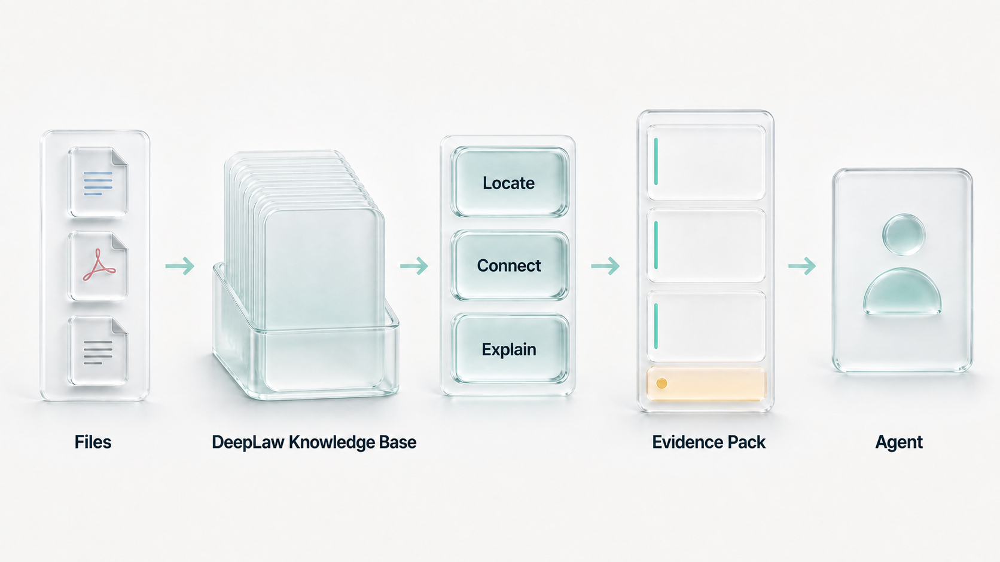

<p align="center">
  <a href="README.zh-CN.md">简体中文</a> · <strong>English</strong>
</p>

<h1 align="center">DeepLaw 2.0</h1>

<p align="center">
  
</p>

<p align="center">
  <strong>A local-first Knowledge OS for long-running AI agents.</strong><br />
  Compile files, decisions, experience, tool results, and domain sources into verifiable,
  review-gated Knowledge Assets—and deliver only the right evidence for the current task.
</p>

<p align="center">
  <a href="https://github.com/Eysn0130/DeepLaw/actions/workflows/ci.yml"></a>
  
  
  
  <a href="LICENSE"></a>
</p>

<p align="center">
  <a href="#90-second-local-loop">Quick Start</a> ·
  <a href="#how-it-works">Architecture</a> ·
  <a href="#verified-capability-matrix">Capabilities</a> ·
  <a href="#agent-integrations">Agent Integrations</a> ·
  <a href="#trust-boundaries">Security</a> ·
  <a href="#documentation">Documentation</a>
</p>

---

DeepLaw is an independent knowledge layer for Codex, Claude Code, OpenCode, and other
Agent hosts. It does not replace a model, runtime, IDE, vector database, or human notes app.
It owns the knowledge supply chain:

```text
Source → immutable version → fragments → proposals → human review
       → active Knowledge Assets → bounded Capsule → Agent task
       → run receipt → structured feedback → proposal / regression case
```

Unlike a conventional RAG pipeline, retrieval does not make content trusted. DeepLaw keeps
source bytes, exact locators, hashes, review decisions, lifecycle state, and task receipts
separate—and fails closed when those bindings no longer verify.

Chinese law is the first strict Domain Pack. It runs in a separate process and store, with
official-source, release, temporal, and receipt rules that general project knowledge cannot
inherit. Case-private data remains outside both products.

## Why DeepLaw

| Typical knowledge stack | DeepLaw 2.0 |
| --- | --- |
| A chunk or generated summary becomes the practical truth | Original bytes and located fragments remain evidence; every summary, graph, embedding, and Wiki page is derived |
| Re-ingesting a changed file silently duplicates or replaces knowledge | A stable `source_key` owns immutable versions, review-gated diffs, and explicit supersede/revoke events |
| An Agent can write “memory” directly | Agent MCP is read-only; learning enters an untrusted proposal/review path |
| Similarity is treated as confidence or authority | Discovery, admission, selection, and authority are separate stages |
| Top-k context can be noisy or source-free | Capsules use hard item/payload/provenance budgets and retain at least one compact source reference per source-bound item |
| Feedback is free text detached from the task | Feedback binds a verified Capsule and Run Receipt, classifies helpful/noisy/stale/missing knowledge, and produces a replayable regression case |

<p align="center">
  
</p>

## 90-second local loop

Requirements: Python 3.11+ and [`uv`](https://docs.astral.sh/uv/). This path uses no
optional model and writes only to a temporary vault.

```bash
git clone https://github.com/Eysn0130/DeepLaw.git
cd DeepLaw
uv sync --frozen

QUICKSTART_ROOT="$(mktemp -d)"
QUICKSTART_VAULT="$QUICKSTART_ROOT/vault"
printf '# Decision\nUse SQLite as the canonical local store.\n' > "$QUICKSTART_ROOT/project.md"

uv run deeplaw knowledge init \
  --vault "$QUICKSTART_VAULT" \
  --name quickstart \
  --scope project

SOURCE_RESULT="$(uv run deeplaw knowledge source add \
  --vault "$QUICKSTART_VAULT" \
  --source "$QUICKSTART_ROOT/project.md" \
  --typed-extraction deterministic-v1 \
  --confirm-no-case-data)"
SOURCE_ID="$(printf '%s' "$SOURCE_RESULT" | uv run python -c \
  'import json,sys; print(json.load(sys.stdin)["source"]["source_id"])')"

REVIEW_MANIFEST="$(uv run deeplaw knowledge review manifest \
  --vault "$QUICKSTART_VAULT" \
  --source-id "$SOURCE_ID")"
REVIEW_SHA="$(printf '%s' "$REVIEW_MANIFEST" | uv run python -c \
  'import json,sys; print(json.load(sys.stdin)["review_manifest_sha256"])')"

uv run deeplaw knowledge review approve-source \
  --vault "$QUICKSTART_VAULT" \
  --source-id "$SOURCE_ID" \
  --review-manifest-sha256 "$REVIEW_SHA" \
  --reviewer-id local-operator \
  --reason 'Reviewed the exact source and proposal.' \
  --confirm-reviewed

uv run deeplaw knowledge context \
  --vault "$QUICKSTART_VAULT" \
  --task 'Which local store must this project use?' \
  --confirm-no-case-data \
  --output "$QUICKSTART_ROOT/capsule.json"

uv run deeplaw knowledge verify-capsule \
  --vault "$QUICKSTART_VAULT" \
  --capsule "$QUICKSTART_ROOT/capsule.json"
```

Commands return stable JSON by default. Put `--format jsonl` or `--format human` immediately
after `knowledge` for a compact machine event or human-readable output. The review step commits
to the exact proposal membership;
if the source or queue changes, approval stops instead of reviewing a moving target.

## How it works

```text
Files / directories / project knowledge
                  │
                  ▼
       Source Control Plane
 source_key · immutable version · diff
                  │
                  ▼
        Knowledge Compiler
 fragments · typed proposals · quarantine
                  │
                  ▼
          Review Workbench
 manifest · reviewer · immutable receipt
                  │
                  ▼
      Active Knowledge Asset Vault
 lifecycle · scope · relations · audit chain
                  │
                  ▼
          Context Compiler
 budget · provenance · conflicts · gaps
                  │
                  ▼
        Knowledge Capsule → Agent
                  │
                  ▼
 Run Receipt → Feedback Ledger → replay / proposal
```

SQLite plus content-addressed source fragments is canonical. Markdown/Obsidian exports are
deterministic human views, never a second database.

### Source versions and atomic updates

```bash
uv run deeplaw knowledge source list --vault "$QUICKSTART_VAULT"
uv run deeplaw knowledge source update \
  --vault "$QUICKSTART_VAULT" \
  --source-key sourcekey_REPLACE_WITH_EXACT_ID \
  --source ./project.md \
  --typed-extraction deterministic-v1 \
  --confirm-no-case-data
uv run deeplaw knowledge source diff \
  --vault "$QUICKSTART_VAULT" \
  --old-source-id source_REPLACE_OLD \
  --new-source-id source_REPLACE_NEW
```

The old active version remains usable until the successor's exact review manifest is
approved. Individual approval of successor assets is rejected because it would break the
atomic switch. Approval then supersedes matching knowledge and revokes deleted sections in
one transaction; history and source bytes remain available for audit.

For a directory, use a bounded, replayable manifest. Each admitted file is one atomic source
transaction; failures do not corrupt successful files and are reported explicitly.

```bash
uv run deeplaw knowledge source add-dir \
  --vault "$QUICKSTART_VAULT" \
  --directory ./docs \
  --recursive \
  --include '*.md' \
  --exclude 'archive/**' \
  --dry-run \
  --confirm-no-case-data
```

### Typed proposals—not automatic truth

`deterministic-v1` recognizes explicit heading cues such as Decision, Constraint, Procedure,
Rule, Fact, Lesson, and Question. It is local, deterministic, optional, and intentionally
narrow. Every result is still `proposed` or `quarantined`; it never becomes active from an
extractor score. General model-based extraction remains experimental and off the runtime path.

### Run receipts and feedback replay

```bash
uv run deeplaw knowledge run-receipt create \
  --vault "$QUICKSTART_VAULT" \
  --capsule "$QUICKSTART_ROOT/capsule.json" \
  --status partial \
  --host-name codex \
  --host-version local

uv run deeplaw knowledge feedback record \
  --vault "$QUICKSTART_VAULT" \
  --run-id run_REPLACE_WITH_EXACT_ID \
  --outcome partial \
  --missing-knowledge 'The rollback owner is not documented.' \
  --observation 'The storage decision was useful.' \
  --recommended-action 'Review a source-bound rollback owner decision.' \
  --confirm-no-case-data
```

Feedback produces a review-gated lesson proposal and a source-free regression-case record.
Replay compares the historical verified Capsule with current retrieval; it never infers task
success and every development result remains `claim_eligible=false`.

## Verified capability matrix

Status here means implementation + tests + a usable CLI/MCP path. It is not a market-ranking
claim.

| Capability | Status | Boundary |
| --- | --- | --- |
| Source bytes, fragments, locators, hashes | **Supported** | Source text is untrusted data; selected bytes are rehashed |
| Logical source identity, immutable versions, diff/update/remove | **Supported** | Successor activation requires exact source review |
| Single-file and bounded directory ingestion | **Supported** | PDF, DOCX, legacy DOC via controlled conversion, Markdown/TXT, code, JSON/JSONL, YAML/TOML, CSV/TSV, SQL, XML/HTML/CSS/log text |
| Review queue, manifests, local review receipts | **Supported** | v1 local receipt has reviewer identity and content commitment; signature is explicitly `null` |
| Knowledge Asset lifecycle | **Supported** | `proposed/quarantined → active → superseded/revoked`; human review only |
| Deterministic typed extraction | **Operator-only** | Explicit heading cues only; no general semantic understanding |
| Context Capsule and verification | **Supported** | Hard item/character/payload/provenance bounds; gaps remain explicit |
| Task Run Receipt and structured Feedback Ledger | **Supported** | Run identity is derived from a verified Capsule; replay does not infer task success |
| Legacy control migration recovery | **Supported** | Verified pre-apply backup, post-apply audit/lifecycle verification, explicit atomic rollback |
| Local semantic Discovery Index | **Experimental** | Removable sidecar, pinned and vault-bound, excluded from default Context and MCP |
| Markdown/Obsidian projection | **Supported (minimal)** | One-way Asset/INDEX projection; SQLite remains canonical; richer views are planned |
| `.dlk` portability | **Supported with restriction** | Content integrity only; imported assets become untrusted quarantine |
| `knowledge_support` and `law_support` MCP | **Supported** | Separate processes, explicit activation, read-only, bounded output |
| Windows equivalent owner-only ACL proof | **Not verified** | `knowledge doctor --permissions` reports `not_verified`; native ACL gate is roadmap work |
| URL/Git connectors, watch jobs, TUI/Web review | **Planned** | No placeholder command is advertised as implemented |
| Cross-system performance leadership | **External verification pending** | Requires frozen artifacts, secret held-out data, and two independent signed evaluators |

Legacy v0.5 vaults can inspect, apply, verify, and roll back the additive control-plane
migration. Apply always creates and verifies a backup before changing the database:

```bash
uv run deeplaw knowledge migrate --vault /path/to/vault
uv run deeplaw knowledge migrate --vault /path/to/vault --apply --backup /safe/vault-backup
uv run deeplaw knowledge migrate --vault /path/to/vault --verify --backup /safe/vault-backup
uv run deeplaw knowledge migrate --vault /path/to/vault \
  --rollback --backup /safe/vault-backup --confirm-rollback
uv run deeplaw knowledge doctor --vault /path/to/vault --permissions
```

## Agent integrations

DeepLaw ships two optional plugins:

- `plugins/deeplaw-knowledge-os` exposes the general `knowledge_support` leaf.
- `plugins/deeplaw` exposes the Chinese Legal Pack `law_support` leaf.

Both MCP surfaces are read-only. Persistent import, review, activation, feedback recording,
removal, and migration remain offline CLI administration. See
[`docs/AGENT_ADAPTERS.md`](docs/AGENT_ADAPTERS.md) for Codex, Claude Code, and OpenCode
configuration and verified/static-only distinctions.

```json
{
  "operation": "context",
  "task": "Prepare the migration while preserving reviewed project constraints",
  "confirm_no_case_data": true
}
```

Provider-visible search returns at most five evidence cards. Full content is fetched by exact
Asset or segment ID. `restricted` Knowledge Assets never cross the Agent MCP boundary.

## Chinese Legal Pack

The Legal Pack is not a general-vault preset. It keeps official catalogs, user-private legal
references, immutable releases, temporal metadata, evidence duties, and receipts physically
and semantically separate. Official HTTPS catalogs require exact-byte Ed25519 verification;
private references never inherit official authority or ranking.

See [`docs/DEEPLAW_2.md`](docs/DEEPLAW_2.md) and
[`docs/CORPUS_GOVERNANCE.md`](docs/CORPUS_GOVERNANCE.md). DeepLaw supports legal research
evidence; it does not determine that a rule applies to a specific case.

## Trust boundaries

- Agent-facing MCP has no write, learn, remember, approve, import, revoke, or delete operation.
- MCP read-only is not an OS sandbox. If a host grants the Agent arbitrary same-user shell
  access, it can invoke offline administration unless the host policy or OS identity blocks it.
- Vaults reject symlinked roots and protected files. POSIX owner-only modes are checked.
  Equivalent NTFS ACL isolation is not yet mechanically proven.
- Imported text may contain prompt injection. Only an active, human-reviewed
  constraint/rule/procedure can carry `reviewed_instruction`, and it still cannot override
  host, repository, developer, or current-user instructions.
- Case-private files, facts, chats, and identifiers must not enter the Knowledge OS or Legal
  Pack. Use isolated synthetic fixtures for tests.
- `.dlk` v1 authenticates content integrity, not publisher identity. Import always loses source
  trust and enters quarantine.

Read [`SECURITY.md`](SECURITY.md) before granting a host local shell or filesystem access.

## Benchmarks and evidence status

Development evaluations bind source code, dependency lock, corpus/query hashes, parameters,
and hardware where available. They are diagnostics, not external claims, and are marked
`claim_eligible=false`.

The external protocol and evaluator tooling are prepared, but the current status remains:

```text
pending_external_execution
```

No secret held-out run and no two independent signed evaluator attestations have been returned
for this version. DeepLaw therefore does not claim “best”, “world first”, or superiority over
all RAG, GraphRAG, memory, Wiki, or notes systems. See
[`docs/BENCHMARKS.md`](docs/BENCHMARKS.md) and
[`docs/EXTERNAL_BENCHMARK_PROTOCOL.md`](docs/EXTERNAL_BENCHMARK_PROTOCOL.md).

## Development

```bash
uv lock --check
uv run ruff check .
uv run pytest
uv build
uv run --frozen python benchmarks/verify_fresh_wheel.py --dist dist
git diff --check
```

The runtime targets Python 3.11–3.13. Optional document-engine model changes require a new
security audit, OpenVEX update, and real PDF extraction test.

## Documentation

| Document | Purpose |
| --- | --- |
| [`docs/KNOWLEDGE_OS.md`](docs/KNOWLEDGE_OS.md) | Canonical Knowledge Asset, Context, lifecycle, and safety contracts |
| [`docs/CLI_LIFECYCLE.md`](docs/CLI_LIFECYCLE.md) | Source → review → Capsule → run → feedback → update walkthrough |
| [`docs/ARCHITECTURE.md`](docs/ARCHITECTURE.md) | Product isolation and runtime architecture |
| [`docs/DEEPLAW_2.md`](docs/DEEPLAW_2.md) | Chinese Legal Pack design and current boundaries |
| [`docs/BENCHMARKS.md`](docs/BENCHMARKS.md) | Reproducible internal evidence and limitations |
| [`docs/EXTERNAL_BENCHMARK_PROTOCOL.md`](docs/EXTERNAL_BENCHMARK_PROTOCOL.md) | Independent hidden-evaluation protocol |
| [`ROADMAP.md`](ROADMAP.md) | Unfinished work, dependencies, and acceptance gates |
| [`CONTRIBUTING.md`](CONTRIBUTING.md) / [`SECURITY.md`](SECURITY.md) | Contribution and security policies |

Historical implementation plans live under [`docs/archive/`](docs/archive/) and are not
current sources of truth.

## Contributing and license

Issues and focused pull requests are welcome. Preserve the source/audit/lifecycle boundaries,
add tests for every contract change, and do not commit source legal files, generated release
databases, credentials, or private notes.

DeepLaw is licensed under [Apache License 2.0](LICENSE). See
[`THIRD_PARTY_NOTICES.md`](THIRD_PARTY_NOTICES.md) for upstream notices.
