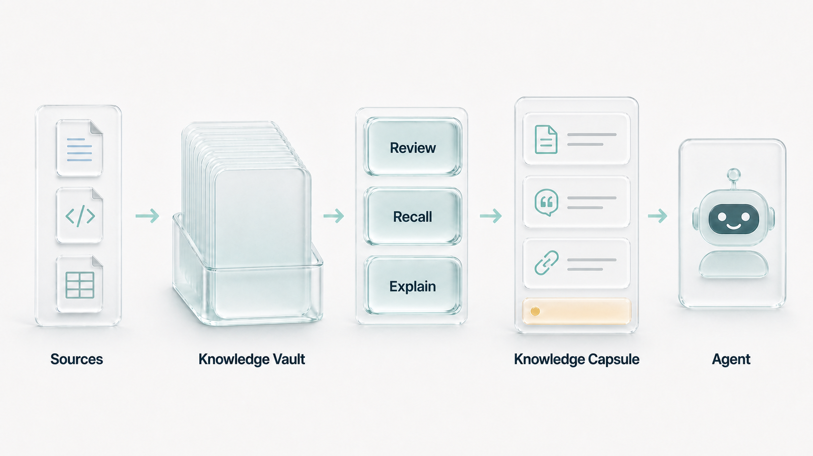
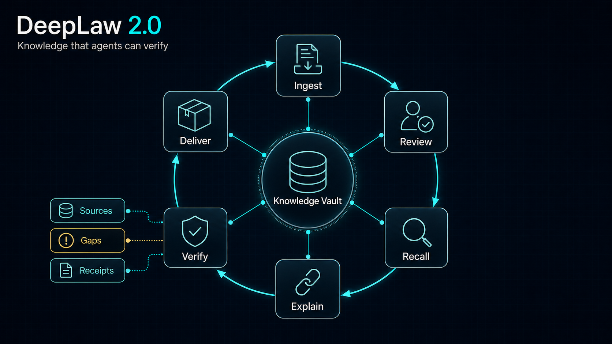
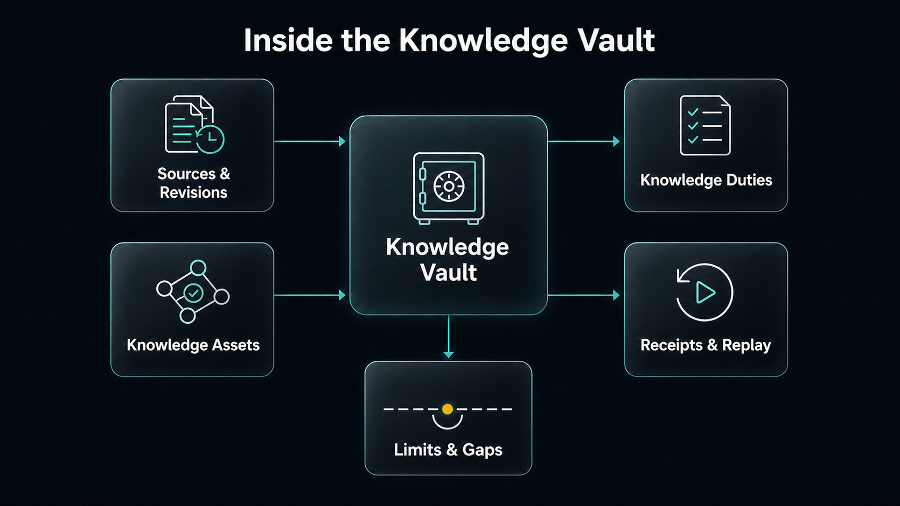
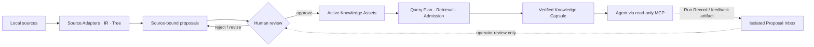

<p align="center">
  <a href="README.md">简体中文</a> · <strong>English</strong>
</p>

<h1 align="center">DeepLaw 2.0</h1>

<p align="center">
  
</p>

<p align="center">
  <strong>Give agents a traceable, reviewed knowledge base they cannot silently rewrite.</strong><br />
  Local single-user Agent Knowledge OS · Source-bound · Human-reviewed · Capsule-delivered
</p>

<p align="center">
  <a href="https://github.com/Eysn0130/DeepLaw/actions/workflows/ci.yml"></a>
  <a href="https://github.com/Eysn0130/DeepLaw/releases/tag/v0.7.0"></a>
  
  
  
  <a href="LICENSE"></a>
</p>

<p align="center">
  <a href="#what-belongs-in-the-vault">Use cases</a> ·
  <a href="#five-step-start">Start</a> ·
  <a href="#how-knowledge-moves">How it works</a> ·
  <a href="#inside-the-vault">Inside the Vault</a> ·
  <a href="#connect-an-agent">Agent access</a> ·
  <a href="#v070-at-a-glance">Capabilities</a> ·
  <a href="#documentation">Docs</a>
</p>

<p align="center">
  
</p>

<p align="center">
  <sub>Local sources enter the Vault; reviewed, explainable recall becomes a bounded Knowledge Capsule for the Agent.</sub>
</p>

DeepLaw is the knowledge layer between local material and an Agent. It compiles documents, code, decisions,
constraints, experience, and tool results into **traceable Knowledge Assets**, then delivers a
small, sufficient, reviewable **Knowledge Capsule** for the task at hand.

DeepLaw cares less about how much was stored than whether an Agent can answer: **where did this
come from, may it be used now, why is it in this context, and what is still missing?** Sources,
knowledge, review, retrieval, and feedback have separate identities and lifecycles. The owner's
SQLite database, content-addressed source fragments, and append-only audit chain form the
canonical local state.

> DeepLaw does not think for the Agent or turn transcripts into memory automatically. It guards
> source, review, and delivery boundaries so the Agent works inside an explicit evidence envelope.

## What belongs in the Vault

Not every file should become durable knowledge. DeepLaw is most useful for information that will
be reused across tasks, carries a real cost when wrong, and must keep its provenance and status:

| Knowledge scenario | Typical sources | What the Agent receives |
| --- | --- | --- |
| **Project constraints and architecture decisions** | ADRs, API contracts, repository rules, dependency choices | The current constraint or decision with its original support |
| **Repeatable ways of working** | Release checklists, runbooks, review procedures, operation records | A bounded procedure with prerequisites, not a vague summary |
| **Research and domain knowledge** | Research notes, standards, terminology, concept relations, open questions | Traceable concepts and questions with explicit gaps |
| **Experience and Agent feedback** | Tool results, failure reviews, Run Records, feedback artifacts | Review-pending experience in the Proposal Inbox; never an automatic write to active knowledge |

One Vault can support coding, research, operations, and content work. Each task receives only the
context it needs instead of the whole repository being poured into its prompt.

## Why agents need a knowledge system

Agents can reason and act, but they do not inherently know which local statement is still current,
which one was reviewed, why it belongs in this task, or what evidence is missing. A useful Agent
knowledge base must answer five questions:

| Question | DeepLaw's answer |
| --- | --- |
| **Where did this knowledge come from?** | Exact Source Revision, fragment, locator, and hash; a summary never replaces the source |
| **May it be used now?** | `proposed / quarantined / active / superseded / revoked` lifecycle plus a human Review Receipt |
| **Why was it recalled?** | Hashable Query Plan, channel candidates, admission/exclusion reasons, and Explain Trace |
| **How much should reach the Agent?** | A Knowledge Capsule bounded across text, source metadata, and complete serialized payload |
| **How does Agent feedback return?** | Capsule-bound Run Record / feedback artifact → isolated Proposal Inbox → human review; never a direct write to active knowledge |

That turns a repository that can find chunks into a system that can deliver verifiable context.

## Five-step start

DeepLaw requires Python 3.11+ and [`uv`](https://docs.astral.sh/uv/). Install the signed wheel from
GitHub Release:

```bash
uv tool install https://github.com/Eysn0130/DeepLaw/releases/download/v0.7.0/deeplaw-0.7.0-py3-none-any.whl
```

Run the complete local loop:

```bash
# 1. Initialize an owner-controlled Vault
deeplaw init ./vault --name my-project

# 2. Ingest a file or directory; this creates proposed / quarantined knowledge only
deeplaw add ./docs --vault ./vault --confirm-no-case-data

# 3. Review, edit, split, merge, or reject proposals locally
deeplaw review --vault ./vault --interactive

# 4. Build a Query Plan, Explain Trace, and bounded Capsule for this task
deeplaw recall "Which constraints govern this release?" \
  --vault ./vault --confirm-no-case-data --output capsule.json

# 5. Inspect selection, exclusion, source coverage, and gaps
deeplaw explain --vault ./vault --last
```

The default path needs no remote database, background service, or model API key. `recall` verifies
the Capsule in the same result and fails closed instead of handing unverifiable context to an Agent.

## How knowledge moves

DeepLaw treats knowledge as an evolving local asset, not a one-time index. A complete loop starts
by preserving sources, passes through proposals and human review, then recalls, explains, verifies,
and delivers for one task. Feedback returns only through an isolated review-pending path.

<p align="center">
  
</p>

<p align="center">
  <sub>Knowledge is not a one-time index: sources, review, recall, explanation, verification, and delivery form a reviewable lifecycle.</sub>
</p>

## Inside the Vault

<p align="center">
  
</p>

<p align="center">
  <sub>The Vault is not a black-box index: sources, knowledge, task duties, gaps, and receipts remain distinct.</sub>
</p>

| Vault responsibility | Evidence retained or produced |
| --- | --- |
| **Sources & Revisions** | Original bytes, document order, structured locators, content hashes, and immutable revisions |
| **Knowledge Assets** | Source-supported constraints, decisions, procedures, experiences, concepts, and questions |
| **Knowledge Duties** | Requirements this task must cover; duties are compiled before candidates are compared and budgets assigned |
| **Limits & Gaps** | Text/source/full-payload budgets plus evidence that is missing, inadmissible, or insufficiently covered |
| **Receipts & Replay** | Review, Explain, Run, feedback, and audit anchors used to verify and replay the selection |

### How one piece of knowledge crosses the system



### Five core objects

| Object | Role |
| --- | --- |
| **Source Revision** | Immutable source bytes, structure, order, locator, and hash, preserved independently of derived knowledge |
| **Knowledge Asset** | A constraint, decision, procedure, experience, concept, or question supported by one or more source fragments |
| **Knowledge Vault** | Owner-only SQLite, content-addressed fragments, relation revisions, FTS, and append-only audit chain |
| **Knowledge Capsule** | Bounded context for one task with sources, selection reasons, gaps, budgets, and a Vault audit anchor |
| **Explain / Run / Feedback records** | Replay retrieval, Agent use, and feedback; feedback can create only a review-pending artifact |

### Design principles

- **Sources first:** source bytes and fragments remain independent. Graphs, embeddings, summaries,
  pages, and rankings are removable derived data.
- **Human governance:** compilers, models, imported packages, and Agent feedback may create only a
  proposal or quarantine. Explicit review is the sole activation path.
- **Stable identity:** Identity v2 separates logical source, Source Revision, Compilation,
  Knowledge Revision, and Governance Revision while retaining rename, move, split, merge, and
  historical relationships.
- **Bounded delivery:** DeepLaw compiles task duties before fusing exact, BM25, Source Tree,
  reviewed graph, temporal, feedback, and explicitly optional Dense/reranker candidates. A score
  cannot change authority.
- **Local ownership:** one OS user, local persistence, no default telemetry, and no remote listener.
  Markdown and Obsidian are rebuildable views; SQLite remains canonical.
- **Read-only Agent surface:** an Agent may retrieve a Capsule but cannot use MCP to remember,
  learn, approve, import, revoke, delete, or administer knowledge.

## Connect an Agent

DeepLaw 2.0 provides two isolated product surfaces in one repository. They share the principles of
verifiable sources, read-only Agent access, and local operator-governed writes, but never share a
process, store, or implicit activation path:

| Product surface | What it manages | What reaches the Agent | Optional plugin / MCP tool |
| --- | --- | --- | --- |
| **Agent Knowledge OS** | General project knowledge, decisions, constraints, experience, and tool results | A Knowledge Capsule with sources, selection reasons, budgets, and gaps | `deeplaw-knowledge-os` / `knowledge_support` |
| **Chinese Legal Pack** | Signed, immutable, version-aware official legal-source releases | At most five evidence cards, exact segments by ID, and receipts | `deeplaw` / `law_support` |

Codex, Claude Code, and OpenCode use thin host-specific adapters. Plugins are installed and enabled
explicitly and never take over unrelated coding or data work. Both MCP surfaces are permanently
read-only; ingestion, review, activation, import, revocation, and deletion belong only to the local
CLI. See
[`docs/AGENT_ADAPTERS.md`](docs/AGENT_ADAPTERS.md) for configuration, install, upgrade, removal, and
dual-product isolation.

## v0.7.0 at a glance

| Surface | Current implementation |
| --- | --- |
| **Ingestion and structure** | Markdown/TXT, HTML, PDF, DOCX, PPTX, XLSX, EPUB, code, JSON/YAML/TOML, CSV/TSV, SQL, conversations, and tool results; Source IR / Tree retains locators, order, and hashes |
| **Compilation and governance** | Deterministic-v2 many-to-many compiler, proposal/quarantine, individual and batch review, lineage, temporal relations, and carry-forward proposals |
| **Recall and explanation** | Query Plan, exact/BM25/structure/graph/temporal/feedback channels, fusion, Knowledge Duties, token budgets, Explain Trace, and explicit gaps |
| **Local operator surfaces** | Golden CLI, resumable jobs, curses Workbench, Markdown/Obsidian/JSON Canvas projection, isolated Inbox, and Skill Factory |
| **Reliability** | Snapshot/restore, migration/rollback, GC, forgetting, doctor, corruption/lock/permission checks, POSIX owner-only permissions, and native Windows ACL/reparse gates |
| **Optional derived capabilities** | Removable Discovery Index bound to exact model/Vault/source/index bytes and a manifest-pinned local reranker; neither enters default MCP/Context retrieval |

For exact status, boundaries, and commands, use
[`docs/KNOWLEDGE_OS.md`](docs/KNOWLEDGE_OS.md) and
[`docs/CLI_LIFECYCLE.md`](docs/CLI_LIFECYCLE.md).

## Security boundaries

- Imported text is always untrusted data. Review cannot let it override host, repository,
  developer, or current-user instructions.
- Restricted knowledge, local Vault paths, inactive proposals, and unbounded graph traversal never
  cross MCP.
- Case-private documents, facts, chats, and identifiers stay outside the Knowledge OS, Legal Pack,
  caches, logs, and query corpora.
- General Knowledge Assets always carry `legal_authority: false`. Official legal sources exist only
  in a separate, signed, immutable Legal Pack release.
- Dense retrieval, rerankers, model compilers, and generated views cannot approve knowledge, decide
  legal validity, or invent missing sources.
- The repository includes auditable benchmark and evaluator tooling, but does not present incomplete
  external execution as a performance conclusion.

See [`SECURITY.md`](SECURITY.md) for the threat model and private reporting channel.

## Open-source collaboration

DeepLaw is open source under the [Apache License 2.0](LICENSE). Reproducible bugs, Source Adapters,
cross-platform regressions, documentation, and bounded retrieval improvements are welcome:

- read [`CONTRIBUTING.md`](CONTRIBUTING.md) and [`CODE_OF_CONDUCT.md`](CODE_OF_CONDUCT.md);
- open an [Issue](https://github.com/Eysn0130/DeepLaw/issues) with a minimal reproduction, expected
  boundary, and environment details;
- use [`ROADMAP.md`](ROADMAP.md) for the long-term direction;
- download versioned wheel, sdist, OCI, SBOM, and verification material from
  [Releases](https://github.com/Eysn0130/DeepLaw/releases).

Do not commit legal source documents, generated release databases, credentials, model weights,
private notes, or local paths containing user material.

## Documentation

| Topic | Entry point |
| --- | --- |
| Knowledge OS contract | [`docs/KNOWLEDGE_OS.md`](docs/KNOWLEDGE_OS.md) |
| Golden CLI, Workbench, and lifecycle | [`docs/CLI_LIFECYCLE.md`](docs/CLI_LIFECYCLE.md) |
| Local single-user architecture and product isolation | [`docs/ARCHITECTURE.md`](docs/ARCHITECTURE.md) |
| Agent and MCP adapters | [`docs/AGENT_ADAPTERS.md`](docs/AGENT_ADAPTERS.md) |
| Install, upgrade, and rollback | [`docs/INSTALL_UPGRADE_ROLLBACK.md`](docs/INSTALL_UPGRADE_ROLLBACK.md) |
| Benchmark evidence and external protocol | [`docs/BENCHMARKS.md`](docs/BENCHMARKS.md) · [`docs/EXTERNAL_BENCHMARK_PROTOCOL.md`](docs/EXTERNAL_BENCHMARK_PROTOCOL.md) |
| v0.7 acceptance and release notes | [`docs/V0_7_ACCEPTANCE_MATRIX.md`](docs/V0_7_ACCEPTANCE_MATRIX.md) · [`docs/RELEASE_NOTES_v0.7.0.md`](docs/RELEASE_NOTES_v0.7.0.md) |
| Third-party components | [`THIRD_PARTY_NOTICES.md`](THIRD_PARTY_NOTICES.md) |

---

<p align="center">
  <strong>Local sources in. Verifiable knowledge out. Agent writes stay review-gated.</strong>
</p>
