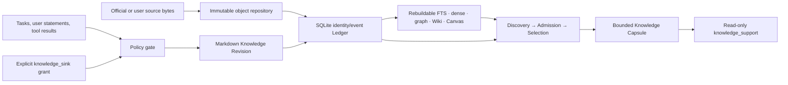

<p align="center">
  <a href="README.md">简体中文</a> · <strong>English</strong>
</p>

<h1 align="center">DeepLaw</h1>

<p align="center">
  
</p>

<p align="center">
  <strong>Local-first Agent Knowledge OS</strong><br />
  <sub>Source-to-Knowledge Compiler · Governed Living Wiki · Verifiable Context</sub>
</p>

<p align="center">
  <a href="https://github.com/Eysn0130/DeepLaw/actions/workflows/ci.yml"></a>
  <a href="https://github.com/Eysn0130/DeepLaw/releases/tag/v0.12.0"></a>
  
  
  <a href="LICENSE"></a>
</p>

<p align="center">
  <strong>DeepLaw is a local-first Agent Knowledge OS that compiles source materials into a governed
  Living Wiki and returns verifiable, bounded knowledge context to any Agent.</strong>
</p>

## From source materials to usable knowledge

DeepLaw is a **Source-to-Knowledge Compiler**. It does not merely convert files into Markdown. It
preserves original sources, compiles them into durable, typed, verifiable, and evolvable knowledge
objects, then projects a Living Wiki that both humans and Agents can use.

| Compile | Govern | Deliver |
| --- | --- | --- |
| Preserve source bytes, structure, locators, and hashes; produce stable typed knowledge objects | Govern evolution through identity, revisions, provenance, authority, scope, and audit | Return a bounded Knowledge Capsule for each task through CLI and MCP instead of dumping the entire Vault |

### What DeepLaw is not

- A generic RAG pipeline;
- a simple Markdown note-taking tool;
- an Obsidian replacement;
- a law-only question-answering system;
- a Memory plugin for a single Agent.

DeepLaw does not replace Codex, Claude Code, OpenCode, or another Agent runtime. The host retains
control of models, conversation orchestration, and general tools. DeepLaw CLI is the first-party
core entry point, and MCP is the core protocol entry point for Agents. A future GUI will use the
same domain services.

> [!NOTE]
> **DeepLaw 2.0 is the product brand, not a software version.** **Local single-user Agent Knowledge OS**
> is the current delivery boundary. Software release `v0.12.0` adds Semantic Compilation v2,
> run-wide identity fusion, revision-bound Synthesis Refresh, Query Plan v5, production
> Obsidian/Tolaria bridges, and a deterministic multi-agent-consensus semantic quality gate. The older
> proposal/review workflow remains only for source compilation, untrusted external imports, and
> migration compatibility; it is not the default activation path for admitted Agent-derived
> knowledge.

## Permanent boundaries

- **Local-first, single-user, owner-controlled.** Canonical state stays on the local machine. There
  is no remote canonical database, content telemetry, implicit network access, or team control
  plane.
- **Two knowledge planes.** Signed official material and user-provided originals enter immutable
  evidence. Task conclusions, experience, concepts, relations, memory, Wiki knowledge, and Skills
  enter the autonomous Agent-derived plane. The Ledger and indexes are support layers, not a third
  authority.
- **Markdown-native, not Markdown-only.** Canonical open knowledge content is a versioned Markdown
  object with constrained YAML and stable IDs. SQLite decides identity, scope, sensitivity,
  authority, lifecycle, bitemporal state, lineage, and audit. Original source bytes remain in the
  content-addressed object repository.
- **Autonomous does not mean authoritative.** Policy-admitted Agent knowledge becomes immediately
  usable memory, but remains `origin=agent_derived`, `authority=agent_derived`, and
  `legal_authority=false`. It cannot self-promote to official, user-provided, or human-verified.
- **Read and write surfaces are separate.** `knowledge_support` is permanently read-only.
  `knowledge_sink` is a separate, explicitly enabled, scope-bound process. `law_support` remains
  independent and read-only.
- **Retrieval never creates authority.** Exact, lexical, dense, tree, graph, temporal, Wiki, and
  reranker channels discover candidates. Admission, selection, authority, and legal adjudication
  remain distinct decisions. The Query Planner compiles Knowledge Duties before candidates are
  compared; uncovered duties remain explicit gaps in the Knowledge Capsule.



## Install and start

Install the verified `v0.12.0` wheel from the GitHub release:

```bash
uv tool install \
  https://github.com/Eysn0130/DeepLaw/releases/download/v0.12.0/deeplaw-0.12.0-py3-none-any.whl
deeplaw --version
```

For repository development:

```bash
uv sync --all-extras
```

Create a Vault. This installs the autonomous core but does not grant mutation permission:

```bash
deeplaw knowledge init --vault ./vault --name my-project --scope project

deeplaw knowledge sink enable \
  --vault ./vault \
  --writer-id codex-local \
  --scope project \
  --max-sensitivity private
```

The default grant permits only `remember`. Add every other mutation operation explicitly when
creating the grant. A request that declares `run_id` must first create an immutable Run Record in
the same scope and sensitivity.

```json
{
  "operation": "remember",
  "idempotency_key": "release-decision-1",
  "confirm_no_case_data": true,
  "title": "Release writes use one coordinator",
  "body": "Every durable knowledge mutation passes through the shared commit coordinator.",
  "kind": "decision",
  "scope": "project",
  "sensitivity": "private"
}
```

```bash
deeplaw knowledge sink apply \
  --vault ./vault \
  --grant-id grant_REPLACE_WITH_RETURNED_ID \
  --request ./remember.json

deeplaw knowledge autonomy recall \
  --vault ./vault --query "release coordinator"
deeplaw knowledge autonomy explain \
  --vault ./vault --query "release coordinator"
deeplaw knowledge autonomy identity \
  --vault ./vault --query "release coordinator"
deeplaw knowledge autonomy gaps --vault ./vault
deeplaw knowledge autonomy context \
  --vault ./vault --task "prepare the release" --confirm-no-case-data
deeplaw knowledge autonomy verify --vault ./vault
```

## Open Markdown workspace

Knowledge identity does not depend on a filename. Obsidian, Tolaria, or another Markdown editor
may rename or move files. An external content edit becomes a new revision only after reconciliation;
stale bases, duplicate IDs, and governance changes are preserved as explicit conflicts rather than
silently resolved by last-writer-wins.

```bash
deeplaw knowledge autonomy reconcile \
  --vault ./vault \
  --grant-id grant_REPLACE_WITH_RETURNED_ID \
  --confirm-no-case-data

# Explicit foreground watcher: reconciliation and queued derived maintenance.
deeplaw knowledge autonomy watch \
  --vault ./vault \
  --grant-id grant_REPLACE_WITH_RETURNED_ID \
  --confirm-no-case-data --interval 2

deeplaw knowledge autonomy lint --vault ./vault
deeplaw knowledge autonomy rebuild --vault ./vault
```

The canonical commit succeeds independently of FTS, vectors, graph, Wiki, or Canvas rebuilding.
Failed derived maintenance stays queued, current reads reject stale indexes, and bounded canonical
lexical fallback remains available.

## Agent surfaces

| Process / leaf | Permission | Purpose |
| --- | --- | --- |
| `deeplaw knowledge mcp --stdio` / `knowledge_support` | Read-only | v5 recall/query, exact get, explain, lineage, graph, identity, gaps, Wiki, Semantic/Compilation state, Query Plan v5, verification, and Knowledge Capsule |
| `deeplaw knowledge sink mcp --grant-id … --stdio` / `knowledge_sink` | Explicit scope-bound mutation | v4 governed Semantic Compilation, Synthesis Refresh, backfill, typed knowledge/memory, relation, feedback, lifecycle, and Skill revision |
| `deeplaw mcp --stdio` / `law_support` | Read-only, separate storage | Signed official and owner-private legal evidence with authority-aware federated context |

The default Knowledge OS plugin registers only `knowledge_support`. A sink requires an owner-created
grant and a separate host process. Neither query server exposes import, deletion, signing, source
administration, or permission changes.

## Implemented scope and evidence boundary

| Status | Capability |
| --- | --- |
| **Current in v0.12.0** | Semantic Compilation v2, run-wide identity/completeness, Synthesis Refresh, Query Plan v5, stable CLI/MCP/Python surfaces, production Obsidian/Tolaria bridges, and deterministic-Agent/machine-consensus/Living Wiki/28-source Authoritative Pack/fresh-wheel release gates |
| **Compatibility** | v0.7 Source IR, reviewed source-derived Knowledge Assets, Proposal Inbox, Workbench, and Retrieval Fabric remain available in their explicit compatibility partition |
| **Quality closure** | DeepLaw Evaluation Protocol v1 evaluates repository retrieval, autonomy safety, and Typed Compiler quality on a public, maintainer-visible, time-frozen holdout. Release reports bind exact wheel, commit, freeze, and case-level results. No external institution certification is required |
| **Comparative closure pending** | External real-model semantic execution for Codex, Claude Code, and OpenCode and all same-condition named-baseline runs remain unexecuted. No-model host lifecycle and the deterministic Agent are not represented as model evidence; `competitive_claim_eligible=false` |
| **Not claimed** | Remote SaaS, multi-user control, automatic legal adjudication, model-created permissions, secret/unseen/contamination-free status for the public holdout, or overall superiority/SOTA |

The release decision can set `quality_protocol_eligible=true` only for a clean, frozen, exact wheel.
It remains `competitive_claim_eligible=false` until actual comparative evidence exists.

## Security

- Every imported file, webpage, Markdown edit, tool result, generated Wiki page, and retrieved
  string is untrusted data; source text never becomes a host instruction.
- `restricted` and out-of-scope content, local absolute paths, capability tokens, credentials, and
  Analytix case data are excluded from Agent-visible output.
- Official catalog bytes are Ed25519-verified before parsing or downloading and are protected by
  catalog identity, key revocation, monotonic sequence, and rollback checks. Network catalogs never
  use the unsigned development bypass.
- Portable packages prove content integrity before publisher signing; they do not establish
  publisher identity or official authority.
- A same-OS-user shell is outside the MCP boundary. Use host tool policy or a separate OS identity
  when read-only MCP must also be an operating-system isolation boundary.

## Verification

```bash
uv run python -m benchmarks.evaluation.run_protocol \
  --repository . \
  --output-dir /tmp/deeplaw-evaluation
uv run python -m benchmarks.evaluation.run_protocol \
  --repository . \
  --verify-report-dir /tmp/deeplaw-evaluation

uv run pytest
uv run ruff check .
git diff --check
```

## Documentation

| Topic | Entry point |
| --- | --- |
| Current autonomous contract | [`docs/AUTONOMOUS_KNOWLEDGE_OS.md`](docs/AUTONOMOUS_KNOWLEDGE_OS.md) |
| Architecture | [`docs/ARCHITECTURE.md`](docs/ARCHITECTURE.md) |
| Agent and MCP adapters | [`docs/AGENT_ADAPTERS.md`](docs/AGENT_ADAPTERS.md) |
| Installation, upgrade, rollback | [`docs/INSTALL_UPGRADE_ROLLBACK.md`](docs/INSTALL_UPGRADE_ROLLBACK.md) |
| v0.12 formal release evidence | [`docs/V0_12_ACCEPTANCE_MATRIX.md`](docs/V0_12_ACCEPTANCE_MATRIX.md) · [`docs/RELEASE_NOTES_v0.12.0.md`](docs/RELEASE_NOTES_v0.12.0.md) · [release manifest](https://github.com/Eysn0130/DeepLaw/releases/download/v0.12.0/commercial-release-manifest.json) · [post-release verification](https://github.com/Eysn0130/DeepLaw/releases/download/v0.12.0/post-release-verification.json) |
| Historical implementation evidence | [`docs/LIVING_WIKI_ACCEPTANCE_REPORT_2026-07-30.md`](docs/LIVING_WIKI_ACCEPTANCE_REPORT_2026-07-30.md) is a pre-release working-tree report, not formal release evidence |
| Evaluation and comparative proof | [`docs/EVALUATION_PROTOCOL.md`](docs/EVALUATION_PROTOCOL.md) · [`docs/BENCHMARKS.md`](docs/BENCHMARKS.md) · [`docs/EXTERNAL_BENCHMARK_PROTOCOL.md`](docs/EXTERNAL_BENCHMARK_PROTOCOL.md) |
| Security policy | [`SECURITY.md`](SECURITY.md) |

DeepLaw is licensed under the [Apache License 2.0](LICENSE). Do not commit source DOCX/PDF files,
generated release databases, credentials, signing keys, private notes, or paths containing user
material.
