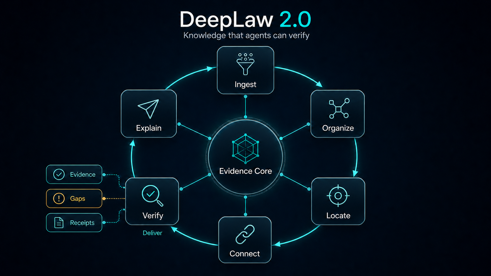
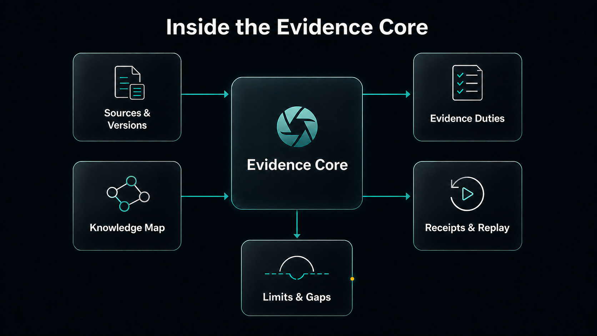

<p align="center">
  <a href="README.md">简体中文</a> · <strong>English</strong>
</p>

<h1 align="center">DeepLaw - 2.0</h1>

<p align="center">
  
</p>

<p align="center">
  <strong>A local-first Knowledge OS for the next generation of AI agents.</strong><br />
  Compile information, project experience, tool results, and domain sources into verifiable, evolvable Knowledge Assets.
</p>

<p align="center">
  <a href="https://github.com/Eysn0130/DeepLaw/actions/workflows/ci.yml"></a>
  
  
  
  <a href="LICENSE"></a>
</p>

<p align="center">
  <a href="#quick-start">Quick Start</a> ·
  <a href="#deeplaw-architecture">Architecture</a> ·
  <a href="#evidence-compiler">Evidence Compiler</a> ·
  <a href="#agent-integrations">Agent Integrations</a> ·
  <a href="#current-catalog-and-updates">Current Catalog</a> ·
  <a href="#documentation">Documentation</a>
</p>

---

<p align="center">
  
</p>

DeepLaw 2.0 is an independent knowledge layer for existing Agent hosts; it does not replace
the reasoning and execution loops in Codex, Claude Code, or OpenCode. It stores files,
project decisions, constraints, experience, and tool results as source-bound,
lifecycle-managed **Knowledge Assets**, then compiles only the task-relevant subset into a
small, verifiable **Knowledge Capsule**.

Chinese law remains a separate strict domain pack. Legal sources enter immutable,
version-aware releases and the Agent receives a bounded **Evidence Pack**. General
knowledge and legal knowledge do not share stores or update authority, and neither product
owns Analytix case projects.

## Core Capabilities

| Capability | How DeepLaw 2.0 handles it |
| --- | --- |
| **Knowledge Compiler** | Preserves source bytes and located fragments before producing review candidates; a summary or semantic unit never replaces evidence |
| **Lifecycle** | `proposed → active → superseded/revoked`, with risky content in `quarantined`; only explicit human review can activate |
| **Context Compiler** | Prioritizes constraints, decisions, rules, and experience under hard content, provenance-metadata, and serialized-payload budgets |
| **Candidate discovery** | An optional local derived index finds candidates that do not share query terms; models are pinned, the index is vault/source-bound and off by default, and every candidate still requires exact-ID verification |
| **Durable knowledge** | Separates working, project, experience, wisdom, and domain tiers; temporary knowledge expires and transcripts are not copied wholesale |
| **Isolation and sensitivity** | Every vault is a separate owner-only SQLite store; public/internal/private/restricted controls export and Agent visibility |
| **Verification and transfer** | The event chain is reconciled with current Asset/source/relation/FTS state and selected source bytes are rehashed; every `.dlk` import begins in untrusted quarantine |
| **Human maintenance** | SQLite is canonical; Markdown/Obsidian is a rebuildable review view with explicit relations and backlinks |
| **Strict domain pack** | The Legal Pack retains version, temporal, source, Evidence Pack, and receipt gates without being weakened by the general core |
| **Low host impact** | Two separate, explicit-use, read-only single-leaf MCP plugins; normal code and data work does not auto-activate them |

## DeepLaw Architecture

DeepLaw uses one general core and one isolated Legal Pack:

```text
Project Sources / Decisions / Experience / Tool Results
  → Knowledge Compiler
  → owner-only Knowledge Asset Vault
  → human review + lifecycle
  → Context Compiler
  → bounded Knowledge Capsule
  → knowledge_support → Agent

Reviewed Legal Sources
  → Document IR
  → immutable Legal Pack Release
  → Evidence Compiler
  → bounded Evidence Pack
  → law_support → Agent
```

- **Knowledge Asset Vault** stores source fragments, lifecycle state, explicit relations,
  and an audit chain. Persistent writes are local CLI administration; Agents are read-only.
- **Knowledge Capsule** carries the task, budget, selected assets, provenance, gaps, digest,
  and vault audit anchor.
- **Legal Pack Release** remains read-only and immutable, retaining source versions, blocks,
  segments, temporal metadata, relationships, risks, and hashes.
- **Markdown derived views** support human review and Obsidian, can be rebuilt, and are
  never canonical.
- **Plugin isolation** keeps `knowledge_support` and `law_support` in separate processes
  with different explicit activation intent.

### The Knowledge Asset cycle

```text
Ingest → Propose/Quarantine → Human Review → Active
  → Search/Context → Verify → Feedback Proposal
  → Human Review → Supersede/Revoke
```

DeepLaw exposes no Agent-facing `remember` or `learn` write. Debugging experience and
Capsule feedback only create proposals, and feedback must bind a verified Capsule file
instead of an asserted ID. Instruction-like source content is quarantined and requires
both `--confirm-reviewed` and `--confirm-quarantine` before activation. Even reviewed
content becomes `reviewed_instruction` only for a
constraint/rule/procedure and can never override host, repository, or user instructions.

Every general Knowledge Asset emits `legal_authority: false`. Project rules and
user-provided domain references cannot impersonate official legal sources; authoritative
Chinese-law retrieval belongs to the separate `law_support` interface.

### Legal Pack: the file-to-evidence cycle

<p align="center">
  
</p>

| Action | Responsibility | Constraint |
| --- | --- | --- |
| **Ingest** | Verify files, extract content, and build Document IR | Processing success is not human approval |
| **Organize** | Retain hierarchy, order, versions, and the Knowledge Map | A derived summary cannot overwrite source text |
| **Locate** | Find titles, document numbers, articles, terms, and related segments | Broad terms do not expand into unbounded candidates |
| **Connect** | Link citations, amendments, repeal, replacement, definitions, and exceptions | A relationship is not itself a legal conclusion |
| **Explain** | Produce source-bound navigation, short summaries, and question decomposition | A derived explanation must resolve to an exact source segment |
| **Verify** | Check source, time, evidence duties, budgets, gaps, and receipts | The system does not invent content to look complete |

`Deliver` is the final action: only the evidence, limitations, gaps, and receipts needed for
the task reach the Agent.

### Evidence Core

<p align="center">
  
</p>

The Evidence Core keeps five kinds of information on one verifiable chain:

- **Sources & Versions** pin the release, source URL, source hash, segment hash, and exact locator.
- **Knowledge Map** admits source-bound relationships to the authority path; derived
  relationships can only propose candidates.
- **Evidence Duties** compile a question into a closed set of requirements covering the
  primary rule, exact citation, temporal status, definitions, interpretation, procedure,
  amount or filing thresholds, counterevidence, and case references.
- **Limits & Gaps** bound cards, characters, relationship paths, and hops while separating
  evidence, corpus, review, temporal, and extraction gaps.
- **Receipts & Replay** bind selection to a release, segment, and hashes so results can be
  verified and replayed.

## Evidence Compiler

The Evidence Compiler is the core query path in DeepLaw 2.0. It does not simply truncate a
list of top-scoring segments. It first defines what would be sufficient for the current
question, then selects content:

```text
Question
  → closed Evidence Duties
  → bounded candidate discovery
  → integrity / relevance / temporal-intent / extraction admission
  → coverage witnesses
  → limitation and counterevidence challenges
  → bounded coverage-first evidence set
  → evidence + uncertain evidence + gaps + receipts
```

Within a bounded candidate pool and context budget, the compiler follows deterministic
priorities: exact targets and required duties first, then definitions, limits, exceptions,
counterevidence, and version changes. A candidate is selected only when it adds or improves
a witness. This is a bounded, coverage-first de-duplication process, not a claim of a
globally minimal set. A flood of topically similar segments cannot displace an exact article
or a necessary limitation. A candidate that does not pass capability predicates cannot
produce a coverage witness or mark a required duty as covered.

A lone topic uses navigation mode: it returns only a source-anchored primary rule and short
follow-up choices, without expanding inbound citation paths. One-hop deterministic relations
are admitted only for an explicit research question that needs version, exception, replacement,
or counterevidence context.

Even when a question does not explicitly ask about temporal status, a candidate already known
to be historical, repealed, superseded, or not yet effective remains in `uncertain_evidence`
unless the caller supplies an applicable `as_of`. It cannot cover a primary evidence duty.

An Evidence Pack separates:

| Output | Meaning |
| --- | --- |
| `evidence` | Research evidence that passed integrity, relevance, and the temporal/extraction gates activated for this query; it is not a claim of human-reviewed source identity or current legal effect |
| `uncertain_evidence` | Relevant material with at least one unmet admission condition |
| `obligation_coverage` | The machine-checkable witnesses covering each evidence duty |
| `gaps` | Uncovered or unresolved evidence, corpus, temporal, review, and extraction requirements |
| `receipt_id` | A receipt whose segment hash can be recomputed inside the fixed release |

Discovery may combine title, article, relevance, and source tier to order candidates, but
that ordering score cannot raise integrity, temporal, extraction, or human-review status.
Models and derived indexes may help discover candidates; they cannot determine amendment
or repeal, erase a blocking gap, or turn a research candidate into a case-applicability conclusion.

## Current Version v0.5.0

| Capability | Current status |
| --- | --- |
| Knowledge Assets | Owner-only vaults, source fragments, proposal/quarantine/activation/supersession/revocation, sensitivity, event-chain verification, and current-state reconciliation |
| Context Capsules | Task priority, item/character budgets, explicit gaps, provenance, one bounded reviewed-relation expansion, selection reasons, digest, and historical audit anchor |
| Candidate discovery | Optional English or Chinese-English local models, fixed revisions and file manifests, plus derived-index integrity and current-vault binding; excluded from default Context and MCP paths |
| Experience growth | Debugger and Capsule feedback create review proposals only; an Agent cannot write or self-promote memory |
| Sharing and human views | Reproducible fixed-revision `.dlk`, untrusted import quarantine, and deterministic Markdown/Obsidian projection |
| File processing | The official catalog accepts DOCX/PDF; the private library also accepts UTF-8 TXT; block-level locators and extraction evidence are retained |
| Data model | Immutable originals, Document IR, read-only SQLite releases, and rebuildable Markdown derived views remain separate |
| Official catalog | Ed25519 verification, HTTPS updates, sequence anti-rollback/rewrite checks, and per-source byte-size and SHA-256 verification |
| User-private library | Owner-only storage, explicit add/delete, separate immutable snapshots, and no blending with official results |
| Locate and Connect | Titles, aliases, document numbers, articles, Chinese full-text search, source-bound topic locators, and bounded source-bearing relationship paths |
| Evidence delivery | Closed QueryPlan, heuristic Evidence Duties, query-activated temporal/extraction gates, bounded evidence, explicit gaps, and receipts |
| Agent interface | Two independently installable read-only MCP plugins, each with one leaf and no persistent write operation |
| Hosts | Codex, Claude Code, and OpenCode adapters; Analytix case projects remain outside DeepLaw 2.0 |

## Quick Start

DeepLaw 2.0 requires Python 3.11+ and [`uv`](https://docs.astral.sh/uv/):

```bash
git clone https://github.com/Eysn0130/DeepLaw.git
cd DeepLaw
uv tool install '.[document-engine]'
deeplaw --version
```

Create an isolated project vault:

```bash
deeplaw knowledge init \
  --vault "$HOME/.deeplaw/vaults/my-project" \
  --name my-project \
  --scope project

deeplaw knowledge ingest \
  --vault "$HOME/.deeplaw/vaults/my-project" \
  --source "./ARCHITECTURE.md" \
  --source-kind document \
  --sensitivity internal \
  --confirm-no-case-data
```

Ingestion produces only `proposed` or `quarantined` assets. Review an `asset_id` to
activate one Asset. If the complete source has been reviewed, use its exact `source_id`
to activate all candidates from that source in one transaction:

```bash
deeplaw knowledge approve \
  --vault "$HOME/.deeplaw/vaults/my-project" \
  --asset-id "asset_..." \
  --confirm-reviewed

deeplaw knowledge approve-source \
  --vault "$HOME/.deeplaw/vaults/my-project" \
  --source-id "source_..." \
  --confirm-reviewed

deeplaw knowledge context \
  --vault "$HOME/.deeplaw/vaults/my-project" \
  --task "Implement the migration without violating the current storage contract" \
  --confirm-no-case-data \
  --output "./capsule.json"
```

Because `task` and `goal` are persisted in the Capsule file, context compilation
also requires `--confirm-no-case-data`. This attestation permits non-case project
knowledge only; it does not authorize copying case facts, chats, or attachments
into DeepLaw.

If an asset is `quarantined`, review the risky content and also pass
`--confirm-quarantine`; `--confirm-reviewed` alone cannot activate it.

Capsule, `.dlk`, and Markdown exports do not overwrite unrelated existing files
or directories; use a new path for each new artifact.

See [`docs/KNOWLEDGE_OS.md`](docs/KNOWLEDGE_OS.md) for the complete lifecycle,
exports, feedback, and security boundary.

For explicit local exploration of candidates that do not share query terms,
install `uv tool install --force --reinstall-package deeplaw '.[discovery]'`
and follow
[`Optional candidate discovery`](docs/KNOWLEDGE_OS.md#optional-candidate-discovery).
It is off by default and is not part of the Agent MCP or Context Compiler.

The official catalog includes PDFs. Before the first official install or any update, also
install PDF rendering, OCR, and Simplified Chinese language data:

```bash
# macOS (Homebrew)
brew install poppler tesseract tesseract-lang

# Debian / Ubuntu
sudo apt-get update
sudo apt-get install -y poppler-utils tesseract-ocr tesseract-ocr-chi-sim
```

Provision the document models once through an explicit administrative command. DeepLaw
writes its owner-only configuration only after all 15 files in the pinned revision pass
byte-size and SHA-256 verification. Normal ingestion never downloads models or consumes
upstream environment/configuration overrides:

```bash
deeplaw document-engine setup
deeplaw document-engine status
deeplaw-document-engine --version
pdftoppm -v
tesseract --version
tesseract --list-langs | grep -x 'chi_sim'
```

A signed official catalog's build policy is mandatory. `official install` and
`official update` run the same strict preflight before downloading any official source,
building a release, or changing the active release, including a full rehash of the local
model manifest. A missing or modified file aborts the operation without silent degradation,
and the CLI cannot weaken the catalog policy. The first `setup` downloads about 1.1 GB from
the pinned source; use `deeplaw document-engine setup --local-files-only` when the complete
cache is already present. A machine that only reads an existing release may use the
lightweight `uv tool install .` instead. Select the document engine explicitly for a risky
user PDF:

```bash
uv tool install --force --reinstall-package deeplaw '.[document-engine]'
deeplaw document-engine setup
deeplaw private add \
  --source "/path/to/scanned-legal-reference.pdf" \
  --pdf-fallback document-engine \
  --allow-needs-ocr \
  --confirm-no-case-data
```

Install the team-maintained official catalog. The client verifies the signature, downloads
original files from cataloged official sources, and builds an immutable release locally.
The repository does not redistribute those source files.

```bash
deeplaw official install
deeplaw official status
deeplaw doctor
```

For human browsing or review, export deterministic Markdown from the immutable release.
The output is a disposable derived view and can always be rebuilt:

```bash
deeplaw export-markdown --output "/path/to/deeplaw-markdown"
```

When the team publishes a new catalog, the user updates explicitly:

```bash
deeplaw official update
```

An existing source package that exactly matches the catalog can be reused:

```bash
deeplaw official install --source-root "/path/to/legal-source-package"
```

The official catalog is optional. Disabling or uninstalling it does not touch the private
library:

```bash
deeplaw official disable
deeplaw official enable
deeplaw official uninstall
```

User-owned legal references enter a separate local private library. Import requires an
explicit confirmation that the file is not case material. Agents can read the library but
cannot upload or delete through MCP.

```bash
deeplaw private add \
  --source "/path/to/user-legal-reference.docx" \
  --confirm-no-case-data
deeplaw private list
deeplaw private search --query "document title article one"
deeplaw private delete --document-id "doc_..."
```

## Agent Integrations

| Host | Entry point | Activation boundary |
| --- | --- | --- |
| Codex | [`plugins/deeplaw`](plugins/deeplaw) / [`plugins/deeplaw-knowledge-os`](plugins/deeplaw-knowledge-os) | Legal and general knowledge are separate explicit Skills |
| Claude Code | Same plugin roots | Each plugin registers one separate read-only MCP leaf |
| OpenCode | [`adapters/opencode`](adapters/opencode) | Denied by default and separately enabled for two dedicated agents |
| Analytix | [`docs/ANALYTIX_INTEGRATION.md`](docs/ANALYTIX_INTEGRATION.md) | Future turn-scoped integration; its case-project library is not part of DeepLaw 2.0 |

Install locally in Codex:

```bash
codex plugin marketplace add /absolute/path/to/DeepLaw
codex plugin add deeplaw@deeplaw
codex plugin add deeplaw-knowledge-os@deeplaw
```

Install locally in Claude Code:

```bash
claude plugin validate --strict /absolute/path/to/DeepLaw/.claude-plugin/marketplace.json
claude plugin marketplace add /absolute/path/to/DeepLaw
claude plugin install deeplaw@deeplaw
claude plugin install deeplaw-knowledge-os@deeplaw
```

Each plugin exposes one MCP leaf. The Legal Pack's `law_support` uses
`search/get/verify/release_info`; the private library uses
`private_search/private_get/private_verify/private_info`. The Knowledge OS
`knowledge_support` uses `search/get/context/verify/inspect`. Every operation is
read-only. Installing a plugin never downloads, learns, or mutates data in the background;
updates, ingestion, and review require explicit CLI administration.

Ordinary work should not auto-activate either plugin. Use the Knowledge OS only for an
explicit request for durable project knowledge or a Knowledge Capsule, and the Legal Pack
only for explicit legal research. Hosts should hide unselected schemas where possible to
avoid token, latency, and routing regressions.

## Knowledge Boundaries

| Scope | Who may update it | Immutable / prohibited actions | Agent access |
| --- | --- | --- | --- |
| General Knowledge Asset vault | The local owner proposes, reviews, supersedes, and revokes through CLI; edited content becomes a new Asset | Agents cannot persist writes; source bytes are not edited in place; every Asset has `legal_authority=false`; restricted data never crosses MCP | Separate `knowledge_support`; active, non-restricted assets only |
| Team-maintained official legal catalog | The DeepLaw team publishes a new monotonically sequenced, Ed25519-verified catalog; users explicitly install, update, disable, or uninstall | Neither users nor Agents can edit statutes, versions, temporal metadata, sources, segments, relations, or review state inside a release; corrections create a new immutable release | Four official read-only `law_support` operations |
| User-private legal references | The current OS user runs `private add/delete`; each change creates an independent snapshot | It cannot enter or overwrite the official catalog and never inherits official authority, ranking, or review state; Agents cannot upload, delete, or rewrite it | Explicit `private_*` operations only and always labeled user-provided |
| Analytix case projects | Analytix alone manages each case store | Attachments, facts, chats, identities, transactions, and case SQLite/DuckDB never enter any DeepLaw scope | DeepLaw never reads, indexes, or shares them |

Vaults and the local private library rely on the operating-system account and owner-only
permissions; they are not multi-tenant authentication or encryption at rest. Case
evidence, facts, chats, identities, and transactions must not enter any DeepLaw scope.
Agent conversations are not copied wholesale; only reviewed non-case decisions,
constraints, facts, or experience belong in a general vault.

“Agent read-only” is the DeepLaw plugin/MCP interface boundary, not a replacement
sandbox for a host's general shell. If a host separately gives an Agent arbitrary
shell or file-write access as the local owner, it can also reach offline
administration. Integrations must deny Agent writes to `~/.deeplaw` and
administrative commands, or run the read-only MCP under a separate OS identity.

## File Processing and Quality Gates

- **DOCX** is parsed directly from OOXML while retaining paragraphs, table rows, styles,
  and footnote references.
- **PDF** retains native text, layout blocks, locators, extraction methods, confidence
  information, and risk flags per page; poor pages enter multi-path parsing and visual review.
- **TXT** uses strict UTF-8 decoding with stable line and paragraph order.
- **Document IR** assigns every block a stable ID, order, text hash, page or paragraph,
  kind, source, and quality state.
- **Markdown** is a derived view generated from IR for browsing and correction. It is not
  the source of truth for segmentation, retrieval, or legal citation.

Quality decisions are attached to pages and segments instead of contaminating an entire
document. A segment that has not passed extraction admission appears only in
`uncertain_evidence`, never as verified primary evidence. Detailed page-level status,
methods, hashes, and audit records remain in the release build report. Corrections are
published through a new immutable release.

## Quality and Verification

```bash
uv lock --check
uv run ruff check .
uv run pytest
uv run deeplaw eval --cases evals/core-v0.4.0-2026-07-25.jsonl --limit 5
git diff --check
```

The reproducible smoke suite covers exact location, temporal buckets, extraction admission,
official/private isolation, and receipt round-trip verification. Knowledge OS tests
additionally cover vault permissions and isolation, lifecycle and
explicit supersession, database/FTS/source-file tampering, stored-instruction quarantine
and double confirmation, Context budgets and bounded relation expansion, fabricated
Capsule IDs plus tamper/staleness/revocation, `.dlk` structure and trust laundering,
safe Markdown replacement, a complete CLI lifecycle, and a real stdio MCP session.
The pinned release, database, cases, source
tree, environment, hashes, and metrics are recorded in
[`docs/BENCHMARKS.md`](docs/BENCHMARKS.md). Cross-system performance claims require external
held-out evaluation under the same corpus, questions, model, and context budget.

The external protocol, per-case scorers, independently signed suite manifests, and
machine-enforced claim gate are frozen. Evidence remains `pending_external_execution`, so
DeepLaw does not emit a cross-system leadership claim. See
[`docs/EXTERNAL_BENCHMARK_PROTOCOL.md`](docs/EXTERNAL_BENCHMARK_PROTOCOL.md).

The general Knowledge OS also has a source-bound, claim-ineligible 100,000-Asset
diagnostic. Across 100 long-task queries, search Hit@1, Capsule recall, and Capsule
verification were all `1.0`; the persistent read-only process measured `0.82 ms` search
p95 and `1.28 ms` context p95. A cold CLI process first replays full audit and state
integrity, taking about `5.85 s` with about `443 MB` peak RSS in this run, so host
integrations should use the persistent MCP process. The environment, implementation
hashes, and limits are recorded in
[`benchmarks/scale/knowledge-scale-100k-2026-07-26.json`](benchmarks/scale/knowledge-scale-100k-2026-07-26.json).
This synthetic diagnostic is permanently `claim_eligible=false` and is not extrapolated
to one million Assets.

## Safety and Responsibility

- DeepLaw 2.0 returns verifiable research evidence; it does not replace legal advice,
  factual findings, or adjudication.
- Knowledge Asset `trust` is provenance, not a truth score; model output and feedback
  cannot activate themselves.
- A user cannot self-assert `verified_source`; general assets are never legal authority,
  and legal-source research must use the Legal Pack.
- `.dlk` v1 verifies content integrity but does not sign publisher identity; imports begin
  in untrusted quarantine.
- Live web content never enters primary evidence at query time, and a model cannot decide
  amendment, repeal, conflict, or priority on its own.
- User-private material cannot change an official release, review status, ranking, or update lifecycle.
- Restricted legal sources and case information must not appear in issues, pull requests,
  logs, screenshots, or public benchmarks.

See [`docs/CORPUS_GOVERNANCE.md`](docs/CORPUS_GOVERNANCE.md) for corpus governance and
[`SECURITY.md`](SECURITY.md) for security reporting.

## Roadmap

- [x] Immutable Knowledge Releases, Document IR, receipts, and read-only MCP
- [x] Signed official-catalog lifecycle and physically separate user-private legal references
- [x] Precise location, evidence duties, temporal/extraction gates, and explicit gaps
- [x] Codex, Claude Code, and OpenCode adapters
- [x] Knowledge Asset vaults, human-reviewed lifecycle, Context Capsules, and read-only MCP
- [x] Experience feedback proposals, reproducible `.dlk`, and Markdown/Obsidian projection
- [ ] Add independent publisher signing, revocation, and monotonic updates for `.dlk`
- [x] Freeze the ten-suite held-out protocol, per-case statistics, signed evidence chain, and claim gate
- [ ] Complete all ten real runs, two third-party hidden sets, and two independent reproductions
- [ ] Extend the complete legal hierarchy and bitemporal legal-event ledger
- [ ] Add a Corpus Coverage Manifest and release approval/revocation metadata
- [ ] Establish an external held-out Chinese legal-evidence benchmark
- [ ] Complete Analytix turn-scoped activation and the inactive zero-impact A/B gate

## Documentation

| Document | Scope |
| --- | --- |
| [`docs/KNOWLEDGE_OS.md`](docs/KNOWLEDGE_OS.md) | Knowledge Assets, Context Capsules, memory lifecycle, packages, and security boundaries |
| [`docs/DEEPLAW_2.md`](docs/DEEPLAW_2.md) | Legal Pack technical design, formal invariants, and research gates |
| [`docs/ARCHITECTURE.md`](docs/ARCHITECTURE.md) | System architecture, storage, and runtime facts |
| [`docs/DOCUMENT_IR.md`](docs/DOCUMENT_IR.md) | DOCX/PDF/TXT ingestion, Document IR, multi-candidate PDF gates, and Markdown's role |
| [`docs/CORPUS_GOVERNANCE.md`](docs/CORPUS_GOVERNANCE.md) | Source, review, licensing, release, and update governance |
| [`docs/BENCHMARKS.md`](docs/BENCHMARKS.md) | Reproducible validation results and the next evaluation protocol |
| [`docs/EXTERNAL_BENCHMARK_PROTOCOL.md`](docs/EXTERNAL_BENCHMARK_PROTOCOL.md) | External held-out fairness, signed evidence, and claim gating |
| [`docs/IMPLEMENTATION_AUDIT_2026-07-26.md`](docs/IMPLEMENTATION_AUDIT_2026-07-26.md) | Item-by-item implementation, source, and remaining-boundary audit |
| [`docs/RESEARCH_MATRIX.md`](docs/RESEARCH_MATRIX.md) | Agent knowledge-base research matrix, layer boundaries, and comparison gates |
| [`docs/KNOWLEDGE_OS_RESEARCH.md`](docs/KNOWLEDGE_OS_RESEARCH.md) | Research decisions for durable knowledge, memory safety, isolation, and Context Capsules |
| [`docs/AGENT_ADAPTERS.md`](docs/AGENT_ADAPTERS.md) | Codex, Claude Code, and OpenCode adapters |
| [`docs/ANALYTIX_INTEGRATION.md`](docs/ANALYTIX_INTEGRATION.md) | Future Analytix integration and zero-impact gates |
| [`docs/SOURCE_AUDIT_2026-07-14.md`](docs/SOURCE_AUDIT_2026-07-14.md) | Source and build-history audit for the first 28 materials |

## Current Catalog and Updates

DeepLaw 2.0 is a general-purpose legal knowledge base. As of **2026-07-14**, the current
official catalog records **28** items: **10 DOCX** and **18 PDF**. This is the present
coverage, not a limit on future jurisdictions or material types. The repository distributes
the signed catalog, public trust roots, source URLs, sizes, and hashes; original files are
acquired from official sources during installation.

| Current source group | Count | Coverage |
| --- | ---: | --- |
| Core legal sources | 4 | Criminal Law, Criminal Procedure Law, amendments, and filing standards |
| Finance and illegal fundraising | 4 | Money laundering, AML, illegal fundraising, and prohibition rules |
| Data and cyber | 3 | Personal information, data security, and telecom-fraud rules |
| Case references | 4 | Public cases from the People's Court Case Library |
| Procedure and evidence | 4 | Economic-crime procedure, criminal procedure, and asset handling |
| AML, payments, and beneficial ownership | 8 | Foreign exchange, beneficial ownership, due diligence, and payments |
| Offence topic | 1 | Judicial interpretation on tax-administration crimes |
| **Total** | **28** | **10 DOCX + 18 PDF** |

DeepLaw 2.0 records the **issuing authority** separately from the **official download host**.
The former identifies source authority; the latter records where the original file was
obtained.

Here, “official catalog” means a DeepLaw-team-maintained and signed download catalog whose
materials come from the official sites below. It is not certification of DeepLaw's build by
an issuing authority, nor does it mean every legal proposition has received human review.

| Official download source | Count | Files currently obtained |
| --- | ---: | --- |
| [National Laws and Regulations Database](https://flk.npc.gov.cn/) | 10 | DOCX: laws, amendments, and judicial interpretations |
| [Ministry of Justice Administrative Regulations Database](https://xzfg.moj.gov.cn/) | 4 | PDF: administrative regulations and related rules |
| [People's Bank of China](https://www.pbc.gov.cn/) and its official branch site | 6 | PDF: AML, payments, due diligence, and amendment decisions |
| [Shandong Court](https://www.sdcourt.gov.cn/) official hosts | 5 | PDF: case-library references and procedure material |
| Official hosts of the [CSRC](https://www.csrc.gov.cn/), [NIA](https://www.nia.gov.cn/), and [SZSE](https://www.szse.cn/) | 3 | PDF: officially hosted originals issued by the relevant authority |
| **Total** | **28** | **Each file records URL, format, byte size, and SHA-256** |

Users fetch a team update explicitly:

```bash
deeplaw official update
```

The team maintains the catalog in three steps:

1. Identify the title, document number, issuing authority, promulgation/effective dates,
   and legal status.
2. Obtain the original from the issuing authority or an official download host without
   guessing URLs or saving webpage text as an original file.
3. Verify format, first-page identity, size, and SHA-256; record version relationships and
   build a new immutable release.

Drafts, consultation papers, webpage-only materials, commercial-database reposts, and
private case material do not enter the public catalog. Cases support research and argument;
they do not replace legal-effect analysis of normative sources.

## Community and License

Reproducible location, version, extraction, and security reports are welcome when they use
synthetic fixtures. See [`CONTRIBUTING.md`](CONTRIBUTING.md),
[`CODE_OF_CONDUCT.md`](CODE_OF_CONDUCT.md), and [`SECURITY.md`](SECURITY.md).

DeepLaw source code is available under the [Apache License 2.0](LICENSE). Rights in external
legal sources, cases, website layouts, and third-party assets remain with their respective
owners. See [`THIRD_PARTY_NOTICES.md`](THIRD_PARTY_NOTICES.md) for licenses, model terms,
and redistribution boundaries of optional document-processing dependencies.
