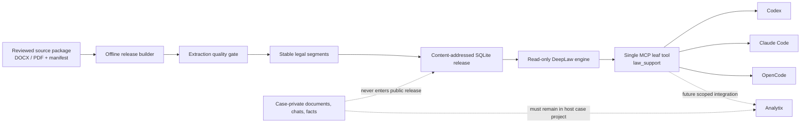

# DeepLaw Architecture

Status: architecture baseline for DeepLaw `0.2.0`, reviewed against the current
implementation on 2026-07-15.

DeepLaw is a read-only, version-aware Agent Knowledge Base for Chinese legal sources. It is a
separate local service and release format used by Codex, Claude Code, and
OpenCode, and designed for a later Analytix integration. It is not an agent
memory store, a case workspace, or an LLM-authored legal authority.

## Decision Summary

- Keep authoritative source material and derived retrieval data separate.
- Build content-addressed SQLite releases offline; open them with SQLite
  `mode=ro&immutable=1` at runtime.
- Prefer exact title, citation, article, effective-date, and lexical retrieval.
- Return at most five evidence cards, then fetch normalized extracted text by
  stable `segment_id`; `get` exposes truncation and accepts `max_chars` up to
  6000, while the official source and locator remain the comparison authority.
- Keep semantic discovery, relationship discovery, reranking, and source-bound
  explanations optional, derived, replaceable, and outside the authority decision.
- Expose one compact, read-only MCP tool instead of injecting a legal corpus or
  a large tool catalogue into every agent session.
- Never place case-private documents, conversations, facts, or identifiers in a
  public DeepLaw release.

This is a constrained Agent Knowledge Base. Local semantic discovery,
relationship discovery, and source-bound explanations may be added as
release-pinned sidecars after they prove useful on a Chinese legal benchmark.
They can help Locate, Connect, or Explain, but can never become source text or
establish legal validity.

## Goals And Non-Goals

### Goals

- Reproduce every returned excerpt from an identified immutable release.
- Preserve official source URL, source SHA-256, segment SHA-256, and a page or
  paragraph locator where the parser can provide one.
- Distinguish effective-date filtering from a conclusion about applicability.
- Keep the provider-visible result set and context cost bounded.
- Work locally and offline after a release has been built.
- Give different agent hosts one stable MCP contract without duplicating the
  legal engine in each host.
- Fail closed when a release, source hash, segment, or receipt cannot be
  verified.

### Non-goals

- Predict guilt, sentencing, liability, or case outcomes.
- Treat a date match as proof that a rule governs a case.
- Let an LLM decide whether a law was amended, repealed, or superseded.
- Automatically crawl and publish an unreviewed comprehensive legal corpus.
- Store case projects, uploads, chats, user memory, or agent state.
- Make every non-legal Analytix task pass through a legal classifier or legal
  retrieval pipeline.
- Claim that DeepLaw exceeds every external knowledge system without a fair,
  reproducible, held-out benchmark.

## Trust And Authority Model

DeepLaw uses an explicit evidence hierarchy:

| Layer | Examples | Authority status |
| --- | --- | --- |
| Source declaration | Official HTTPS URL, retrieval date, expected size and SHA-256 | Provenance claim; requires review |
| Source bytes | DOCX/PDF verified against the source manifest | Primary input for a release |
| Normalized segment | Extracted text, locator, source and segment hashes | Reproducible representation of source bytes |
| Release database | SQLite artifact plus `release.json` and database SHA-256 | Runtime source of truth for that release |
| Search result | Rank, excerpt and hit reason | Evidence candidate, not legal authority |
| Receipt | Hash binding release, document, segment, source and text | Integrity proof for a returned candidate |
| Derived index | FTS, graph, embedding, reranker cache | Rebuildable retrieval aid |
| Derived prose | Summary, tag, topic page, source-bound explanation | Non-authoritative navigation only |

An official-looking URL alone does not prove authenticity or current legal
effect. A production release requires review of the source, its issuer, the
document identity, version dates, status, redistribution conditions, and
parser output. GitHub mirrors and local filenames are never authoritative legal
sources.

## System Context



The builder is an offline administrative surface. The `0.2.0` MCP runtime uses
the SDK's low-level `Server` over local stdio only; it has no HTTP listener and
no corpus-write operation. Its process lifespan resolves and verifies one
release, computes the database hash once during startup, keeps that read-only
release fixed for the lifetime of the process, and serializes access to the
shared SQLite connection. By default, installed hosts share `~/.deeplaw`;
deployments can override that root with `DEEPLAW_HOME` or select one artifact
before startup with `DEEPLAW_DB`. Host-specific configuration and skills are
thin adapters; they do not contain a second copy of retrieval logic.

## Release Build Pipeline

The current implementation starts in
[`src/deeplaw/ingest.py`](../src/deeplaw/ingest.py):

1. Resolve the source root and manifest using real paths.
2. Reject empty, duplicate, or source-root-escaping manifest paths.
3. Verify each file's byte size and SHA-256 before parsing.
4. Require an HTTPS `officialSource` value.
5. Assign an initial document type, issuer, and authority rank. These heuristic
   values are review aids, not a substitute for legal metadata review.
6. Extract DOCX or PDF content.
7. Stop on a low-quality PDF unless an operator explicitly chooses a local
   fallback or accepts an incomplete candidate build.
8. Segment by article and heading while retaining order and available page or
   paragraph locators.
9. Hash the normalized document metadata, every segment identity/text hash,
   extractor backend/version/configuration, extracted-text hash, SQLite engine
   version, segmentation recipe, and storage schema into the derivation
   identity.
10. Build the SQLite database in a staging directory, run
    `PRAGMA integrity_check`, and calculate the database SHA-256.
11. Write `release.json` and `build-report.json`, mark all three release files
    read-only, and atomically publish a previously unseen release directory.
12. If the same release ID already exists, verify its derivation and database
    hashes without rewriting it; optionally update the local `ACTIVE` pointer
    atomically.

The release ID therefore binds the selected manifest fields, reviewed status
fields supplied by that manifest, normalized document metadata, parser output,
extractor versions/configuration, extracted-text and segment hashes, SQLite
engine version, and derivation/storage schema versions. A change to source
bytes, OCR output, parser identity, or normalized legal text creates a
different release. SQLite's binary hash remains a separate artifact integrity
value.

### Known `0.2.0` release limitations

The current implementation is an alpha baseline, not yet a production release
authority. The following gaps must remain visible until code and tests close
them:

- `document_type`, `issuer`, and `authority_rank` begin as filename/title
  heuristics; they require explicit review before a production release.
- The builder validates an HTTPS source declaration but does not yet enforce an
  approved official-domain policy or independently refetch the source.
- Release metadata carries a database SHA-256 but no release signature.
- The CLI has a local candidate activation pointer but does not yet implement
  signed release approval, revocation, or supersession workflows. Human PDF
  page-review files record reviewer identity, role, time, and attestation, but
  they are not a signed release-approval workflow.
- The original source package is external to the release database, so a
  reproducible release requires separately retained and access-controlled
  source bytes.
- Candidate IDs and metrics recorded before the current `deeplaw.sqlite/v4`
  provenance schema are historical evidence only. A later code or schema
  change does not retroactively upgrade them; they must be rebuilt and
  revalidated before being described as a current runtime candidate.

These are hardening requirements, not reasons to weaken the authority model or
silently label a candidate corpus as verified.

### Extraction Backends

| Input | Default | Optional fallback | Current provenance |
| --- | --- | --- | --- |
| DOCX | Direct OOXML parsing | None | Paragraph order and style; table rows become blocks |
| Text-layer PDF | `pypdf` layout/text extraction | None when quality is sufficient | Page number and quality warnings |
| Scanned or poor PDF | Quality gate fails | `deeplaw-vision-consensus` | Page image/native/OCR/selected hashes, confidence, consistency, risks, review status and tool versions |

`deeplaw-vision-consensus` is a first-party evidence pipeline. It renders every
page to bind an image hash, evaluates the native text layer, and invokes the
separately installed local OCR executable only when that page fails the native
quality gate. It stores page-level OCR confidence and native/OCR consistency;
low-confidence or disagreeing output remains review-required. A human-reviewed
override is accepted only through a closed file bound to both source PDF and
rendered-page hashes, with a human identity, timestamp, role, and visual
comparison attestation. The pipeline cannot create that attestation itself.

OCR or layout-model output requires source comparison and review. A successful
process exit is not proof of extraction fidelity.

## Release Storage

The current SQLite schema is created by
[`src/deeplaw/store.py`](../src/deeplaw/store.py).

### Authoritative runtime tables

- `metadata`: release schema version, release ID, and canonical release
  metadata.
- `documents`: source identity, title, source URL/hash, type, issuer,
  authority rank, effective interval, review status, extraction backend/version,
  and extraction warnings/review flag.
- `segments`: stable segment ID, document order, article/heading, text/hash,
  and page/paragraph interval.

### Derived runtime index

- `segment_search`: FTS5 index over pre-tokenized title, body, and locator
  fields. Chinese runs are represented with two- and three-character n-grams;
  ASCII identifiers remain lexical tokens.
- `legal_edges`: one-hop navigation edges with subject/object document IDs,
  predicate, exact provenance segment and evidence hash, derivation, review
  status, and optional validity interval.

The release database contains normalized text and provenance, not the original
DOCX/PDF bytes. Source packages remain separately controlled inputs. Runtime
connections use `query_only`, foreign keys, and SQLite's immutable read-only
URI. No WAL or write-capable cache belongs beside a published database.

### Stable identifiers

- `lawrel_*`: derived from source/metadata, normalized segment hashes,
  extraction recipe, and storage schema.
- `doc_*`: derived from source SHA-256 and title.
- `seg_*`: derived from document ID, order, article, part, and text hash.
- `lawrcpt_*`: binds release ID, document ID, segment ID, source hash, and
  segment hash.

Changing source bytes or segment text therefore produces a different identity
or receipt. IDs are evidence handles, not human citations; user-facing answers
must also name the document and locator.

## Retrieval Architecture

The current engine in [`src/deeplaw/search.py`](../src/deeplaw/search.py) first
compiles a closed QueryPlan and then uses a small deterministic routing layer:

- `navigation`: short broad terms such as a bare topic; returns shorter cards
  and suggested narrowing questions.
- `exact`: explicit article/citation or exact-version intent.
- `research`: a substantive legal research question.

The implemented execution channels are:

1. exact article label;
2. compact document-title match;
3. Chinese n-gram FTS5;
4. deterministic, provenance-carrying one-hop legal graph navigation;
5. deterministic reordering by channel, term coverage, authority rank, and FTS
   score;
6. obligation coverage, explicit gaps, per-document/article deduplication and a
   hard evidence/character budget.

An `as_of` date classifies candidates as `verified_in_scope`,
`unverified_metadata`, or `outside_effective_interval`. Only the first class can
enter primary evidence; unknown or unreviewed dates are isolated in
`uncertain_evidence`, and known out-of-scope material is excluded. This is
research assistance, not an applicability ruling.

The current model accepts document numbers, aliases, promulgation dates,
jurisdiction, effective intervals, issuer/status fields, and hash-bound review
metadata. SQLite v4 includes `legal_edges`, but the `0.2.0` runtime produces only
`deterministic_exact` edges derived from an exact known-document-name reference
in a source segment. Review-overlay relations are hash-bound governance
proposals; they are not inserted into the runtime graph, and no current producer
creates a `reviewed` edge.

Graph paths are navigation metadata and cannot independently mark an evidence
obligation covered. Missing graph navigation does not create a graph-specific
gap. If the bounded evidence execution still leaves a required obligation
uncovered or uncertain, the response reports the corresponding generic
obligation gap rather than filling it by model inference.

### Retrieval ladder for future expansion

Future channels must preserve this order:

```text
exact title / document number / article / alias
  -> effective interval and status filter
  -> bounded graph navigation over cites/amends/repeals/replaces/implements/exception_to
  -> Chinese lexical retrieval
  -> small candidate reranking
  -> semantic retrieval only as a bounded fallback
  -> derived topic navigation only for broad research
```

New channels may add candidates; they may not bypass source/version validation,
increase the public result limit, or silently replace exact matches. A vector
index must be a disposable sidecar keyed by release and segment hashes. An
LLM-generated edge remains a proposal until deterministic validation or human
review accepts it.

## Evidence Contract And Context Budget

The provider-facing schemas live in [`contracts`](../contracts):

- DeepLaw `0.2.0` keeps `law-support.input` and verification at v1; the advertised
  output union, search response, segment, release-info, evidence-card, and corpus
  release-manifest contracts are v2.
- `LegalEvidenceCardV2` returns the release, receipt, stable IDs, title, issuer,
  source URL/hash, segment hash, locator, effective interval, status, extraction
  method/configuration/review warnings, score, hit reason, and bounded excerpt.
- Search returns at most five cards and at most 6,000 excerpt characters.
- Broad navigation cards are shorter than research cards.
- Full text requires a second `get` call with an exact `segment_id`.
- `verify` recomputes the segment text hash and the receipt binding over the
  release, document, segment, stored source hash, and stored segment hash. It
  does not reopen or rehash the original DOCX/PDF.
- `law-support.output` is a closed union of search, segment, verification, and
  release-info schemas; hosts must reject unknown output fields.

This two-stage pattern prevents broad queries such as `诈骗` from inserting
dozens of semantically related provisions into the model context. Search is a
selection operation; `get` is a deliberate evidence-read operation.

## MCP And Host Boundary

[`src/deeplaw/mcp_server.py`](../src/deeplaw/mcp_server.py) uses the MCP SDK's
low-level `Server` and local stdio transport to expose one tool, `law_support`,
with four read-only operations. Its advertised output schema is a bundled,
closed copy of the repository contracts, so clients do not need to resolve
remote schema URLs during the handshake:

| Operation | Purpose | Required selector |
| --- | --- | --- |
| `search` | Return bounded evidence candidates | Query and optional purpose/date filters |
| `get` | Fetch one exact segment | `segment_id` |
| `verify` | Verify a returned receipt | `segment_id` and `receipt_id` |
| `release_info` | Inspect the active release | None |

Some hosts display a transport-qualified name such as
`mcp__deeplaw__law_support`. The `mcp__deeplaw__` portion is host routing
metadata, not a second MCP tool or a separate DeepLaw contract. The only leaf
tool name is `law_support`.

The compact tool surface is intentional. Tool definitions consume provider
context even when not called, and a large legal tool catalogue can bias
unrelated agent work.

Host integration must follow these rules:

- Do not inject statutes, generated topic pages, or release summaries into the system
  prompt at startup.
- Invoke DeepLaw only for an explicit legal research need.
- Do not invoke it merely because an unrelated dataset contains words such as
  `诈骗`, `合同`, or `法院`.
- Send a de-identified legal issue, citation, or date filter; do not send a full
  case record or personal identifiers to the public service.
- Keep case-private attachments, conversation state, and analysis in the host's
  case project storage.
- Treat an unavailable or unverified release as a visible failure; do not fall
  back silently to model memory or Web search.

These constraints allow Analytix to gain legal research capability without
changing its normal data-analysis path. Analytix integration is a later host
change, not part of the public corpus runtime.

## Derived Discovery Sidecars

Derived layers are permitted only when all of the following hold:

- keyed by exact `release_id`, `document_id`, and `segment_id`;
- disposable and completely rebuildable from the release;
- marked with generator name/version, model name where applicable, timestamp,
  and input hashes;
- unable to change legal status, effective dates, version lineage, or source
  text;
- excluded from final citations unless the answer separately cites the source
  segment;
- evaluated against exact/lexical-only retrieval before activation.

The `0.2.0` deterministic graph supports only `cites`, `amends`, `repeals`,
`replaces`, `implements`, and `exception_to`. Each runtime edge is
`deterministic_exact` and retains the source segment and evidence hash. Relations
declared in a review overlay remain governance proposals; the current runtime
has no producer that promotes them to `reviewed` edges. A source-bound
explanation sidecar may summarize topics, disputes, and timelines, but every
proposition must link back to a source segment and the entire sidecar must be
safe to delete.

## Security And Failure Boundaries

Inputs at the manifest, filesystem, archive, PDF, OCR subprocess, SQLite, MCP,
and host boundaries are untrusted.

Required protections include:

- path containment and duplicate source detection;
- size and SHA-256 validation before parsing;
- HTTPS source declarations and future source-host allowlists;
- ZIP/XML/PDF parser resource limits;
- subprocess argument lists without shell interpolation;
- bounded stderr and output inventory in failures;
- read-only immutable runtime connections;
- no credentials, source documents, case text, or query payloads in public
  logs and benchmarks;
- explicit review state for incomplete temporal metadata and OCR derivatives.

DeepLaw must not:

- auto-publish downloaded legal material;
- infer repeal or legal effect solely from an embedding or LLM output;
- return unlimited vector top-k context;
- use generated summaries as authoritative citations;
- accept case-private writes through MCP;
- share one mutable database between public law and case projects;
- hide missing evidence by answering from model memory;
- market benchmark superiority without reproducible evidence.

## Evaluation And Change Gates

The current evaluator reports retrieval/constraint/overall pass rates, Hit@1,
MRR, average excerpt characters, p50/p95 latency, corpus/release hashes, and
per-case results. It checks expected titles/articles, forbidden versions,
route, evidence count, and excerpt budget. It is a smoke/regression harness,
not sufficient evidence of legal retrieval superiority.

The current MCP boundary also relies on the host and skill to de-identify
queries; it does not implement a reliable personal-information detector. That
limitation is why the public service contract forbids complete case records
rather than claiming to sanitize arbitrary uploads.

`DeepLawBench-CN` should add held-out cases for:

- title, alias, document number, and article precision;
- historical versions, not-yet-effective rules, repeal, amendment, and
  transitional provisions;
- judicial interpretations and cross-references;
- broad-topic low-noise navigation;
- multi-rule fact patterns;
- no-answer and out-of-corpus behavior;
- non-legal false activation;
- OCR page/span fidelity;
- near-duplicate and wrong-version distractors.

Release gates should cover Hit@1/3, MRR/nDCG, character-span precision/recall,
wrong-version rate, provenance coverage, receipt validity, excerpt-token p95,
latency, memory, stability, and non-legal activation rate. Wrong-version
citations and unverifiable provenance are hard failures, not metrics to trade
for recall.

Any future claim that DeepLaw outperforms another system must name the corpus,
held-out split, baselines, configuration, hardware, cost, metrics, confidence
intervals, and failure cases. Until then, the defensible claim is that DeepLaw
is designed for versioned, bounded, auditable Chinese legal evidence retrieval.

## Related Decisions

- Upstream evaluation and reuse boundaries:
  [`UPSTREAM_REUSE.md`](UPSTREAM_REUSE.md)
- Third-party reference and optional adapter notices:
  [`../THIRD_PARTY_NOTICES.md`](../THIRD_PARTY_NOTICES.md)
- Stable host contracts: [`../contracts`](../contracts)
